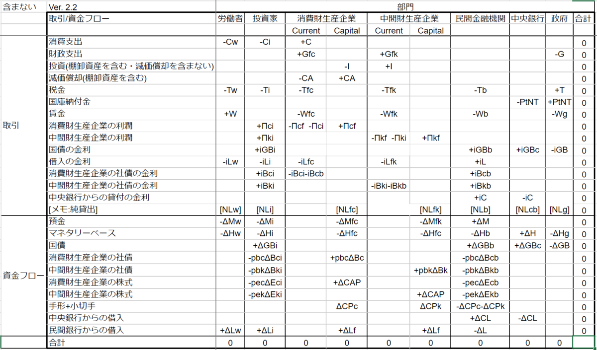
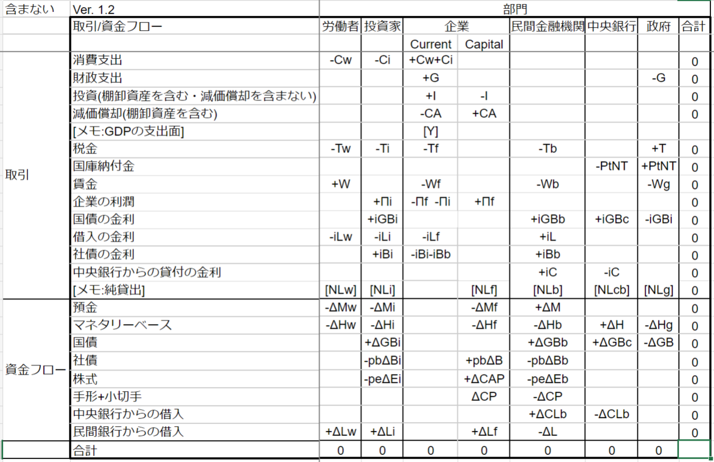

使われる語句には私が勝手に翻訳したものも含まれる。最初になるべく元の英語を示すが、忘れているものもあるに違いない。

- [０，前提](#０前提)
- [１，SFCモデル(Stock-Flow consistent model)とは](#１sfcモデルstock-flow-consistent-modelとは)
- [１－１，SFCモデルの原則](#１１sfcモデルの原則)
  - [①フローの整合性](#フローの整合性)
  - [②金融資産と負債の対応関係](#金融資産と負債の対応関係)
  - [③ストックとフローの整合性](#ストックとフローの整合性)
  - [④ストックからフローへのフィードバック](#ストックからフローへのフィードバック)
- [１－２，SFCモデルの柔軟さ](#１２sfcモデルの柔軟さ)
- [１－３，SFCモデルの性質を決める肝](#１３sfcモデルの性質を決める肝)
- [１－４，SFCモデルの限界、予測と説明の意味について](#１４sfcモデルの限界予測と説明の意味について)
- [２，SFCモデルの作成の大雑把な手順](#２sfcモデルの作成の大雑把な手順)
- [３，SFCモデルで使われる式の分類](#３sfcモデルで使われる式の分類)
  - [３－１，会計恒等式](#３１会計恒等式)
    - [３－１－１，ストックとフローの整合性を表す恒等式について](#３１１ストックとフローの整合性を表す恒等式について)
  - [３－２，行動方程式(behavioural equation)](#３２行動方程式behavioural-equation)
  - [３－３，定義式](#３３定義式)
- [４，行列と会計恒等式](#４行列と会計恒等式)
  - [４－１，SFCモデルで頻繁に使われる行列](#４１sfcモデルで頻繁に使われる行列)
  - [４－２，バランスシート行列](#４２バランスシート行列)
  - [４－３，取引フロー行列](#４３取引フロー行列)
    - [４－３－１，取引フロー行列の例](#４３１取引フロー行列の例)
    - [４－３－２，純貸出の存在意義と、純利益との関係について](#４３２純貸出の存在意義と純利益との関係について)
    - [４－３－３，取引フロー行列の、変数の符号](#４３３取引フロー行列の変数の符号)
- [１２，注釈](#１２注釈)

### ０，前提
ストック・フロー一貫モデルの概要は、Wikipediaを読めば大雑把には掴めるんじゃないかと思う。がしかし、本記事も最後まで読んでいただければ、Wikipediaしか読まない場合より少しだけでも理解が深まると思う、多分....そうであってほしい.....。[Stock-flow consistent model - Wikipedia](https://en.wikipedia.org/wiki/Stock-flow_consistent_model)　私もこれくらい説明上手になりたい。

SFCモデルの基礎は会計の知識だ。人によっては、SFCモデルの勉強の前に、日商簿記3級の勉強を先にする方が良いかも。この記事は、複式簿記において、費用・収益・資産の増加・負債の増加・資産の減少・負債の減少を区別して認識できる読者を想定して書く。厳密さや詳細を追求する人は、高いレベルの知識が必要になるかもしれない。

### １，SFCモデル(Stock-Flow consistent model)とは
厳密な会計フレームワークに基づくマクロ経済モデル。モデル化された経済全体の、フローとストックの会計的な整合性を保証する。

SFCモデルにおける会計的な一貫性は、物理学におけるエネルギー保存則と似た立場にある。私の意見では、現実の経済をうまく説明・予測できるマクロ経済のモデルは、会計的な一貫性を満たしているはずだ、と思う。エネルギー保存則だけでは物理現象を説明・予測できないが、エネルギー保存則を破る物理現象は起こらない(と信じられている)。同じように、会計的な一貫性だけではどのような経済活動が起こるかを説明できないが、すべての経済活動に伴う会計には鉄則がある。

SFCモデルとの呼称は、いくつかの少しづつ異なる意味で使われるようだが、この記事では、以下の4つの原則すべてを満たすマクロ経済モデルを指す。

### １－１，SFCモデルの原則
####    ①フローの整合性
すべての資金やモノがどこからきてどこへ行くのかをもれなく示す、フローの一貫性。取引に伴う2者間のフローの一貫性(支払った金額と受け取った金額が常に一致する)を”水平整合性(‘horizontal’ consistency)”と呼び、すべての取引が一経済主体にとっては貸方と借方の項目を伴うという一貫性を”垂直整合性(‘vertical’ consistency)と呼ぶ。水平整合性と垂直整合性をまとめると、すべての取引が、簿記上で四ヵ所同時に計上される(2つの経済主体にとっての、借方と貸方→2×2=4)ことと対応した四重計上の原則(The quadruple entry principle)が成立する。

####    ②金融資産と負債の対応関係
ある部門のすべての金融資産には、別の1つ以上の部門の負債が対応している。システム全体の純金融資産はゼロである。

加えて、システム全体の純資産と実物資産がバランスする。

金融資産と負債のバランスと、実物資産と純資産のバランスが、貸借対照表のバランスをもたらす。

####    ③ストックとフローの整合性
「期末の資産＝期首の資産＋期首の資産の評価額上昇分＋その資産に関連するフロー」で算出されるという、ストックとフローの整合性。

####    ④ストックからフローへのフィードバック
ストックを表す変数[^2]が、フローを表す変数[^3]に対して、影響する必要がある。消費金額が保有する純資産に依存する、利払いが負債額に比例する、など。

### １－２，SFCモデルの柔軟さ
モデルは何かを表現するために作られる。経済部門の設定・取引の種類の設定・行動方程式の設定次第で、様々な性質を示す無数のSFCモデルが作られる。ほとんどの場合、広い意味のポスト・ケインズ派によって用いられるモデルなので、しばしば「需要主導型の方程式体系」「内生的貨幣供給(資金需要が先に生まれ、その資金需要に合わせて貨幣・通貨が生み出され供給される)を表現する方程式体系の採用」などといった特徴を持つ。

### １－３，SFCモデルの性質を決める肝
SFCモデルの性質を決定する最も影響が大きい要因は、おそらく２つ。

一つ目は、経済的な意思決定方法の理論およびモデルである。例えば、

・投資支出の水準が、内部留保・既存の借入額・稼働率などの関数で書かれる

・消費水準は所得と純資産の関数で書かれる

・価格水準は単位生産費用にマークアップを乗せる形で決定され、通常の稼働率付近では、一定期間価格が不変である

・金融機関は資本比率の法的な規制にのっとって行動する

・家計のための融資需要は所得の一定割合である

・企業は投資資金調達の一定割合を新規株式で行う

・生産性は一定か、場合によっては外生的に与えられた率で成長する

・インフレは、賃金労働者とその使用者の間の対立の結果である

などといったものだ。変数間の因果関係の構造も、ここに含む。

二つ目は、部門の分け方だ。AB-SFC(後述)であろうとそうでなかろうと、部門の分け方はそのSFCモデルで何を表現したいかを反映する。国際的な通貨危機の表現のために閉鎖経済のモデルを作るなどということはあり得ないし、部門の分け方を細かく詳しく多様にすれば良いというものでもない。

 

モデルの性質は、部門の分け方や、行動方程式(後述)が示す変数間の因果関係に、決定的に依存する。採用する前提の小さな変化がモデルの性質を大きく変えることもある。

複雑なモデルは事実に近づくかもしれないが、指数関数的に扱いづらく、因果関係の構造を理解しづらくなる。モデルを作る目的に沿った、適切な複雑さを選択することが求められる。

### １－４，SFCモデルの限界、予測と説明の意味について
「根本的な不確実性を想定していること」「長期的な予測が事実上不可能だ。と信じていること」などを理由に、ポスト・ケインズ派は、説明と未来の予測を区別して考える。生物学者が、ダーウィン以来進化論を唱えながら、将来どのような生物が出現するのかを予測できないようなものだ(進化の示すパターンなどは、「自己組織化と進化の論理」という本など、面白い話がいろいろあるけど、細かい話は横に置かせてほしい)。モデルは、「モデルを作ったときに採用した仮説・前提・原理・パラメータたちが、未来にわたって現実的である」という極めて厳しい条件下でのみ、予測としての意味を持つ。過去のデータでカリブレーションしたパラメータを使って作ったモデルが、未来にもうまく当てはまるとは限らない。理論上・経験上不変だとされていたパラメータが変動することは、よくある。これは、すべてのマクロ経済モデル(動学的一般均衡モデルなども含む)に当てはまる。ケインズが、数学に明るかったにもかかわらず、自分の理論を閉じた数学的形式(closed mathematical form)で表現することに消極的だった理由だそうだ。そうはいっても、「すべてのマクロ経済モデルがあらゆる面で将来にわたって無意味だ」と考えるのは極端すぎる。説明や予測を行うにあたって、経験的に安定した値をとるもの、あるいは政策当局が高い精度でコントロールできるものを、パラメータに採用してモデルを作ることが望ましい。

10～11年後の気候を推測することは、10～11年後の天気を推測するより簡単だ（気候は天気の移り変わりの一定のパターンのことを指す）。似たようなことが経済にも言える。例えば、バブルと不況を繰り返すマクロ経済の”気候”を説明するモデルを作ることはできるが、いつバブルが始まりはじけるかという”天気”を説明するモデルを作ることは(少なくとも現時点では)できない。SFCモデルは通常、”気候”を説明することを目的に据えている。

経済学は、物理学のように、時間を通して普遍の原理原則や理論を発見・構築することに適した分野ではない。人は、広い意味で学習し続ける生き物であり、自身が手に入れることのできる情報をもとに不完全な能力を使って判断し、大なり小なり異なる未来を予測し、その予測を適宜更新している。人の行動を扱う分野である以上、予測と説明を同じ精度で行えるようになるためには、人の行動を超高精度で再現するモデルが必要となる。現状、それは到底不可能だ。

ポスト・ケインズ派にとって、過去の事象の説明と未来予測は全く異なる意味を持つ。説明はあくまで後付けの説明に過ぎず、未来予測は数多くの前提ありきで行われる。

また、モデルが実際のマクロ経済変数の変化を精度良く再現したとしても、そのモデルに採用された理論・前提・仮説が正しいということの証明にはならない。どの程度正しいと信じるかは、モデルが採用した仮説・理論がどの程度確からしいか、判断する人次第となる。

 

### ２，SFCモデルの作成の大雑把な手順
①目的を決める：どのような経済のモデルを作るのか（閉鎖経済を作るのかそれとも開放経済のモデルを作るのか、などといったこと）、どの程度の時間を扱うか、どのような現象を扱うか（金融不安定性を主に扱うかもしれないし、経済成長を扱うかもしれない）を決める

②部門分けを行う：家計・消費財生産企業・資本財生産企業・銀行・中央銀行・政府・外国などの、部門を定義する

③ストックとフローの変数を導入する：モデルで扱う部門間の取引の種類と資産および負債の種類を決め、フローとストックを表す変数を導入する

④会計的な一貫性を確認する：「モデルが満たすべき、会計的一貫性を示す恒等式」を示す

②～④は、行列やフローチャートを使って行われることが多い。

⑤行動方程式を作る：それぞれの部門がどのようにして経済行動をとるかを示す、方程式を立てる。行動の原因に該当する変数を引数とする関数が、行動の結果に該当する変数を算出する

⑤まで完了すると、モデルのすべての内生変数が計算可能な状態になる。

⑥カリブレーションを行う：モデルの出力が、実際のデータとできるだけ一致するように、あるいは、再現したい現象が現れるように、パラメータを調整する

⑦感度分析を行う：政策当局が決定する変数の変化の影響を調べたり、パラメータ・外生変数の変更によって均衡の位置がどの程度変化するかを調べたりする

⑧モデルの出来を評価する：現実世界のデータと比較したり、目的の現象が再現されたりかどうか判断したり、既存のモデルが出力した成果と比較したりする。

 

### ３，SFCモデルで使われる式の分類
SFCモデルでは、各変数は3種類の式で関係を表現される。

####    ３－１，会計恒等式
「フローの整合性」「ストックの整合性」および「ストックとフローの関係の整合性」を表す恒等式で構成される、会計的な整合性を表す恒等式。会計的一貫性を保証できる組み合わせで会計恒等式が用いられなければならない。

少なくとも2つの恒等式が、ほかの恒等式の組み合わせで導出できる。ほかの恒等式の組み合わせで導出される恒等式は、モデルでは用いない(どの恒等式の組み合わせを選ぶかは任意)。モデルで用いない恒等式は、隠された等式(hidden equation)と呼ばれる。＃ここをわかりやすく。これじゃ伝わらない　もう少し具体的な言い方をしてみると。恒等式A=B, B=C, C=Aという3つの恒等式が使えるとき、C=AはA=BとB=Cの組み合わせとして導出可能なので、A=BとB=Cを含むモデルがはじき出した結果の会計的一貫性を確認するときに、C=Aになっているかどうかを見れば良い、といった感じ。

モデルで計算して出した結果が、隠された等式を満たしていれば、モデルに会計的な矛盾が含まれないことを確認できる。

フローの整合性を表す恒等式は、後述する取引フロー行列において、行と列であらわされる恒等式。

ストックの整合性を表す恒等式は、後述するバランスシート行列において、行と列であらわされる恒等式。

#####   ３－１－１，ストックとフローの整合性を表す恒等式について
ストックとフローの関係の整合性を表す恒等式は、差分方程式体系のモデルにおいて、価格pと量Xを用いて

p(t)*X(t)=p(t-1)*X(t-1) + Δp(t)*X(t-1) + p(t-1)*ΔX(t) + Δp(t)*ΔX(t)

などとあらわされる。+ Δp(t)*X(t-1)は、期首のストックの評価額上昇分に該当する項であり、後述する取引フロー行列では記載しない。Δp(t)*ΔX(t)も記載しない。pとXの両方を可変とする場合、Xを変化させた後pが変化する、ということにするのではないかな。ただ、差分方程式体系のモデルでは、モデルの複雑さを抑えるためだろう、pとXのどちらか一方しか時間変化しないという前提を採用することが多い。（ので、Δp(t)*ΔX(t)を考慮する必要はあまりないはず）

価格不変あるいは価格の概念がない変数(例えば預金やローンや価格不変の前提を追加された国債など)では

X(t)=X(t-1) + ΔX(t)

などとあらわされる。

期首の価格で取引されたと考えるか、期末の価格で取引されたと考えるか、それ以外の方法をとるか、そのあたりの設定が恒等式の細かい形を左右する。

連続時間のモデルでは、ストックを表す変数の時間微分でフローを表す場合、ストックとフローの整合性を表す恒等式を明示的に示す必要がないはずだ。

####    ３－２，行動方程式(behavioural equation)
「各経済部門(あるいは経済主体)の取引行動の意思決定の方法」を表現する仮説に該当する。内生変数ｚがほかの変数の関数F(x1,x2,x3,,,)として書かれ、内生変数ｚが結果、ほかの変数x1,x2,x3,,,が原因に位置づけられる。前期末までのストックが、しばしば、今期のフローを表す行動方程式で使われる(そのため、モデルは動的になり、経路依存性を持つ)。

「各経済部門(あるいは経済主体)の取引行動の意思決定の方法」には、大きく分けて5つのカテゴリーがある。

①エージェントがどのように支出を決定するかを表現する行動方程式。消費関数、投資関数、政府支出関数など。

②エージェントが純借入の資金調達方法をどのように決めるか、決めることができるかに関連するもの。「財政赤字分の新規国債を発行するときに、短期国債と長期国債をどのような割合で発行するか」「企業が内部留保と投資の不一致分を株式と社債と銀行融資からどのような割合で賄うか」などを表現する。

③エージェントがどのように保有資産を配分するかを表す行動方程式。例えば、下でポートフォリオ方程式と呼称するような方程式である。

④生産性上昇・賃金・インフレ率の決定にかかわる方程式。

⑤金融システムの振る舞いを決定する行動方程式。中央銀行による内生的な貨幣供給(すなわち、資金需要水準などが原因となり、貨幣供給がそれらの原因の結果として決定する)や、銀行が与える与信の規模をどのように決めるかを表す方程式など。

行動方程式の中には、前期の変数が今期の変数に影響することを意味するものが含まれるのが、一般的らしい。

 

内生変数がn個、会計恒等式の必要十分な数がk個のとき、合計n-k個の行動方程式または定義式が必要。会計恒等式の存在は、それが無い場合と比べてモデルの自由度を大きく低下させる(内生変数の数が同じなら、パラメータ・外生変数の数を減らせる。パラメータや外生変数の数が同じなら、内生変数の数が減らせる)。

####    ３－３，定義式
変数の定義のための式。

総需要Y＝消費C＋投資I＋政府支出G

稼働率u＝潜在産出対資本ストック比率σ×総生産Y/資本ストックK＃カレツキアン・モデルっぽく。というか、カレツキアン・モデルって、マクロの話してたよな？自信なくなってきた要確認

期待値xe(t) = λe * 前期の期待値xe(t-1) + (1 - λe) * 前期の実現値x(t-1)

みたいな式。＃期待値を導入する式は定義式か行動方程式か問題。

 

 

### ４，行列と会計恒等式
典型的なSFCモデルが、どのように会計的な一貫性を保証し、どのように金融と実物の連動を保証しているのかを、説明していく。

####    ４－１，SFCモデルで頻繁に使われる行列
SFCモデルを用いる際は、多くの場合、

１，ストック(資産・負債・純資産)の会計的一貫性を表す行列

・バランスシート行列(Balance sheet matrix, あるいはBalance sheet account matrix)

２，フロー(費用・収益・損益)と、それに伴うストック移動および増減の、会計的一貫性を表す行列

・取引フロー行列(Transactions matrix、あるいはtransaction flow matrix)

・社会会計行列(Social accounting  matrix: SAM)

のいずれか

の、２種類の行列を用いる。AB-SFCモデル(後述)では、取引フロー行列の代わりにフローチャートを用いることが多い。

Full-integrated matrix含むことを検討。TFMとBSMのつなぎみたいな位置づけで、符号の付け方はBSMと同じ。便利だと思ったことはないけど、使う人は使うから、何か明確なメリットがあるんだろうとは思う

行列は、会計的な一貫性を保証するために満たすべき恒等式群を、視覚的に表現している。行列は、会計的な整合性を保証する”会計恒等式”を示すためのツールであり、モデルを解釈する人にとっては、それを復元するためのツールでもある。

行列を使うことによって、モデル内に「取引相手のいない謎取引」や「謎資産」が紛れ込んでいないかを確認することが容易になる。(しばしば、ブラックホールが存在しない、みたいな言い方をするようだ)

資金フローを表す変数や式(Δがつく変数が含まれる)は、バランスシート行列に書かれている変数と結びついている。X(t) = X(t-1) + ΔX(t) などといった具合に。

####    ４－２，バランスシート行列
バランスシート行列は、例えばこんな感じに書かれる(多くのモデルではもっとシンプル)。

    
     
    <em>取引フロー行列の例①、投資が減価償却を含むバージョン
    (今後修正＆改変する予定)
    社債はpbいらない</em>

バランスシート行列(ストックを表す行列)は、カラムが経済部門、インデックスがストックの種類(現金とか、債券とか)を示す。資産を＋記号を付けて表現し、負債や純資産をー記号を付けて表現する。貸借対照表において借方に記載される分が＋、貸方に記載される分が - と思えば良いかと。

一番下の行には、それ以外の行の合計値が書かれ、値は0である（貸方と借方が常にバランスすることと対応する）。

一番右の列には、それ以外の列の合計値が書かれる。そのストックの、経済全体で見た合計を示す。金融資産を表す行では、純金融資産は0なので0が書き込まれ、固定資本や棚卸のような実物資産を表す行は、0より大きい値になる。（生産活動は、実物資産と純資産を同額増加させる。固定資産や棚卸の行の一番右の列に0ではない値が出るのはそのせい。）

バランスシート行列と名乗るだけあって、バランスシート(貸借対照表)に対応する。

金融資産には対応する金融負債があって、すべての金融資産と金融負債を相殺すると0になる。また、実物資産は純資産とバランスする。バランスシート行列の右端の列で、金融資産は0、質物資産は+で書かれることで、それらが表現されている(純資産はー)。

####    ４－３，取引フロー行列
フローを表す行列。カラムが経済部門、インデックスが資金の流れの種類を示す。(ここの表現、要改善。現状の表現はPandas使いにはやさしいが、そうでない場合にもわかりやすいようにしたい。)

取引フロー行列上の変数は、取引を表す変数(=収益・費用・損益を表す変数)と、資金フローを表す変数(=金融資産・負債の増減を表す変数)に大別される。

資金フロー(金融資産および負債の増減)を表す行は、取引フロー行列上では、ΔXといった具合にΔをつけた変数を用いて表記される。これは、バランスシート行列上の変数Xとの関係を、X(t)=X(t-1)+ΔX(t)という風に書きたいからだと思われる。

一番下の行はそれ以外の行の合計、すなわち0になる(収益ー費用ー損益＝０, あるいは 資産の増加分ー負債の増加分ー純資産の増加分＝０　に該当)。

一番右の列はそれ以外の列の合計が記載され、値は0になる(誰かの費用＝他の誰かの収益、誰かの金融負債の増加＝他の誰かの金融資産の増加　に該当)。

なお、行列上には[メモ]の行が挿入されている場合が多い。[メモ]の行の変数は、列の合計の計算の対象にならないし、純貸出(Net Lending)を表す場合などの例外を除き、行の合計が0ではない。[メモ]の行は存在しなくても成立するので、あくまでもメモの役割と思われる。

#####   ４－３－１，取引フロー行列の例
取引フロー行列は、費用・収益・損益と、それらに伴う資産・負債・純資産の増減を記載する行列。例えばこんな感じに書かれる(多くのモデルではもっとシンプル)。

    
     
    <em>取引フロー行列の例①、投資が減価償却を含むバージョン
    (今後修正＆改変する予定)
    社債はpbいらない</em>

    
     
    <em>取引フロー行列の例①、投資が減価償却を含むバージョン
    (今後修正＆改変する予定)
    社債はpbいらない</em>

    
     
    <em>取引フロー行列の例①、投資が減価償却を含むバージョン
    (今後修正＆改変する予定)
    社債はpbいらない</em>

#####   ４－３－２，純貸出の存在意義と、純利益との関係について
ちなみに、これらの例における純貸出(net lendingの翻訳)は、保有する純金融資産の今期の増減分であり、

「純貸出」＝「純資産の増加分」ー「実物資産の増加分」＝「金融資産の増加分」ー「負債の増加分」

である。すべての部門の純貸出の合計は常に0である。

純貸出をわざわざ導入するのは、純利益と純貸出を区別したいからではなかろうか。純貸出は、金融の不安定性・持続可能性・企業の資金繰りなどの議論の文脈で、純利益(利潤ともいう)よりも有用だと思う。

家計・企業・預金取扱機関ではない民間金融機関にとって、純利益と純貸出の関係は、

税引き後当期純利益(＝PKの言う企業利潤、損益の一種)

＝現預金増加分-債務(買掛金、借入金、その他債務など)増加分+現預金以外の債権(売掛金、その他債券など)増加分＋投資(実物資産増加分)

＝純貸出+投資(実物資産増加分)

この式本当？

。純利益が+なのに純貸出が-になることもありうる。

民間銀行にとっては注釈[^4]。中央銀行にとっては注釈[^5]、政府にとっては注釈[^6]。

#####   ４－３－３，取引フロー行列の、変数の符号
※この節、もっと一般的に成り立つ説明を、もっとわかりやすくできるはず。

私の知る限り、取引フロー行列の変数の符号の付き方は、「資金源(資金の増加)に+をつけ、資金用途(資金の減少)にーをつける」と説明されることが多い。が、この説明だと、資金フローの行や利潤の行や投資の行を見ているときに、混乱してしまうのではないだろうか（「資金」という言葉のニュアンスが、抽象的で難しいからだろう）。この記事では、別の言葉で符号の付き方の規則を説明する。慣れてくると、「資金源(資金の増加)に+をつけ、資金用途(資金の減少)にーをつける」と説明したくなる気分もわかるようになるはず。

＋とーのつけ方にはルールがある。

取引の行(Capital列を除く)において、
-   「損益計算書で借方に計上される勘定科目」が発生する場合はー
-   「損益計算書で貸方に計上される勘定科目」が発生する場合は＋

資金フローの行とCapital列において、
-   「貸借対照表で借方に計上される勘定科目」の増加はー
-   「貸借対照表で貸方に計上される勘定科目」の増加は＋
-   「貸借対照表で借方に計上される勘定科目」の減少は＋
-   「貸借対照表で貸方に計上される勘定科目」の減少はー

というルールだ。別の表現だと、

-   （＋）収益
-   （ー）費用
-   （ー）利益
-   （＋）損失
-   （ー）金融資産の増加
-   （＋）金融資産の減少
-   （＋）負債の増加
-   （ー）負債の減少
-   （＋）純金融資産の増加
-   （ー）純金融資産の減少
-   （ー）実物資産の増加
-   （＋）実物資産の減少

となる。負の金融資産は負債であり、負の負債は金融資産、負の純資産は純負債。そんなところ。

### １２，注釈
[^2]: 貸借対照表に書かれるような量を表す変数。資産・負債・純資産に大別される
[^3]: 損益計算書に書かれるような量を表す変数。収益・費用・損益に大別される
[^4]: 多くのSFCモデルでは簡単のために、預金取扱機関の実物資産なんて存在しないことにするので、税引き後当期純利益＝-債務(預金、その他債務など)増加分+債権(貸付金、その他債券など)増加分＝純貸出) 
[^5]: 多くのSFCモデルでは簡単のために、中央銀行の実物資産なんて存在しないことにするので、税引き後当期純利益＝-債務(準備預金、その他債務など)増加分+債権(国債、その他債券など)増加分＝純貸出
[^6]: 財政収支＝純貸出  これ正しい？基礎的財政収支の文脈では、フローの固定資本減耗を簿価表示、ストックの固定資本減耗を時価表示、ということになっているらしい。詳しくは内閣府のpdf資料を参考https://www.esri.cao.go.jp/jp/sna/seibi/kaigi/shiryou/pdf/taikei/051117/shiryou4-2-1.pdf