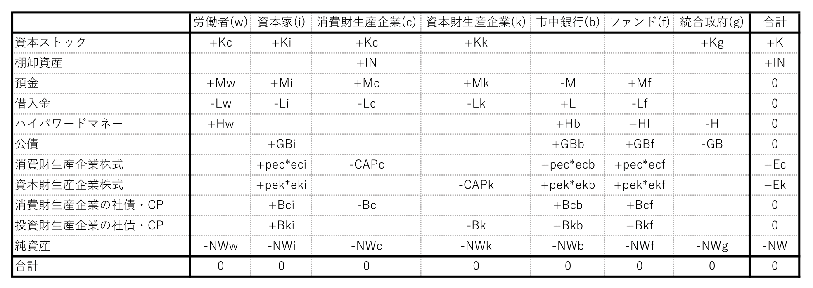
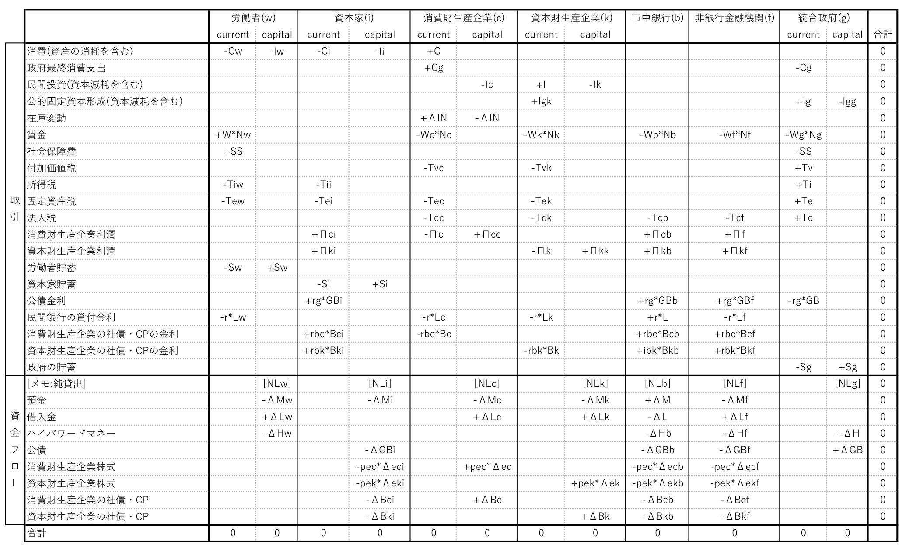
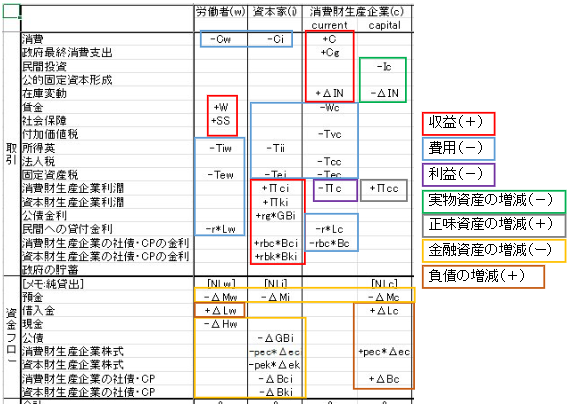
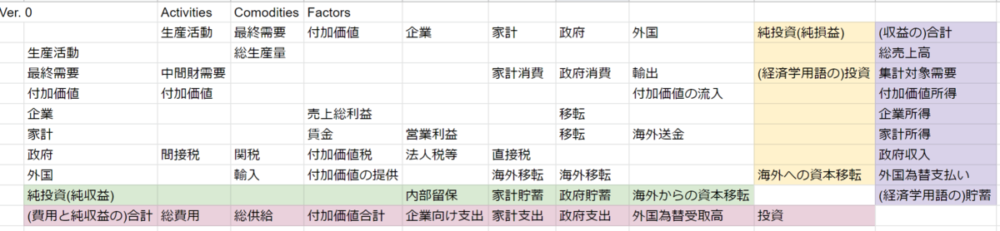

自信ない部分はこの色、編集の都合で残していて、完成版では削除する部分がこの色、どーでもいい部分や扱いを決めあぐねている部分はこの色

8時間かけて読んだら一通りわかる。くらいのボリュームを目指す。これを読んだ後自作し始めて、何かに引っ掛かったらまた戻ってくる、みたいな使い方に適する教材を目指す

使われる語句には私が勝手に翻訳したものも含まれる。最初になるべく元の英語を示すが、忘れているものもあるに違いない。

- [０，前提](#０前提)
- [１，SFCモデル(Stock-Flow consistent model)とは](#１sfcモデルstock-flow-consistent-modelとは)
  - [１－１，SFCモデルの原則](#１１sfcモデルの原則)
    - [①フローの整合性](#フローの整合性)
    - [②金融資産と負債の対応関係](#金融資産と負債の対応関係)
    - [③ストックとフローの整合性](#ストックとフローの整合性)
    - [④ストックからフローへのフィードバック](#ストックからフローへのフィードバック)
  - [１－２，SFCモデルの柔軟さ](#１２sfcモデルの柔軟さ)
  - [１－３，SFCモデルの性質を決める肝](#１３sfcモデルの性質を決める肝)
  - [１－４，SFCモデルの限界、予測と説明の意味について](#１４sfcモデルの限界予測と説明の意味について)
- [２，SFCモデルの作成の大雑把な手順](#２sfcモデルの作成の大雑把な手順)
- [３，SFCモデルで使われる式の分類](#３sfcモデルで使われる式の分類)
  - [３－１，会計恒等式](#３１会計恒等式)
    - [３－１－１，ストックとフローの整合性を表す恒等式について](#３１１ストックとフローの整合性を表す恒等式について)
  - [３－２，行動方程式(behavioural equation)](#３２行動方程式behavioural-equation)
  - [３－３，定義式](#３３定義式)
- [４，行列と会計恒等式](#４行列と会計恒等式)
  - [４－１，SFCモデルで頻繁に使われる行列](#４１sfcモデルで頻繁に使われる行列)
  - [４－２，バランスシート行列](#４２バランスシート行列)
  - [４－３，取引フロー行列](#４３取引フロー行列)
    - [４－３－１，取引フロー行列の例](#４３１取引フロー行列の例)
    - [４－３－２，純貸出の存在意義と、純利益との関係について](#４３２純貸出の存在意義と純利益との関係について)
    - [４－３－３，取引フロー行列の、変数の符号](#４３３取引フロー行列の変数の符号)
    - [４－３－４，Current列とCapital列、投資と純利益](#４３４current列とcapital列投資と純利益)
    - [４－３－５，株式及・資本金・利益剰余金の取り扱いについて](#４３５株式及資本金利益剰余金の取り扱いについて)
  - [４－４，社会会計行列](#４４社会会計行列)
  - [４－５，フローチャート](#４５フローチャート)
- [５，仮説と行動方程式](#５仮説と行動方程式)
  - [５－１，ポスト・ケインズ派による行動方程式の特徴](#５１ポストケインズ派による行動方程式の特徴)
  - [５－２，変数間の因果関係の向きと行動方程式](#５２変数間の因果関係の向きと行動方程式)
  - [５－３，行動方程式の例](#５３行動方程式の例)
    - [５－３－１，消費関数](#５３１消費関数)
    - [５－３－２，投資関数](#５３２投資関数)
    - [５－３－３，政府支出関数](#５３３政府支出関数)
    - [５－３－４，給与関数（呼び方？）](#５３４給与関数呼び方)
    - [５－３－N，ポートフォリオ方程式(金融資産の保有配分量の決定のモデル)](#５３nポートフォリオ方程式金融資産の保有配分量の決定のモデル)
- [６，モデルを閉じる](#６モデルを閉じる)
- [７，SFCモデルにとっての長期均衡あるいは定常状態について](#７sfcモデルにとっての長期均衡あるいは定常状態について)
- [８，SFCモデルの特徴、経路依存性と最適化の不必要性](#８sfcモデルの特徴経路依存性と最適化の不必要性)
- [９，カリブレーション](#９カリブレーション)
- [１０，様々なSFCモデル](#１０様々なsfcモデル)
  - [１０－１，開放経済モデル](#１０１開放経済モデル)
  - [１０－２，微分方程式による連続時間のモデル](#１０２微分方程式による連続時間のモデル)
  - [１０－３，モンテカルロ法との併用](#１０３モンテカルロ法との併用)
  - [１０－４，AB-SFCモデル](#１０４ab-sfcモデル)
    - [１０－４－１，ABモデル](#１０４１abモデル)
    - [１０－４－２，AB-SFCモデルの特徴](#１０４２ab-sfcモデルの特徴)
    - [１０－４－３，AB-SFCモデルの難しさと限界](#１０４３ab-sfcモデルの難しさと限界)
    - [１０－４－４，AB-SFCモデルの存在意義](#１０４４ab-sfcモデルの存在意義)
    - [１０－４－５，金融市場とAB-SFCモデル](#１０４５金融市場とab-sfcモデル)
- [１１，DSGEモデルとの対比](#１１dsgeモデルとの対比)
  - [１１－１，現実的な仮定と、現象の再現について](#１１１現実的な仮定と現象の再現について)
  - [１１－２，暗に含まれるイデオロギーについて](#１１２暗に含まれるイデオロギーについて)
- [１２，類似or発展的or補完的 情報源](#１２類似or発展的or補完的-情報源)
- [１３，注釈](#１３注釈)

### ０，前提
ストック・フロー一貫モデルの概要は、Wikipediaを読めば大雑把には掴めるんじゃないかと思う。がしかし、本記事も最後まで読んでいただければ、Wikipediaしか読まない場合より少しだけでも理解が深まると思う、多分....そうであってほしい.....。[Stock-flow consistent model - Wikipedia](https://en.wikipedia.org/wiki/Stock-flow_consistent_model)　私もこれくらい説明上手になりたい。

SFCモデルの基礎は会計の知識だ。人によっては、SFCモデルの勉強の前に、日商簿記3級の勉強を先にする方が良いかも。この記事は、複式簿記において、費用・収益・資産の増加・負債の増加・資産の減少・負債の減少を区別して認識できる読者を想定して書く。厳密さや詳細を追求する人は、高いレベルの知識が必要になるかもしれない。

### １，SFCモデル(Stock-Flow consistent model)とは
厳密な会計フレームワークに基づくマクロ経済モデル。モデル化された経済全体の、フローとストックの会計的な整合性を保証する。

SFCモデルにおける会計的な一貫性は、物理学におけるエネルギー保存則と似た立場にある。私の意見では、現実の経済をうまく説明・予測できるマクロ経済のモデルは、会計的な一貫性を満たしているはずだ、と思う。エネルギー保存則だけでは物理現象を説明・予測できないが、エネルギー保存則を破る物理現象は起こらない(と信じられている)。同じように、会計的な一貫性だけではどのような経済活動が起こるかを説明できないが、すべての経済活動に伴う会計には鉄則がある。

SFCモデルとの呼称は、いくつかの少しづつ異なる意味で使われるようだが、この記事では、以下の4つの原則すべてを満たすマクロ経済モデルを指す。

#### １－１，SFCモデルの原則
#####    ①フローの整合性
すべての資金やモノがどこからきてどこへ行くのかをもれなく示す、フローの一貫性。取引に伴う2者間のフローの一貫性(支払った金額と受け取った金額が常に一致する)を”水平整合性(‘horizontal’ consistency)”と呼び、すべての取引が一経済主体にとっては貸方と借方の項目を伴うという一貫性を”垂直整合性(‘vertical’ consistency)と呼ぶ。水平整合性と垂直整合性をまとめると、すべての取引が、簿記上で四ヵ所同時に計上される(2つの経済主体にとっての、借方と貸方→2×2=4)ことと対応した**四重計上の原則**(The quadruple entry principle)が成立する。

#####    ②金融資産と負債の対応関係
ある部門のすべての金融資産には、別の1つ以上の部門の負債が対応している。システム全体の純金融資産はゼロである。

加えて、システム全体の純資産と実物資産がバランスする。

金融資産と負債のバランスと、実物資産と純資産のバランスが、貸借対照表のバランスと対応する。

#####    ③ストックとフローの整合性
「期末の資産＝期首の資産＋期首の資産の評価額上昇分＋その資産に関連するフロー」で算出されるという、ストックとフローの整合性。

#####    ④ストックからフローへのフィードバック
ストックを表す変数[^1]が、フローを表す変数[^2]に対して、影響する必要がある。消費金額が保有する純資産に依存する、利払いが負債額に比例する、など。

#### １－２，SFCモデルの柔軟さ
モデルは何かを表現するために作られる。経済部門の設定・取引の種類の設定・行動方程式の設定次第で、様々な性質を示す無数のSFCモデルが作られる。ほとんどの場合、広い意味のポスト・ケインズ派によって用いられるモデルなので、しばしば「需要主導型の方程式体系」「内生的貨幣供給(資金需要が先に生まれ、その資金需要に合わせて貨幣・通貨が生み出され供給される)を表現する方程式体系の採用」などといった特徴を持つ。

#### １－３，SFCモデルの性質を決める肝
SFCモデルの性質を決定する最も影響が大きい要因は、おそらく２つ。

一つ目は、経済的な意思決定方法の理論およびモデルである。例えば、

・投資支出の水準が、内部留保・既存の借入額・稼働率などの関数で書かれる

・消費水準は所得と純資産の関数で書かれる

・価格水準は単位生産費用にマークアップを乗せる形で決定され、通常の稼働率付近では、一定期間価格が不変である

・金融機関は資本比率の法的な規制にのっとって行動する

・家計のための融資需要は所得の一定割合である

・企業は投資資金調達の一定割合を新規株式で行う

・生産性は一定か、場合によっては外生的に与えられた率で成長する

・インフレは、賃金労働者とその使用者の間の対立の結果である

などといったものだ。変数間の因果関係の構造も、ここに含む。

二つ目は、部門の分け方だ。AB-SFC(後述)であろうとそうでなかろうと、部門の分け方はそのSFCモデルで何を表現したいかを反映する。国際的な通貨危機の表現のために閉鎖経済のモデルを作るなどということはあり得ないし、部門の分け方を細かく詳しく多様にすれば良いというものでもない。

 

モデルの性質は、部門の分け方や、行動方程式(後述)が示す変数間の因果関係に、決定的に依存する。採用する前提の小さな変化がモデルの性質を大きく変えることもある。

複雑なモデルは事実に近づくかもしれないが、指数関数的に扱いづらく、因果関係の構造を理解しづらくなる。モデルを作る目的に沿った、適切な複雑さを選択することが求められる。

#### １－４，SFCモデルの限界、予測と説明の意味について
「根本的な不確実性を想定していること」「長期的な予測が事実上不可能だ。と信じていること」などを理由に、ポスト・ケインズ派は、説明と未来の予測を区別して考える。生物学者が、ダーウィン以来進化論を唱えながら、将来どのような生物が出現するのかを予測できないようなものだ(進化の示すパターンなどは、「自己組織化と進化の論理」という本など、面白い話がいろいろあるけど、細かい話は横に置かせてほしい)。モデルは、「モデルを作ったときに採用した仮説・前提・原理・パラメータたちが、未来にわたって現実的である」という極めて厳しい条件下でのみ、予測としての意味を持つ。過去のデータでカリブレーションしたパラメータを使って作ったモデルが、未来にもうまく当てはまるとは限らない。理論上・経験上不変だとされていたパラメータが変動することは、よくある。これは、すべてのマクロ経済モデル(動学的一般均衡モデルなども含む)に当てはまる。また、現実の一側面を再現する（現実とよくフィットしていたり、定型化された事実の多くを再現したり）モデルも、現実を正確に記述したものだとは限らない。ケインズが、数学に明るかったにもかかわらず、自分の理論を閉じた数学的形式(closed mathematical form)で表現することに消極的だった理由だそうだ[^3]。そうはいっても、「すべてのマクロ経済モデルがあらゆる面で将来にわたって無意味だ」と考えるのは極端すぎる。説明や予測を行うにあたって、経験的に安定した値をとるもの、あるいは政策当局が高い精度でコントロールできるものを、パラメータに採用してモデルを作ることが望ましい。

10～11年後の気候を推測することは、10～11年後の天気を推測するより簡単だ（気候は天気の移り変わりの一定のパターンのことを指す）。似たようなことが経済にも言える。例えば、バブルと不況を繰り返すマクロ経済の”気候”を説明するモデルを作ることはできるが、いつバブルが始まりはじけるかという”天気”を説明するモデルを作ることは(少なくとも現時点では)できない。SFCモデルは通常、”気候”を説明することを目的に据えている。

経済学は、物理学のように、時間を通して普遍の原理原則や理論を発見・構築することに適した分野ではない。人は、広い意味で学習し続ける生き物であり、自身が手に入れることのできる情報をもとに不完全な能力を使って判断し、大なり小なり異なる未来を予測し、その予測を適宜更新している。人の行動を扱う分野である以上、予測と説明を同じ精度で行えるようになるためには、人の行動を超高精度で再現するモデルが必要となる。現状、それは到底不可能だ。

ポスト・ケインズ派にとって、過去の事象の説明と未来予測は全く異なる意味を持つ。説明はあくまで後付けの説明に過ぎず、未来予測は数多くの前提ありきで行われる。

### ２，SFCモデルの作成の大雑把な手順
①目的を決める：どのような経済のモデルを作るのか（閉鎖経済を作るのかそれとも開放経済のモデルを作るのか、などといったこと）、どの程度の時間を扱うか、どのような現象を扱うか（金融不安定性を主に扱うかもしれないし、経済成長を扱うかもしれない）を決める

②部門分けを行う：家計・消費財生産企業・資本財生産企業・銀行・中央銀行・政府・外国などの、部門を定義する

③ストックとフローの変数を導入する：モデルで扱う部門間の取引の種類と資産および負債の種類を決め、フローとストックを表す変数を導入する

④会計的な一貫性を確認する：「モデルが満たすべき、会計的一貫性を示す恒等式」を示す。行動方程式次第で、どの式を、いつ、どの内生変数の計算に使うかが変わってくるので、行列やフローチャートを書くにとどめておくのが良いと思う

> *②～④は、行列やフローチャートを使って行われることが多い。*

⑤行動方程式を作る：それぞれの部門がどのようにして経済行動をとるかを示す、方程式を立てる。行動の原因に該当する変数を引数とする関数が、行動の結果に該当する変数を算出する。この段階で、どの変数を内生変数とし、どの変数を外生変数とするかを確定する。

⑥カリブレーションを行う：モデルの出力が、実際のデータとできるだけ一致するように、あるいは、再現したい現象が現れるように、パラメータを調整する

⑦感度分析を行う：政策当局が決定する変数の変化の影響を調べたり、パラメータ・外生変数の変更によって均衡の位置がどの程度変化するかを調べたりする

⑧モデルの出来を評価する：現実世界のデータと比較したり、目的の現象が再現されたりかどうか判断したり、既存のモデルが出力した成果と比較したりする。

 

### ３，SFCモデルで使われる式の分類
SFCモデルでは、各変数は3種類の式で関係を表現される。

####    ３－１，会計恒等式
「フローの整合性」「ストックの整合性」および「ストックとフローの関係の整合性」を表す恒等式で構成される、会計的な整合性を表す恒等式。会計的一貫性を保証できる組み合わせで会計恒等式が用いられなければならない。

少なくとも2つの恒等式が、ほかの恒等式の組み合わせで導出できる。ほかの恒等式の組み合わせで導出される恒等式は、モデルでは用いない(どの恒等式の組み合わせを選ぶかは任意)。モデルで用いない恒等式は、隠された等式(hidden equation)と呼ばれる。＃ここをわかりやすく。これじゃ伝わらない　もう少し具体的な言い方をしてみると。恒等式A=B, B=C, C=Aという3つの恒等式が使えるとき、C=AはA=BとB=Cの組み合わせとして導出可能なので、A=BとB=Cを含むモデルがはじき出した結果の会計的一貫性を確認するときに、C=Aになっているかどうかを見れば良い、といった感じ。

モデルで計算して出した結果が、隠された等式を満たしていれば、モデルに会計的な矛盾が含まれないことを確認できる。

フローの整合性を表す恒等式は、後述する取引フロー行列において、行と列であらわされる恒等式。

ストックの整合性を表す恒等式は、後述するバランスシート行列において、行と列であらわされる恒等式。

#####   ３－１－１，ストックとフローの整合性を表す恒等式について
ストックとフローの関係の整合性を表す恒等式は、差分方程式体系のモデルにおいて、価格pと量Xを用いて

$$p_{(t)} X_{(t)}=p_{(t-1)} X_{(t-1)} + \Delta p_{(t)} X_{(t-1)} + p_{(t-1)} \Delta X_{(t)} + \Delta p_{(t)} \Delta X_{(t)}$$

などとあらわされる。 $+ \Delta p_{(t)} X_{(t-1)}$ は、期首のストックの評価額上昇分に該当する項であり、
後述する取引フロー行列では記載しない。 $\Delta p_{(t)} \Delta X_{(t)}$ も記載しない。pとXの両方を可変とする場合、Xを変化させた後pが変化する、ということにするのではないかな。
ただ、差分方程式体系のモデルでは、モデルの複雑さを抑えるためだろう、pとXのどちらか一方しか時間変化しないという前提を採用することが多い。（ので、 $\Delta p_{(t)} \Delta X_{(t)}$ を考慮する必要はあまりないはず）

価格不変あるいは価格の概念がない変数(例えば預金やローンや価格不変の前提を追加された国債など)では

$$X_{(t)}=X_{(t-1)} + \Delta X_{(t)}$$

などとあらわされる。

期首の価格で取引されたと考えるか、期末の価格で取引されたと考えるか、それ以外の方法をとるか、そのあたりの設定が恒等式の細かい形を左右する。

連続時間のモデルでは、ストックを表す変数の時間微分でフローを表す場合、ストックとフローの整合性を表す恒等式を明示的に示す必要がないはずだ。

####    ３－２，行動方程式(behavioural equation)
「各経済部門(あるいは経済主体)の取引行動の意思決定の方法」を表現する仮説に該当する。内生変数ｚがほかの変数の関数 $F(x_1,x_2,x_3,,,)$ として書かれ、内生変数ｚが結果、ほかの変数 $x_1,x_2,x_3,,,$ が原因に位置づけられる。前期末までのストックが、しばしば、今期のフローを表す行動方程式で使われる(そのため、モデルは動的になり、経路依存性を持つ)。

「各経済部門(あるいは経済主体)の取引行動の意思決定の方法」には、大きく分けて5つのカテゴリーがある。

①エージェントがどのように支出を決定するかを表現する行動方程式。消費関数、投資関数、政府支出関数など。

②エージェントが純借入の資金調達方法をどのように決めるか、決めることができるかに関連するもの。「企業が収支の赤字分を株式と社債と銀行融資からどのような割合で賄うか」などを表現する。

③エージェントがどのように保有資産を配分するかを表す行動方程式。例えば、下でポートフォリオ方程式と呼称するような方程式である。

④生産性上昇・賃金・インフレ率の決定にかかわる方程式。

⑤金融システムの振る舞いを決定する行動方程式。中央銀行による内生的な貨幣供給(すなわち、資金需要水準などが原因となり、貨幣供給がそれらの原因の結果として決定する)や、銀行が与える与信の規模をどのように決めるかを表す方程式など。

行動方程式の中には、前期の変数が今期の変数に影響することを意味するものが含まれる。

 

内生変数がn個、会計恒等式の必要十分な数がk個のとき、合計n-k個の行動方程式または定義式が必要。会計恒等式の存在は、それが無い場合と比べてモデルの自由度を大きく低下させる(内生変数の数が同じなら、パラメータ・外生変数の数を減らせる。パラメータや外生変数の数が同じなら、内生変数の数が減らせる)。

####    ３－３，定義式
変数の定義のための式。

$総需要Y ＝ 消費C ＋ 投資I ＋ 政府支出G$

$稼働率u ＝ 潜在産出対資本ストック比率σ × 総生産Y / 資本ストックK$

$x^e_{(t)} = λ_e x^e_{(t-1)} + (1 - λ_e) x_{(t-1)}$
(期待値は慣習的に右上に $e$ の添え字をつける)

みたいな式。

 

 

### ４，行列と会計恒等式
典型的なSFCモデルが、どのように会計的な一貫性を保証し、どのように金融と実物の連動を保証しているのかを、説明していく。

####    ４－１，SFCモデルで頻繁に使われる行列
SFCモデルを用いる際は、多くの場合、

１，ストック(資産・負債・純資産)の会計的一貫性を表す行列

・バランスシート行列(Balance sheet matrix, あるいはBalance sheet account matrix)

２，フロー(費用・収益・損益)と、それに伴うストック移動および増減の、会計的一貫性を表す行列

・取引フロー行列(Transactions matrix、あるいはtransaction flow matrix)

・社会会計行列(Social accounting  matrix: SAM)

のいずれか

の、２種類の行列を用いる。AB-SFCモデル(後述)では、取引フロー行列の代わりにフローチャートを用いることが多い。

行列は、会計的な一貫性を保証するために満たすべき恒等式群を、視覚的に表現している。行列は、会計的な整合性を保証する”会計恒等式”を示すためのツールであり、モデルを解釈する人にとっては、それを復元するためのツールでもある。

行列を使うことによって、モデル内に「取引相手のいない謎取引」や「謎資産」が紛れ込んでいないかを確認することが容易になる。(しばしば、ブラックホールが存在しない、みたいな言い方をするようだ)

資金フローを表す変数や式(Δがつく変数が含まれる)は、バランスシート行列に書かれている変数と結びついている。 $X(t) = X(t-1) + ΔX(t)$ などといった具合に。

####    ４－２，バランスシート行列
バランスシート行列は、例えばこんな感じに書かれる(多くのモデルではもっとシンプル)。

    
     
    <em>バランスシート行列の例</em>

バランスシート行列(ストックを表す行列)は、カラムが経済部門、インデックスがストックの種類(現金とか、債券とか)を示す。資産を＋記号を付けて表現し、負債や純資産をー記号を付けて表現する。貸借対照表において借方に記載される分が＋、貸方に記載される分が - と思えば良いかと。

一番下の行には、それ以外の行の合計値が書かれ、値は0である（貸方と借方が常にバランスすることと対応する）。

一番右の列には、それ以外の列の合計値が書かれる。そのストックの、経済全体で見た合計を示す。金融資産を表す行では、純金融資産は0なので0が書き込まれ、固定資本や棚卸のような実物資産を表す行は、0より大きい値になる。（生産活動は、実物資産と純資産を同額増加させる。固定資産や棚卸の行の一番右の列に0ではない値が出るのはそのせい。）

バランスシート行列と名乗るだけあって、バランスシート(貸借対照表)に対応する。

金融資産には対応する金融負債があって、すべての金融資産と金融負債を相殺すると0になる。また、実物資産は純資産とバランスする。バランスシート行列の右端の列で、金融資産は0、質物資産は+で書かれることで、それらが表現されている(純資産はー)。

####    ４－３，取引フロー行列
フローを表す行列。カラムが経済部門、インデックスが資金の流れの種類を示す。

取引フロー行列上の変数は、取引を表す変数(=収益・費用・損益を表す変数)と、資金フローを表す変数(=金融資産・負債の増減を表す変数)に大別される。

資金フロー(金融資産および負債の増減)を表す行は、取引フロー行列上では、 $\Delta X$ といった具合にΔをつけた変数を用いて表記される。これは、バランスシート行列上の変数Xとの関係を、 $X(t)=X(t-1)+ΔX(t)$ という風に書きたいからだと思われる。

一番下の行はそれ以外の行の合計、すなわち0になる(収益ー費用ー損益＝０, あるいは 資産の増加分ー負債の増加分ー純資産の増加分＝０　に該当)。

一番右の列はそれ以外の列の合計が記載され、値は0になる(誰かの費用＝他の誰かの収益、誰かの金融負債の増加＝他の誰かの金融資産の増加　に該当)。

なお、行列上には[メモ]の行が挿入されている場合が多い。[メモ]の行の変数は、列の合計の計算の対象にならないし、純貸出(Net Lending)を表す場合などの例外を除き、行の合計が0ではない。[メモ]の行は存在しなくても成立するので、あくまでもメモの役割と思われる。

#####   ４－３－１，取引フロー行列の例
取引フロー行列は、費用・収益・損益と、それらに伴う資産・負債・純資産の増減を記載する行列。例えばこんな感じに書かれる。

    
     
    <em>取引フロー行列の例</em>

#####   ４－３－２，純貸出の存在意義と、純利益との関係について
ちなみに、これらの例における純貸出(net lendingの翻訳)は、保有する純金融資産の今期の増減分であり、

「純貸出」＝「純資産の増加分」ー「実物資産の増加分」＝「金融資産の増加分」ー「負債の増加分」

である。すべての部門の純貸出の合計は常に0である。

純貸出をわざわざ導入するのは、純利益と純貸出を区別したいからではなかろうか。純貸出は、金融の不安定性・持続可能性・企業の資金繰りなどの議論の文脈で、純利益(利潤ともいう)よりも有用だと思う。

家計・企業・預金取扱機関ではない民間金融機関にとって、純利益と純貸出の関係は、

>税引き後当期純利益(＝PKの言う企業利潤、損益の一種)
>＝現預金増加分-債務(買掛金、借入金、その他債務など)増加分+現預金以外の債権(売掛金、その他債券など)増加分＋投資(実物資産増加分)
>＝純貸出+投資(実物資産増加分)
>この式本当？

。純利益が+なのに純貸出が-になることもありうる。

民間銀行にとっては注釈[^4]。中央銀行にとっては注釈[^5]、政府にとっては注釈[^6]。

純貸出は、部門の純金融資産の純増分であり、取引の行のcapital列の合計に等しい。currentとcapitalの区別がない場合は、純貸出は、取引の行の合計に等しい。

#####   ４－３－３，取引フロー行列の、変数の符号
取引フロー行列の変数の符号の付き方は、「資金源(資金の増加)に+をつけ、資金用途(資金の減少)にーをつける」と説明されることが多い。が、この説明だと、資金フローの行や利潤の行や投資の行を見ているときに、混乱してしまうのではないだろうか（「資金」という言葉のニュアンスが、抽象的で難しいからだろう）。この記事では、別の言葉で符号の付き方の規則を説明する。慣れてくると、「資金源(資金の増加)に+をつけ、資金用途(資金の減少)にーをつける」と説明したくなる気分もわかるようになるはず。

＋とーのつけ方にはルールがある。

取引の行(Capital列を除く)において、
>-   「損益計算書で**借方**に計上される勘定科目」が発生する場合はー
>-   「損益計算書で**貸方**に計上される勘定科目」が発生する場合は＋

資金フローの行とCapital列において、
>-   「貸借対照表で**借方**に計上される勘定科目」の**増加**はー
>-   「貸借対照表で**貸方**に計上される勘定科目」の**増加**は＋
>-   「貸借対照表で**借方**に計上される勘定科目」の**減少**は＋
>-   「貸借対照表で**貸方**に計上される勘定科目」の**減少**はー

というルールだ。別の表現だと、
>-   （＋）収益
>-   （ー）費用
>-   （ー）利益
>-   （＋）損失
>-   （ー）金融資産の増加
>-   （＋）金融資産の減少
>-   （＋）負債の増加
>-   （ー）負債の減少
>-   （＋）純金融資産の増加
>-   （ー）純金融資産の減少
>-   （ー）実物資産の増加
>-   （＋）実物資産の減少

となる。負の金融資産は負債であり、負の負債は金融資産、負の純資産は純負債。そんなところ。

    
     
    <em>符号のつけ方</em>

#####   ４－３－４，Current列とCapital列、投資と純利益
経常的な取引を示す列(Current)と資本・金融勘定を示す列(Capital)を持つ場合が多い。おかげで、部門内で行われる投資や税引き後当期純利益を扱うことができる。

Currentの列は、費用と収益と損益を表す。費用・利益はマイナスで表記され、収益・損失はプラスで表記される。損益計算書で借方に記載される科目を、取引フロー行列ではマイナス表記。損益計算書で貸方に記載される科目を、取引フロー行列ではプラス表記。

Capitalの列では、バランスシート上で貸方に計上される項目の増加（＝負債の増加・金融資産の減少）に＋をつけて表記し、借方に計上される項目の増加（＝金融資産の増加・負債の減少）をーをつけて表記する。

上の例の企業以外のような、CurrentとCapitalを区別しない列では、「部門内で行われる投資や税引き後当期純利益のような、CurrentとCapitalの列が存在しないと表現できない項目」が無い。無いからこそCurrentとCapitalを区別する必要がない。仮に区別した場合も、モデルのパラメータや行動方程式の数は変化しない。

投資や減価償却の行は、異質な変数で表現される。この行は、保有する実物資産の増減を扱う部分だ。本来なら消費活動も同様に扱うべきなのかもしれないが、言い換えると、消費者が財やサービスを消費していく過程で”減価償却”するのだから、消費(購入)と消費(使用)で別の行を作るのが原理原則にのっとった考え方なのかもしれないが、そのようなモデルは見たことがない。わざわざモデルの複雑さを増すメリットがない上に、どのような”減価償却曲線”が適切なのか分からなさすぎるから、だろうか(私の主観)。

投資（資本減耗を含む）＝ 投資（資本減耗を含まない）- 資本減耗

同じことを言い換えると

投資（付加価値増加額）＝ 投資（投資支出額）- 資本減耗

#####   ４－３－５，株式及・資本金・利益剰余金の取り扱いについて
株価不変という前提を採用する場合、株式は金融資産として扱い、資本金を返済の必要がない負債として扱うのが、SFCモデルにおいては収まりが良く、普通はそのように扱われている。ただ、株式を金融資産として扱い、バランスシート行列に書かれる株価が変動する限り、株価の変動に伴って資本金が変動するという珍事を許容しなければならない。株の時価総額が上がれば、負債としての資本金が同じだけ大きくなり、企業の利益剰余金に該当する変数が同じだけ小さくなる。（資本金や利益剰余金が行動方程式を通じてほかの変数に影響を与えることがなければ、気持ち悪いだけで問題ではない）

株式を実物資産、資本金を純資産とカテゴライズすると、株価の変動に対して資本金や利益剰余金ではなく株式保有者の純資産が対応する。株価の変動と、資本金や利益剰余金を、切り離すことができる。

また、国債や社債やコマーシャルペーパーなどは、市場の価格と額面が一致しないものだ。株式も同じように考えて、バランスシート行列上の株価を簿価の平均値とし、時価を別の変数で導入する方法もある。ただ、株価が安いときに新規株式を発行し、株価が高いときに自社株買いを行うと、バランスシート行列上の株価（簿価の平均の株価）がマイナスになるという、新たな珍事が発生する可能性も理論上ありうる。（バランスシート行列上の株価が行動方程式を通じてほかの変数に影響しない限り、気持ち悪いだけで問題ではない）

####    ４－４，社会会計行列
フローを表す行列には、社会会計行列(SAM：Social Accounting Matrix)と呼ばれるものもある。取引フロー行列の代わりにSAMを使い、バランスシート行列と組み合わせてSFCモデルを作ることもある。取引フロー行列を使うか、SAMを使うかは、かなりの部分が好みの問題になる。

社会会計行列は、例えばこんな感じに書かれるはずだ。

    
     
    <em>社会会計行列の例</em>

社会会計行列はインデックスもカラムも経済部門である。＃経済部門とは違う。分配の所属とでも言う？適切な単語があるとは思うけど、知らない

列は、カラムの経済部門全体から他の経済部門への費用(支払い)と利益を表す。行は、インデックスの経済部門が他の経済部門から受け取る収益(収入)を表す。損益計算書の借方に記載される項目が社会会計行列の列に、損益計算書の貸方に記載される項目が社会会計行列の行に記載される。

行列の一番下にほかの経済部門への費用と損益の合計に該当する行をもち、一番右にほかの経済部門からの収益の合計に該当する列を持つ。費用＋損益＝収益の関係がある。(損益計算書のバランスは常に維持される)

バランスシート行列や取引フロー行列と違い、符号がつかないのが普通。それから、取引フロー行列と違い、資金フローを書かない。資金フローの行を取り除き、Net Lendingの行を一番下に追加した取引フロー行列のような情報だ。

####    ４－５，フローチャート
部門をボックス、取引を矢印で表した、フローチャートが、取引フロー行列やSAMの代わりに用いられることがある。
取引フロー行列やSAMと異なり、部門内での投資や棚卸資産の増減などが、モデルに含まれていても書かれないことが多い。また、どの部門がどの種類の金融資産および負債を増減させる可能性があるのかについても、普通は書かれない。
個人的には、少なくともエージェント・ベースではないSFCモデルでは、フローチャートよりも取引フロー行列を用いることを推奨する。

### ５，仮説と行動方程式
####    ５－１，ポスト・ケインズ派による行動方程式の特徴
新古典派経済学は、市場は価格変動によって調節されると考える。需要や供給の増減に対して、価格と数量の両方が敏感に反応する、と考えるのだ。一般均衡理論。

一方のポスト・ケインズ派などは、供給量が期間内の需要に適応して増減し、短期間において価格は一定で推移すると想定する。供給量が期間内の需要にどのように適応するか？バッファをもって各経済主体が意思決定していると想定することによって。バッファの種類は、企業にとっての在庫や内部資金、家計にとっての預金、(中央)銀行の内生的貨幣供給、イールドカーブコントロールのための注文など。不確実な世界で意思決定を下さなければならない以上、バッファをあらかじめ用意しておいて、予測できない変化に備えておくのが自然だ、というわけだ。

新古典派経済学や多くのニュー・ケインジアンの理論を前提としたモデルは、制約条件下での「最適化」が行われる(予算をはじめとした制約の中で、効用や利潤などを最大化する)。モデルの主な関心ごとは(労働力みたいなのも含めた広い意味での)資源の分配など。

一方のポスト・ケインズ派のSFCモデルでは、経済主体はしばしばストックとフローの比率を目標に持っていて(売上高に対する在庫比率、自己資本比率など)、その目標の比率の維持のために意思決定する。モデルの主な関心ごとは、内生変数の値の時間変化など。

####    ５－２，変数間の因果関係の向きと行動方程式
行動方程式は、左辺に内生変数、右辺に式をもつ。右辺の式で用いられる変数が、左辺の内生変数の原因とされる。行動方程式は、モデルで用いられる変数間の因果関係の向きも表現している。
慣習的に、ストックの変数は、添え字がないときは期首の値を表す。期末の値は次期の期首の値と等しく、 $X_{+1}$ といった具合に添え字を使う。商品の価格も、多分、ストックの変数として扱われている。フローの変数は、今期のフローが添え字なし、前期のフローは $\Delta X_{-1}$ や $X_{-1}$ 、次期のフローは $\Delta X_{+1}$ や $X_{+1}$ といった具合。「期末のストック」＝「期首のストック」＋「フロー」で表される場合、 $X_{+1} = X + ΔX$ などという書き方になる。

####    ５－３，行動方程式の例
行動方程式の例を書いてみる。あくまで例。現実的じゃないとか、複雑すぎるとか、そんなこと言われても知らん

ここでは、用いられる変数がすべて”名目値”を表す。物価水準と実物量(あるいは実質値)を別の変数で書き、名目値はその積で表す場合が多いが、ここでは簡単な説明のために、名目値を用いる。

行動方程式には、前期末(まで)のストック(の推移)が、今期のフローに影響を与えることを表すものが含まれる。ストックがフローに影響を与え、フローがストックに蓄積される。このようなフィードバックループが、モデルを動的にし、経路依存性を持たせる。

#####   ５－３－１，消費関数
消費を表す関数は例えばこのようになる
$$C=\alpha_1 YD^e + \alpha_2 V$$
消費Cが、期待する可処分所得 $YD^e$ と前期末(今期首)の純資産 $V$ で書かれている。因果関係の向きは(Y, V)→Cである。

#####   ５－３－２，投資関数
投資関数は例えばこのようになる
$$g=\frac{I}{K}=\beta_0 + \beta_1 \frac{\Pi_{-1}}{K}-\beta_2 + \beta_3 \frac{L + p E}{K} + \beta_4 \frac{Y_{-1}}{K}$$

この例では、gは資本ストックK当たりの投資Iを表し、前期の内部留保増加分Π・借入L・時価総額(株価pと発行量Eの積)・生産量Y・資本ストックKによって書かれる。

#####   ５－３－３，政府支出関数
$$G = \gamma K$$

#####   ５－３－４，給与関数（呼び方？）
$$W＝W_{-1} + δ \frac{Y_{-1}}{K}$$

#####   ５－３－N，ポートフォリオ方程式(金融資産の保有配分量の決定のモデル)
株・債券・手形・預金などの金融資産のポートフォリオ選択について、SFCモデルでは、頻繁に、以下のようなベクトルや行列を用いて行動方程式が書かれる。

$$
    \begin{pmatrix}
        D\\
        A_{ST}\\
        P_{LT}A_{LT}
    \end{pmatrix}
    =
    \begin{pmatrix}
        \lambda_{10}\\
        \lambda_{20}\\
        \lambda_{30}
    \end{pmatrix}
    V + 
    \begin{pmatrix}
        \lambda_{11} & \lambda_{12} & \lambda_{13}\\
        \lambda_{21} & \lambda_{22} & \lambda_{23}\\
        \lambda_{31} & \lambda_{32} & \lambda_{33}
    \end{pmatrix}
    \begin{pmatrix}
        i_D\\
        i_{ST}\\
        i_{LT}
    \end{pmatrix}
    V +
    \begin{pmatrix}
        \lambda_{14}\\
        \lambda_{24}\\
        \lambda_{34}
    \end{pmatrix}
    YD
$$

$D$：(要求払)預金

$A_{ST}$ : 短期資産の価格

$P_{LT}$：債権であると想定できる長期資産の単位量当たりの価格

$A_{LT}$：債権であると想定できる長期資産の量(どこそこの株を何万株とか、そういう感じ)

$V$：資産総額

$i$：収益率。 $i_X$ はXの収益率

$YD$ : 可処分所得

$λ_{ij}$：(”定型化された事実”に基づく？)パラメータ

期首の資産総額・利回りや金利・今期の収益が原因となって、期末の資産の配分という結果が計算される。というモデルだとわかる。

$\lambda_{i0}$ は各資産の”normalな”保有割合。

$\lambda$ には、 $V = D + A_{ST} + P_{LT}A_{LT}$ を常に成立させる、以下のような綺麗な十分条件が存在する。この条件は必ず満たされなければならない。

$$
    \begin{matrix}
        \lambda_{10}+\lambda_{20}+\lambda_{30}=1\\
        \lambda_{11}+\lambda_{21}+\lambda_{31}=0\\
        \lambda_{12}+\lambda_{22}+\lambda_{32}=0\\
        \lambda_{13}+\lambda_{23}+\lambda_{33}=0\\
        \lambda_{14}+\lambda_{24}+\lambda_{34}=0
    \end{matrix}
$$

$\lambda_{i0} > 0 \ \forall i \in \{1,2,3\}$

ベクトルや行列を用いた行動方程式がメジャーなのは、このような式とセットで、資産配分の整合性を保ちつつ簡潔に記述できるから、だと思われる。上に加えて、下の条件も満たしていることが望ましいとされる（ことが多い？）。

$$
    \begin{matrix}
        \lambda_{ii}>0\\
        \lambda_{ij}=\lambda_{ji}<0
    \end{matrix}
$$

ただし $i \neq j$

$\lambda_{ii} > 0$ および $\lambda_{ij} < 0 \ \ \  (i \neq j)$ は、金利・利回りが高い資産は多めに保有するインセンティブが働くということ。

$\lambda_{ij} = \lambda_{ji}$ は、2種類の資産の金利・利回りが同時に同じだけ増減するとき（例えば国債利回りと配当利回りが同時に1％上昇するとき）は、2つの資産の保有額の差が変化しない。

$$
    \begin{matrix}
        \lambda_{11}+\lambda_{21}+\lambda_{31}=0\\
        \lambda_{12}+\lambda_{22}+\lambda_{32}=0\\
        \lambda_{13}+\lambda_{23}+\lambda_{33}=0\\
    \end{matrix}\\
    \lambda_{ij} = \lambda_{ji}
$$
が満たされているとき、
$$
\begin{matrix}
        \lambda_{11}=-(\lambda_{12}+\lambda_{13})\\
        \lambda_{22}=-(\lambda_{21}+\lambda_{23})\\
        \lambda_{33}=-(\lambda_{31}+\lambda_{32})
\end{matrix}
$$
も成り立つ。

このような資産や収益に対して線形の関係でポートフォリオ選択を表現するモデルが、どの程度現実に説明能力を持つのかは私は知らないが、SFCモデルの中でよく使われている印象はある。非線形な関数でも連続である限りは局所的には線形っぽいので、想定される位置の周りで線形のモデルを使おうってのは、ありそうな話。

### ６，モデルを閉じる
会計恒等式と行動方程式が、内生変数の数を規定する。SFCモデルを作る過程で、どの変数を内生変数にし、どの変数を外生変数にするのか、決めなければならない。どの変数を外生変数にするかを決め、モデルで用いられるすべての内生変数が、行動方程式や会計恒等式や定義式を用いて解くことができる（数値解も含む）状態にすることを、モデルを閉じる（close the model）、と呼ぶ。

### ７，SFCモデルにとっての長期均衡あるいは定常状態について
SFCモデルにとって、長期均衡とは、ストックやフローを表すすべての変数が、お互いに相対的な大きさを維持する状態のことだと思われる。tの増加に従ってすべての変数xが $x=x_0 exp(\alpha t)$ 　(ただし $x_0$ はxに固有の実数定数)　に収束する場合など。定常状態とは、任意の変数 $x_{(t)}$ が $x_{(t)}=x_0$ に収束すること。

長期均衡及び定常状態は、パラメータや外生変数が $x=x_0 exp(\alpha t)$ という条件の下で、(モデルの上では)実現しうる。

ただ、現実の経済では普通、パラメータや外生変数(に該当する現象)が時間変化する。しかも、古い均衡から新しい均衡への移行経路自体が、新しい均衡の位置に影響を与える＃言いたいことがわからない。「内生変数の数」次元の、状態を表す空間があって、そこにポテンシャルがあって、状態の運動が描く軌跡がある。そんなイメージ。わかりやすく。加えて、どの程度の範囲を「均衡している状態」に含めるのかによるが、「現実の経済がしばしば均衡を実現している」という想定を成立させつつ、同時に「均衡を分析することに意義がある」と言える状態が、現実によくある保証は無い。「均衡している状態」の幅が大きく明確な境目が無いのであれば、経済はしばしば「均衡する」ものの、意味のあることをほとんど何も言えなくなる可能性が高い。「均衡している状態」の幅が小さく明確な境目が存在するのであれば、経済は滅多に均衡しないか、外生変数・パラメータの変動が頻繁に発生するので、長期均衡や定常状態に「分析の参考」以上の価値を見出すことが難しい。＃文が汚すぎ。書き直し

 

### ８，SFCモデルの特徴、経路依存性と最適化の不必要性
SFCモデルでは、ストックとフローの時間変化を記録していくため、ストックとフローの比率や、フローとフローの比率の時間変化を扱うことに長けている。また、ストックからフローへのフィードバックが存在することから、SFCモデルは経路依存性を持つ。加えて、新古典派やニュー・ケインズ派が言う意味での最適化された行動の仮定は、モデル作成において必要ではない(含むこともできるだろうが、意味があるかどうか)。

これらの特徴から、SFCモデルは、長期のトレンドだけでなく、短期～中期の景気変動などの現象を扱いやすい。パラメータを時間変化させることで外生的に景気変動を起こすこともできるし(DSGEでも似たことをしている)、「学習」「ランダムさ」「債務不履行に該当する概念」などを導入することで、内生的に景気変動を起こすこともできる。

現実の経済では、安定した経済成長は、経済の不安定性の原因になりうる。

安定した経済成長の下では、個々の経済主体にとっての適応的な行動は、よりリスクをとった行動だ。所得が安定した割合で順調に増えているのであれば、消費性向を高めに保つことが家計の生活水準を上げるための適した行動になる。需要が安定して増えているのであれば、企業は投資による生産能力拡張を通じて将来の市場シェアの維持獲得を狙うことが適応的だ。金融資産の全体的な価格が長期間安定して伸びているのであれば、より高いレバレッジをかけた売買を行うことで期待利益を最大化できる。不況下では信用を得られないような金融商品・債務も、好況下では問題なく流通・償還されうる。

安定した経済の成長は、民間部門の資金調達における負債依存度を上昇する圧力になる。また同時に、安定した経済の成長は、流動性の低い金融資産および負債の、増加と流通を促す圧力になる。（安定した経済成長が必ずそれらを実現する、という意味ではない。）経済の安定した成長は、経済の性質を不安定なものに変える力を持つ。民間部門の資金調達における負債依存度の上昇や、流動性の低い金融資産および負債の増加は、好況やバブルの発生と同時に実現しうるが、不況やバブル崩壊の原因にもなる。したがって、コロナショックのような珍しいイベントがなかったとしても、(当局に高度に統制されていない)経済は、景気変動を失わないであろう。短期・中期的な変動が失われない限り、モデルがそれを再現することにも多少の価値があるのではないだろうか。

 

### ９，カリブレーション
モデルの、パラメータの「いい感じの値の組み合わせ」を選ぶ作業は、推定(estimation)と、カリブレーション(calibration)がある。カリブレーションではく校正と訳すことも多いと思う。

BingAIによると、

>estimationとは、モデルのパラメータや構造を実際のデータに当てはめることで推定する方法です。estimationには、最尤法やベイズ法などの統計的手法が用いられます。estimationの利点は、モデルの妥当性やパラメータの信頼性を検証できることです。estimationの欠点は、計算コストが高く、データの質や量に依存することです。

また、

>calibrationとは、モデルのパラメータや構造を理論的な仮定や既存の研究に基づいて設定する方法です。calibrationには、Time Elimination法やカリブレーション法などの数値的手法が用いられます。calibrationの利点は、計算コストが低く、データの制約を受けないことです。calibrationの欠点は、モデルの妥当性やパラメータの信頼性を検証できないことです。

だそうだ。実証研究で直接計測した値を使ったらカリブレーションで、与えられたデータと実験モデルの兼ね合いで値を推定したら推定かな？
 

### １０，様々なSFCモデル
####    １０－１，開放経済モデル
開放経済を扱ったモデルも、もちろん、多く存在する。ユーロ圏の財政破綻を議論するモデルなど。どうやら、SFCモデルの黎明期から、開放経済のモデルは存在した。

####    １０－２，微分方程式による連続時間のモデル
多くのモデルでは四半期・一年などの一定期間ごとにフローを計算し、ストックを更新するが、連続時間のモデルを作ることもできる。解析的に解くときは、連続時間のモデルを使うことになると思う。

連続時間のモデルのメリットは、

・差分方程式系より微分方程式系の方が解析的に扱いやすい

・意思決定のタイミングを連続時間の中で確率的に発生するイベントだととらえるほうが現実的。（例えば、投機の意思決定のスパンと賃金改定の意思決定のスパンは全然違うが、差分方程式でモデルを作るときにはこれを同じものとして扱うか、行動方程式で用いる過去の変数の数を増やさなければならない。）

などにある。

連続時間のモデルは、自然科学や工学でシミュレーションで広く利用されてきた。連続時間のモデルを作るとき、物理的なシミュレーションや、電子回路の制御などの、洗練されたツールやノウハウを転用できるかもしれない。

連続時間のモデルでは、意思決定とその判断材料になるイベントとの時間差の表現のために、畳み込み積分を多用することになるかもしれない。自分では見たことないけど。畳み込み積分を多用するなんてことになると、解析的に説くのがかなり難しくなりそうだし、数値計算も計算量が一気に多くなりそうだから、何かしら良い工夫がなされているのかもしれない。

####    １０－３，モンテカルロ法との併用
「均衡(あるいは定常状態)が安定しているかどうかを検討」したり、「式のパラメータと内生変数の初期値の組み合わせが少しづつ変わったときに、全く異なる位置で短期及び長期の均衡を生み出さないか」を試すため、ほかにも「経済主体が持つ意思決定の一定のランダムさを再現」するために、モンテカルロ法を用いることがある様子。

ポスト・ケインズ派は、リスクと不確実性の違いを重視している（文脈によるのだろうが、個人的には、リスクよりもむしろ不確実性の影響の大きさを強調することが多い印象）ので、リスクしか取り扱えないモンテカルロ法に対して距離をとっている人が多い、らしい。

####    １０－４，AB-SFCモデル
#####   １０－４－１，ABモデル
Agent Based Modelについては、この記事を編集している中の人は全く詳しくないが、Wikipediaに書いてあることがなんとなく解れば、ABモデルの理解には十分かと思う。ということで、日本語Wikipediaのリンクを貼っておく。私が説明するより生産的ではないかな。
[エージェント・ベース・モデル - Wikipedia](https://ja.wikipedia.org/wiki/%E3%82%A8%E3%83%BC%E3%82%B8%E3%82%A7%E3%83%B3%E3%83%88%E3%83%BB%E3%83%99%E3%83%BC%E3%82%B9%E3%83%BB%E3%83%A2%E3%83%87%E3%83%AB#:~:text=%E3%82%A8%E3%83%BC%E3%82%B8%E3%82%A7%E3%83%B3%E3%83%88%E3%83%BB%E3%83%99%E3%83%BC%E3%82%B9%E3%83%BB%E3%83%A2%E3%83%87%E3%83%AB%EF%BC%88Agent,%E3%83%88%E3%81%99%E3%82%8B%E3%82%82%E3%81%AE%E3%81%A7%E3%81%82%E3%82%8B%E3%80%82)

エージェントベースモデルの多くに当てはまる特徴には、以下のようなものがある。
- ミクロの相互作用の結果として、マクロの性質が形作られる。また、マクロの性質からエージェントが影響を受ける。代表的個人の仮定とは対照的。
- 各エージェントは、均質ではない。様々な点で異質でありうる。
- ミクロの振る舞いとマクロの性質が、ともに適応し、進化する。ミクロにはエージェントが”学習”し、行動パターンを変化させる。ミクロの相互作用の集積として現れるマクロの性質は、エージェントの学習の結果に従って進化する。しばしば不可逆な変化を見せる。
- エージェントが経済合理的な行動をとるにはあまりにも複雑すぎる環境になる。エージェントは限られた情報から判断を下す必要がある。
- 系が非定常的。

#####   １０－４－２，AB-SFCモデルの特徴
ABM(Agent Based Model)は、経済を扱ったモデルであっても、会計的な一貫性がないものもある。が最近は、Agent Basedでありながらストックとフローの一貫性を保証するモデル＝AB-SFCモデルが、用いられることも多い。現実の経済は、自律的な意思決定をする(ように見える)経済主体が、数多く集まって相互に影響しあう。Agent Basedなモデルを用いることの利点は、動学的一般均衡モデルにおけるミクロ的基礎づけ(microfoundations)のような現実との乖離が激しい前提を採用せずに、本当の意味でミクロとマクロの懸け橋になることだろう（個人的には、Agent-BasedではないSFCモデルの部門の行動方程式すら、現実との乖離が激しいせいでモデルから主張できることが少ないと感じる。ただ、DSGEモデルよりもSFCモデルの方がましなのは、行動方程式が最適化問題と結びつかなくてもよいという自由さがあること。新古典派やニューケインズ派の経済学者が言うような意味の合理性は、現実的じゃない。非現実的な仮定に縛られる必要がないこと自体は、SFCモデルの大きな利点だ）。

Agent-Basedなモデルを作ることの重要な恩恵として考えられるのは、「実質所得の分布の変化による効果」や「企業間の権力の影響」がマクロに与える影響に真正面から向き合えることや、「自己組織化」や「制度や認知判断能力が経済の性質に与える影響」を明示的にすること(明示しないとモデルが作れない。例えば企業が価格を決めるときは、限界費用や限界収益を知ることができないという前提をモデラーが採用する場合、限界主義的な行動方程式は採用されない。代わりに、例えば、生産コストにマークアップを上乗せするような価格決定方法が広く採用される。)ではないだろうか。同じような性質の経済主体でも、少しづつ異なる意思決定の方法や保有する能力を付与することもできる。倒産・起業・就職・失業もモデル化できる。任意の経済主体の意思決定が経済主体間の相互作用を通じてマクロ経済の性質を形作り、経済主体間の相互作用が特定の経済主体の運命を決める、というような直感的な動作が再現できるはずだ。市場シェアの動態的変化や、外生的な要素(モンテカルロ法の偶然の要素・モデル内の他の変数で説明できない変数など)次第で様々な運命をたどる経済主体のふるまいなどを再現することができるし、エージェントが過去の経験から学んで行動を変えるという学習の効果を付与することもできる。

定型化された事実の中には、所得分布や企業規模の分布など、分布に関するものも含まれる。AB-SFCモデルの仕事には、それを再現することも含まれる。

#####   １０－４－３，AB-SFCモデルの難しさと限界
AB-SFCモデルは、ABではないSFCモデルと比べると、必要な仮定や理論が非常に多い。消費者はどの企業から財やサービスを買うのか、消費財を生産する企業は中間財の生産者とどのような取引ネットワークやバリューチェーンを作るのか、企業が資金調達のために銀行から融資を求める場合どの銀行を選ぶのか、労働者に対してどのような割合で賃金が分配されるか、失業や新規雇用はどのような意思決定の結果行われるのか、etc.　現実に近い挙動を示すモデルを作ろうとすると、それがどんなに複雑なことかを思い知らされるはずだ。AB-SFCモデルでは、各々のエージェントのふるまいを現実的にしたければ、実証研究や行動経済学などなどからアイデアを輸入する必要がある。シンプルなSFCモデルと比べると、非常にとっつきにくい。

AB-SFCモデルにも限界はある。AB-SFCモデルでリアルさを追い求め始めると、経済主体間の相互作用やその結果として生じるフィードバックがあまりにも多様になりすぎる。因果関係を自然言語で説明することが非常に困難になりうるし、解析的に説くことは事実上不可能だろうし、モデルを完成させるためだけに、エージェントの行動の選択肢を現実よりも大幅に狭める必要に迫られるだろう。リアルさとモデルの完成との間にトレードオフが存在する。

さらには、苦労して作ったAB-SFCモデルの精度が、大半の現象の説明において、ABではないSFCモデルよりも優れている保証はない（例えば、市場シェアや家計の所得が対数正規分布しがちということだけ精度良く再現し、他はボロボロ、なんてことになるかもしれない）。モデルに採用できる程度に単純なアルゴリズムが、現実の人や組織がどのように行動するのかを、要求される以上の精度で表現できるとは限らないからだ。

ただ、悲観する必要は全くない。すでに多くの定型化された事実を精度良く再現するAB-SFCモデルの論文が出ている。

#####   １０－４－４，AB-SFCモデルの存在意義
AB-SFCモデルは、私が個人的に未来を感じる方法の一つだ。数値シミュレーションが現実的ではなかった時代の天才たちが、ミクロがマクロに与える影響とマクロがミクロに与える影響の相互作用になるべく言及しないように、だましだまし作ってきたマクロ経済学を、AB-SFCモデルは根底から書き換えるかもしれない。それに、MMTまで含む広い意味でのポスト・ケインズ派の、”らしさ”を表現しようと思ったら、AB-SFCモデルは、ABではないSFCモデルよりもかなり優れていると思う。ABではないSFCモデルは、「代表的個人の仮定」や「合理性の仮定」や「均衡の実現の仮定」に縛られる多くのDSGEよりはましだが、「経済の多くの性質が、各経済主体の欲求だけでなく、経済主体間の相互作用から大きく影響を受ける」という事実を重視するなら、AB-SFCが適しているはずだ。

#####   １０－４－５，金融市場とAB-SFCモデル
ちなみに、ABモデルは、金融市場を扱うにあたって相性が良い。

金融資産の市場における内生的な価格変動は、過去の出来事から学習して行動を改定するエージェントの相互作用によって発生する。この手の現象を再現したいなら、エージェントベースで連続時間のAB-SFCモデルを作ることが理想だが、これはかなり難しそうだ。次善の策として、金融資産の取引のみをほかの行動と異なる頻度で発生させる差分方程式体系も、作れるはず。

現実の市場における金融資産の価格の変動は、変動幅が比較的大きい時を集めると、変動幅の絶対値の頻度分布がべき乗測で近似できるらしい。規模とその頻度がべき乗測の関係を持つ事象は、規模が小さな事象も大きな事象も、同じ構造で発生するものと考えることができる（参考は[ここ](https://rokabonatttsu.hatenablog.com/entry/2023/02/01/233432)や書籍「市場は物理法則で動く」）。同じ構造で起こる以上、とても大きな変動の可能性があるという知識がプレイヤーにどれだけ普及＆対策されようとも、とても大きな変動はいつか必ず起こる。とても大きな変動を起こさないためには、生態系のルールを変える、ここでは金融市場に政策当局が何かしらの形で介入することが、必須となる。

現実の市場における金融資産の価格の変動は、変動幅が比較的小さい時を集めると、価格の変動幅は正規分布に近くなるらしい（実は対数正規分布のほうが正確なのかもしれないが、分散が小さい領域では、対数正規分布と正規分布は似ている）。正規分布は、結果が「独立に発生する原因」の影響の和で表されるときに発生する（参考：中心極限定理）。対数正規分布は、変動率が「独立に発生する原因」の影響の積で表されるときに発生する。

### １１，DSGEモデルとの対比
####    １１－１，現実的な仮定と、現象の再現について
「現象をうまく説明できるのであれば、仮定が直感的に正しいかどうかは重要ではない」という言い分は、科学の礼儀に即して考えれば正しい。有名どころだと、量子力学は、直感とは程遠い仮定を置くところから始まった。直感に反する仮定に基づいて作られた方程式や理論であっても、既存のほかの理論よりも特に（物理的な意味の）ミクロな世界の説明において現実に起こった出来事をうまく説明できたので、徐々に広く受け入れられていった。科学的な手法の凄さがここにはある。

ただ、「現象をうまく説明できるのであれば、仮定が非現実的であってもかまわない」という思想は、乱暴すぎると私は思っている。仮定は直観に反するものであってもかまわないが、現実的でなければならないと信じているからだ。そして現実的かどうかの判断は、理論が観測や実験をうまく予測できたり（物理学の場合）、説明できたりするかどうかを根拠に行われる。

なぜこんなことを書いたのか。説明する。

SFCモデルの支持者はたいてい、「仮定はなるべく現実的であるべきだ」という立場をとる一方、DSGEモデルを支持・擁護する人たちはたいてい「現象をうまく説明できるのであれば、仮定が非現実的であってもかまわない」という立場をとっている。ならばDSGEモデルは現象への説明能力や予測能力が高いのかというと、様々な意見があることは承知しているが、私は、心底がっかりする程度に低いと思う。そしてなぜDSGEモデルが圧倒的主流であるにもかかわらずショボいのかを私なりに考えた結果、DSGE支持者の多くが「現象をうまく説明できるのであれば、仮定が直感的に正しいかどうかは重要ではない」と「現象をうまく説明できるのであれば、仮定が非現実的であってもかまわない」を混同していることが根本的な問題なのではなかろうかと思うようになった。仮定は直感に反するものであってもかまわない。だが、現実的でなければならないのだ。そして、仮定が現実的かどうかを判断する手段は、理論がどれだけ幅広く精度よく現実の現象を説明・予測できるかどうかしかない。

SFCモデルが現実を精度良く説明・予測してきたかどうかという問いには「大したことはできていない」と答えることもできる。が、それでも例えば金融危機に対する説明はDSGEモデルよりも優れているように見えるし、すでに、定型化された事実のいくつかを同時に再現するSFCモデルが、複数作られている。それなりの成果はすでに出ているのだ。現状のマクロ経済学の世界で圧倒的にメジャーなDSGEモデルの代替手段を探る試みとして、SFCモデルの可能性を追求することは、十分な意義があると思う。

SFCモデルの強みの一つは、採用する仮定に課される制限が緩いことだ。実証研究が進み、より良い仮説や、SFCモデルに採用できる簡潔さと高い現実性を兼ね備えた仮定が発見されることで、今あるSFCモデルの弱点がひとつづつ克服されていく可能性が、多いにあると思っている。一方のDSGEモデルは、ここには詳しくは書かないが（いずれ書くかも）、DSGEモデルの弱点が、モデルそのものの必然的な性質からくるものが多く、個人的には、（説明・予測・政策決定の役に立つという意味での）大幅な発展の可能性をあまり信じることができない。

####  １１－２，暗に含まれるイデオロギーについて
通常、DSGEモデルが長期的には供給主導であるのに対し、SFCモデルは短期でも長期でも需要主導である。SFCモデルは、社会階層や階層別の分配をモデル化するのに適する。一方、DSGEモデルは代表的個人の視点（最近は代表的個人を用いないこともあるようだが）から最適化問題を解く。SFCモデルは資本主義の記述にも適している一方、DSGEモデルは資本主義的ではなく、市場社会主義的なモデルである。

### １２，類似or発展的or補完的 情報源
◎当ブログの、SFCモデルの例示

行動方程式と会計恒等式を、どのように組み合わせてどのような順番で計算しているのか、イメージしやすくなるかもしれない。理解するために、プログラミング言語の知識が少しだけ必要かもしれない。
- [英語WikipediaのSFCモデルのページの、The model structureの節のグラフを再現](https://rokabonatttsu.hatenablog.com/entry/2022/12/26/165722)
- [AB-SFCモデルを作るための諸々の小手調べのために、初めてJuliaで書いた自作SFCモデル（2023年10月6日時点で未完成）](https://rokabonatttsu.hatenablog.com/entry/2023/09/26/001536)

◎外部のブログなど
- [Stock-flow consistent model - Wikipedia](https://en.wikipedia.org/wiki/Stock-flow_consistent_model)
- [Stock-Flow Consistent Model - encyclopedia.pub](https://encyclopedia.pub/entry/30190)
- [MMTの源流へと：ストックフロー一貫カレツキアンモデル (カレツキからミンスキーの世界を覗く)](https://note.com/fuyu0ha0kotatsu/n/ne7b05071b921)

◎論文とか

たぶん誰でも全文読める
- [Stock-Flow Consistent Model Through the Ages](https://papers.ssrn.com/sol3/papers.cfm?abstract_id=2196498)
- [カレツキアン・モデルの新しい展開](https://www.jstage.jst.go.jp/article/peq/47/4/47_KJ00009361663/_pdf)
- [A Post-Keynesian stock-flow consistent model of the Global Financial Crisis and the Age of Secular Stagnation](https://scholar.google.co.jp/scholar?hl=ja&as_sdt=0%2C5&q=A+Post-Keynesian+stock-flow+consistent+model+of+the+Global+Financial+Crisis+and+the+Age+of+Secular+Stagnation&btnG=)

大学からのアクセスとか購読してるとかじゃないと、全文無料ではないと思う。
- [Agent based-stock flow consistent macroeconomics: Towards a benchmark model](https://www.sciencedirect.com/science/article/abs/pii/S0165188915301020?casa_token=FzD29xAiyOEAAAAA:AFBoDPeolr8_TQ6XdH5BZxrdKn_w0UocWT4F9cIBnU2WDbfecIKz6KMrKl5PC9ygsjcZRWR4Vg)
- [Stock-Flow Consistent Macroeconomic Models: A Survey](https://onlinelibrary.wiley.com/doi/abs/10.1002/9781119483328.ch4)

### １３，注釈
[^1]: 貸借対照表に書かれるような量を表す変数。資産・負債・純資産に大別される
[^2]: 損益計算書に書かれるような量を表す変数。収益・費用・損益に大別される
[^3]: 数学に強かったからこそ、消極的だったのかもしれない。数式がどのような前提・仮定を含んでいて、どのようなニュアンスを切り捨てるのかがわかり、数式にリアリティが足りないと感じれば、マクロ経済を数式体系で表現することに意義を感じられないのも、わかる。
[^4]: 多くのSFCモデルでは簡単のために、預金取扱機関の実物資産なんて存在しないことにするので、 税引き後当期純利益＝-債務(預金、その他債務など)増加分+債権(貸付金、その他債券など)増加分＝純貸出) 
[^5]: 多くのSFCモデルでは簡単のために、中央銀行の実物資産なんて存在しないことにするので、 税引き後当期純利益＝-債務(準備預金、その他債務など)増加分+債権(国債、その他債券など)増加分＝純貸出
[^6]: 財政収支＝純貸出 これ正しい？基礎的財政収支の文脈では、フローの固定資本減耗を簿価表示、ストックの固定資本減耗を時価表示、ということになっているらしい。詳しくは内閣府のpdf資料を参考https://www.esri.cao.go.jp/jp/sna/seibi/kaigi/shiryou/pdf/taikei/051117/shiryou4-2-1.pdf