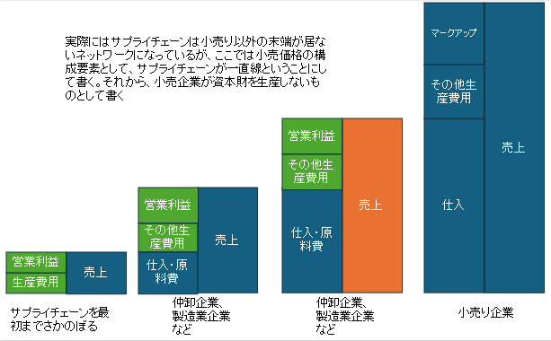
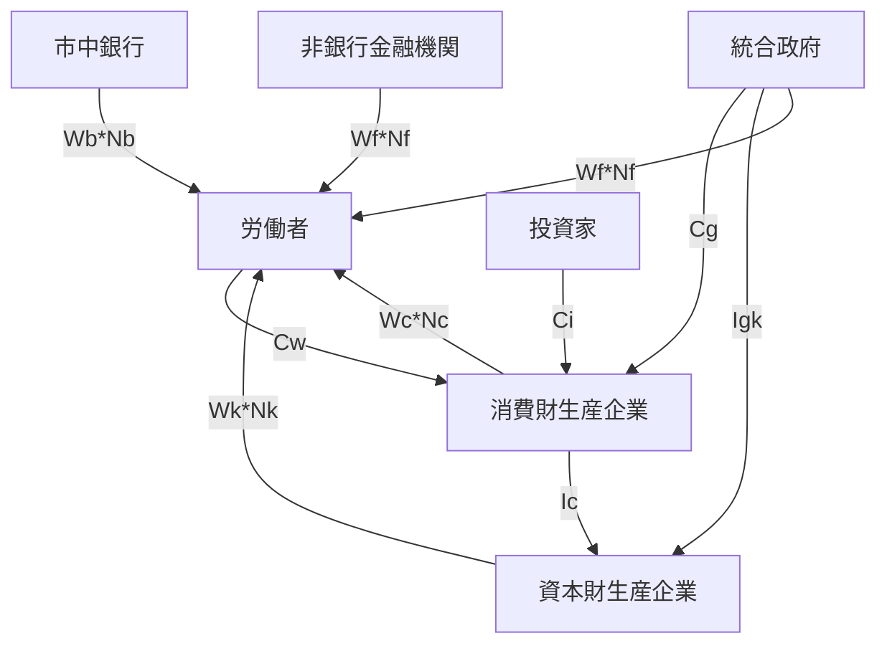
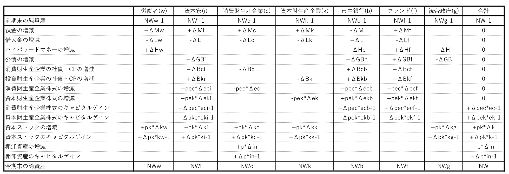

- [1. 編集中ゆえの注意書き](#1-編集中ゆえの注意書き)
- [2. 前提](#2-前提)
  - [2.1. 推奨する基礎知識](#21-推奨する基礎知識)
  - [2.2. 系全体のバランスシートの性質](#22-系全体のバランスシートの性質)
  - [2.3. データとモデルと理論の関係](#23-データとモデルと理論の関係)
  - [2.4. 変数の種類。内生変数/外生変数/パラメータ](#24-変数の種類内生変数外生変数パラメータ)
- [3. SFCモデル(Stock-Flow consistent model)とは](#3-sfcモデルstock-flow-consistent-modelとは)
  - [3.1. SFCモデルの原則](#31-sfcモデルの原則)
    - [3.1.1. フローの整合性](#311-フローの整合性)
    - [3.1.2. ストックの整合性](#312-ストックの整合性)
    - [3.1.3. ストックとフローの接続の整合性](#313-ストックとフローの接続の整合性)
  - [3.2. SFCモデルの柔軟さ](#32-sfcモデルの柔軟さ)
  - [3.3. SFCモデルの性質を決める肝](#33-sfcモデルの性質を決める肝)
  - [3.4. SFCモデルの限界、予測と説明の意味について](#34-sfcモデルの限界予測と説明の意味について)
- [4. SFCモデルの作り方。大雑把な手順](#4-sfcモデルの作り方大雑把な手順)
- [5. 慣習](#5-慣習)
  - [5.1. 変数の文字の割り当ての慣習](#51-変数の文字の割り当ての慣習)
  - [5.2. 時間に関する表記の慣習](#52-時間に関する表記の慣習)
- [6. SFCモデルで使われる式の分類](#6-sfcモデルで使われる式の分類)
- [7. 表と会計恒等式](#7-表と会計恒等式)
  - [7.1. 会計恒等式とは](#71-会計恒等式とは)
  - [7.2. 恒等式群としての表](#72-恒等式群としての表)
  - [7.3. バランスシート表](#73-バランスシート表)
  - [7.4. 取引フロー表](#74-取引フロー表)
    - [7.4.1. 取引フロー表の例](#741-取引フロー表の例)
    - [7.4.2. 取引フロー表の概要](#742-取引フロー表の概要)
    - [7.4.3. 取引フロー表の、変数の符号](#743-取引フロー表の変数の符号)
    - [7.4.4. Current列とCapital列の分離で表現可能となる、投資と利潤](#744-current列とcapital列の分離で表現可能となる投資と利潤)
    - [7.4.5. （資本への）投資について](#745-資本への投資について)
    - [7.4.6. 棚卸資産の増減について](#746-棚卸資産の増減について)
    - [7.4.7. 純貸出と経常収支や資本収支の関係について](#747-純貸出と経常収支や資本収支の関係について)
  - [7.5. 社会会計表](#75-社会会計表)
  - [7.6. フローダイアグラム](#76-フローダイアグラム)
  - [7.7. 完全統合表（日本語訳検討中）](#77-完全統合表日本語訳検討中)
  - [7.8. ストックとフローの整合性を表す恒等式について](#78-ストックとフローの整合性を表す恒等式について)
  - [7.9. 株式/資本金/利益剰余金の取り扱いについて](#79-株式資本金利益剰余金の取り扱いについて)
- [8. 定義式](#8-定義式)
- [9. 仮説と行動方程式(behavioural equation)](#9-仮説と行動方程式behavioural-equation)
  - [9.1. 行動方程式とは](#91-行動方程式とは)
  - [9.2. ポスト・ケインズ派による行動方程式の特徴](#92-ポストケインズ派による行動方程式の特徴)
  - [9.3. 行動方程式の例](#93-行動方程式の例)
    - [9.3.1. 消費関数](#931-消費関数)
    - [9.3.2. 投資関数](#932-投資関数)
    - [9.3.3. 政府支出関数](#933-政府支出関数)
    - [9.3.4. 給与関数（呼び方？）](#934-給与関数呼び方)
    - [9.3.5. ポートフォリオ方程式(金融資産の保有配分量の決定のモデル)](#935-ポートフォリオ方程式金融資産の保有配分量の決定のモデル)
- [10. モデルを閉じる](#10-モデルを閉じる)
  - [10.1. 「モデルを閉じる」とは](#101-モデルを閉じるとは)
  - [10.2. ありがちな、式の計算順](#102-ありがちな式の計算順)
- [11. SFCモデルの特徴、経路依存性と最適化の仮定の不必要性](#11-sfcモデルの特徴経路依存性と最適化の仮定の不必要性)
- [12. パラメータの値の設定](#12-パラメータの値の設定)
  - [12.1. 推定](#121-推定)
  - [12.2. カリブレーション](#122-カリブレーション)
- [13. 様々なSFCモデル](#13-様々なsfcモデル)
  - [13.1. 理論モデルと実証モデル](#131-理論モデルと実証モデル)
    - [13.1.1. 実証モデル](#1311-実証モデル)
  - [13.2. 複雑さの特徴とトレードオフ](#132-複雑さの特徴とトレードオフ)
    - [13.2.1. 実証モデルにおける複雑さ](#1321-実証モデルにおける複雑さ)
  - [13.3. ベースラインシナリオとの比較](#133-ベースラインシナリオとの比較)
  - [13.4. 開放経済モデル](#134-開放経済モデル)
  - [13.5. モンテカルロ法との併用](#135-モンテカルロ法との併用)
  - [13.6. 微分方程式による連続時間のモデル](#136-微分方程式による連続時間のモデル)
    - [13.6.1. 差分方程式体系を微分方程式体系に変換する](#1361-差分方程式体系を微分方程式体系に変換する)
    - [13.6.2. 解析的に解けるSFCモデル](#1362-解析的に解けるsfcモデル)
  - [13.7. AB-SFCモデル](#137-ab-sfcモデル)
    - [13.7.1. エージェント・ベース・モデルの一般的な性質](#1371-エージェントベースモデルの一般的な性質)
    - [13.7.2. マクロ経済を扱うABモデル](#1372-マクロ経済を扱うabモデル)
    - [13.7.3. AB-SFCモデルの特徴](#1373-ab-sfcモデルの特徴)
    - [13.7.4. AB-SFCモデルの難しさと限界](#1374-ab-sfcモデルの難しさと限界)
    - [13.7.5. AB-SFCモデルの存在意義](#1375-ab-sfcモデルの存在意義)
    - [13.7.6. 金融市場とAB-SFCモデル](#1376-金融市場とab-sfcモデル)
    - [13.7.7. 遺伝的アルゴリズムや機械学習とAB-SFCモデル](#1377-遺伝的アルゴリズムや機械学習とab-sfcモデル)
  - [13.8. 経済活動と資源やエネルギーの関係を書くSFCモデル](#138-経済活動と資源やエネルギーの関係を書くsfcモデル)
- [14. DSGEモデルとの対比](#14-dsgeモデルとの対比)
  - [14.1. 比較](#141-比較)
  - [14.2. 現実的な仮定と、現象の再現について](#142-現実的な仮定と現象の再現について)
  - [14.3. 暗に含まれるイデオロギーについて](#143-暗に含まれるイデオロギーについて)
  - [14.4. 近接分野との接続しやすさについて](#144-近接分野との接続しやすさについて)
- [15. 重要かつ未解決/未開拓な課題](#15-重要かつ未解決未開拓な課題)
- [16. 類似or発展的or補完的 情報源](#16-類似or発展的or補完的-情報源)
  - [16.1. 論文](#161-論文)
  - [16.2. 書籍/オンライン百科事典/外部のブログ](#162-書籍オンライン百科事典外部のブログ)
    - [16.2.1. 「好奇心の横断歩道を創る！」の、SFCモデルの例示](#1621-好奇心の横断歩道を創るのsfcモデルの例示)
- [17. 注釈と出典](#17-注釈と出典)

# 1. 編集中ゆえの注意書き

比較的重要な章は、2,5,6

比較的些末な章は、10,13

特に自信ない部分はこの色、編集の都合で残していて、完成版では削除する部分がこの色、どーでもいい部分や扱いを決めあぐねている部分はこの色

この記事の上位互換を書いて公開するか、日本語で教科書を書くか、プルリクエストをくれたら、私はうれしい。

ブログで読んでいる方へ。最新版は[こちら](https://github.com/rokaboNatttsu/to_make_text_about_SFCmodel/blob/main/SFC%E3%83%A2%E3%83%87%E3%83%AB(%E3%82%B9%E3%83%88%E3%83%83%E3%82%AF%E3%83%BB%E3%83%95%E3%83%AD%E3%83%BC%E4%B8%80%E8%B2%AB%E3%83%A2%E3%83%87%E3%83%AB)%E3%81%AE%E5%9F%BA%E6%9C%AC%E3%80%82%E8%87%AA%E4%BD%9C%E3%81%97%E3%81%9F%E3%81%84%E4%BA%BA%E3%81%9F%E3%81%A1%E3%81%AE%E6%9C%80%E5%88%9D%E3%81%AE%E6%95%99%E6%9D%90%E3%82%92%E7%9B%AE%E6%8C%87%E3%81%99(%E4%BB%AE).pdf)。

Markdownファイルで編集しています。PDFファイルもあります。**内容の正しさは全く保証できません。**

8時間かけて読んだら一通りわかる。くらいのボリュームを目指す。これを読んだ後自作し始めて、何かに引っ掛かったらまた戻ってくる、みたいな使い方に適する教材にしたい。

# 2. 前提

## 2.1. 推奨する基礎知識

この記事は、SFCモデルを自作したい人たちと、SFCモデルを用いる論文を読む時に役立つ基礎知識を手に入れたい人たちのために書く。読者の前提知識は、以下の2点を満たすことを推奨する。

- 数学：高校の微積分と、行列の計算の一番基本的なことがわかる
- 簿記：費用/収益/資産の増加/資産の減少/負債の増加/負債の減少を区別できる

自作したい人には、この2つに加えて、

- モデルの実装：2023のAtCoderでレート400程度にアルゴリズムを書ける(さほど高くないレベル)、または、SFCモデルを実装できるソフト(Excelなど)を使える

も推奨する。

シンプルなSFCモデルを作るときは、それだけで十分だと思う。ただ、出来の良いモデルや、複雑なモデルの実装を追求する人は 、SFCモデルを作ろうとする場合、必要に迫られて、適宜、（広い意味のポスト・ケインズ派の理論を中心とした）経済関係の知識を、勉強することになると思う。より幅広い知識が必要になる。

下の説明で使われる語句には、私が勝手に翻訳したものも含まれる。最初になるべく元の英語を示すが、忘れているものもあるに違いない。

## 2.2. 系全体のバランスシートの性質

株式/資本金/利益剰余金の取り扱いについて
と統合しつつ。後、絶望的にわかりにくい

この記事では、資本的資産を、棚卸資産と固定資産と繰延資産の総和のこととする。有価投資証券は含まない。＃この定義だと矛盾が出るかも。要確認。
資産＝金融資産＋資本的資産
資本的資産 $\cap$ 金融資産 $=\varnothing$
になるような定義がしたい

それから、この記事では、正味資産を、
「正味資産」＝「純資産」ー「資本金・資本準備金」＝「金融資産」＋「資本的資産」ー「負債」ー「資本金・資本準備金」
と定義する。（参照[^正味資産の辞書]）
＃この定義だと矛盾が出るかも。要確認

一経済部門にとって、バランスシートの借方と貸方がバランスする。すなわち、

- 一経済部門にとっても、系全体でも、金融資産＋資本的資産＝負債＋純資産

SFCモデルでは、株式発行に伴って発生する資本金や資本準備金のような純資産は、返済/償還する必要のない負債として扱うことが多い。ほとんどと言っても良いと思う。モデルをシンプルに保ちやすいからだろう。この場合、

- 一経済部門にとっても、系全体でも、金融資産＋資本的資産＝負債＋正味資産＝負債＋純資産
- 一経済部門にとっても、系全体でも、正味資産＝純資産
- 系全体では、金融資産＝負債
- 系全体では、資本的資産＝正味資産

となる。多くのSFCモデルでは、株価の変動とともに資本金が増減する。これはモデルをシンプルに保つための工夫の一つと言える。「資本金の金額が、ほかの変数に影響を与えない」という前提を採用すれば、株価に連動して資本金が増減することはモデルの実用上の問題にならないが、事実との乖離であることは確かだ。

株式発行に伴って発生する純資産を、純資産として扱うSFCモデルを作ることもできる。その場合、

- 一経済部門にとっても、系全体でも、金融資産＋資本的資産＝負債＋純資産
- 系全体では、金融資産ー株式＝負債
- 系全体では、資本的資産＝正味資産＝純資産ー株式

## 2.3. データとモデルと理論の関係

実験や観察から得られたデータからは、統計的手法によってパターンを提案することができる。しかし、パターン自体は、データをめぐる因果関係などの構造の説明ではない。データから「真の構造」を推定するために、モデルという「仮定された構造」が導入される。「真の構造」とモデルは、厳密には、異なる可能性が極めて高い。それでも、モデルは、「真の構造」に似た(因果)関係を提案しようとして作られる。理論は、モデルが提案する因果関係の根拠として使われ、モデルの説明および予測の能力は、理論の出来の評価に使われることがある。

また、モデルは「真の構造」に近づこうとして提案されるが、モデルが提案する因果関係そのものが、概念の定義に影響する。

モデルは、仮説を認めたとき何が起こるのかを表現する。また、モデルと現実を比較することにより、現実の性質を形作る主要なメカニズムを推測するために、使われるはず。シンプルで数少ない仮定から多くの現象をより厳密に説明/予測できることが理想だ。

マクロ経済の文脈では、（物理学と比べて）多少の不出来は、現状、仕方がない。マクロ経済を精度よく説明するには、今の理論は貧弱すぎる。

## 2.4. 変数の種類。内生変数/外生変数/パラメータ

内生変数：モデル内の他の変数を使って、値が算出される変数。

外生変数：モデルを作る人が、他の変数の値にかかわらず、恣意的に値を決める変数。

パラメータ：モデルの出力が現実のデータにフィットするように、または現実の性質の1つ以上の側面を再現するように、または計量経済学的な手法で推定して、値を調節する変数を、パラメータと呼ぶ。方程式の係数に近いイメージ。フィッティングに使う自由度。

# 3. SFCモデル(Stock-Flow consistent model)とは

厳密な会計フレームワークに基づくマクロ経済モデル。モデル化された経済全体の、フローとストックの会計的な整合性を保証する。

SFCモデルにおける会計的な一貫性は、物理学におけるエネルギー保存則と似た立場にある。私の意見では、現実の経済をうまく説明&予測できるマクロ経済のモデルは、会計的な一貫性を満たしているはずだ、と思う。エネルギー保存則だけでは物理現象を説明&予測できないが、エネルギー保存則を破る物理現象は起こらない(と信じられている)。同じように、会計的な一貫性だけではどのような経済活動が起こるかを説明できないが、すべての経済活動に伴う会計には鉄則がある。

## 3.1. SFCモデルの原則

SFCモデルとの呼称は、いくつかの少しづつ異なる意味で使われるようだが[^ワークショップYoutube動画][^注釈8]、この記事では、以下の3つの原則をすべて満たすマクロ経済モデルを、SFCモデルと定義する。いくつかの情報源[^SFCモデルの原則の出典１][^ワークショップYoutube動画][^A_Survey][^SFCモデルの原則の出典2][^empirical_SFC_models]をもとに編成した。最も一般的なSFCモデルの定義は、以下に加えて、ポスト・ケインズ派の理論に基づいて作られた、という条件を追加したものかもしれない。

### 3.1.1. フローの整合性

すべての資金やモノがどこからきてどこへ行くのかをもれなく示す、フローの一貫性。

売買/税の支払い/部門内の生産/在庫の増減/融資 に伴う**部門間の**フローの一貫性を”**水平整合性**(買い手が支払った金額と売り手が受け取った金額が常に一致する、など)を”**水平整合性**(‘horizontal’ consistency)”と呼ぶ。複式簿記が常に貸方と借方をバランスさせる事に該当する**部門内の**会計的一貫性を”**垂直整合性**(‘vertical’ consistency)と呼ぶ[^SFCモデルの原則の出典2]。

水平整合性と垂直整合性をまとめると、取引が複式簿記で4項目に同時に同額影響する（2つの部門または経済主体の、貸方と借方。2×2=4）ことと対応した**四重計上の原則**(The quadruple entry principle)が成立する。[^四重計上の原則の詳細][^四重計上の原則の出典]

### 3.1.2. ストックの整合性

◎部門間のストックの整合性

> １，モデルが株式を含む場合、
>すべての種類の負債には、対になる金融資産がそれぞれ同額存在する。株式を除く全ての種類の金融資産には、対になる負債がそれぞれ同額存在する。＃うまく説明できない問題
>
>２，モデルが株式を含まない場合、
>すべての種類の負債には、対になる金融資産がそれぞれ同額存在する。全ての種類の金融資産には、対になる負債がそれぞれ同額存在する。＃うまく説明できない問題

◎部門内のストックの整合性

> 部門内では、一経済主体のバランスシートが常に満たしている恒等式、すなわち
>
> - 金融資産＋資本的資産＝負債＋純資産
> が成立する。

◎系全体のストックの整合性
> 「系全体のストックの整合性」は、「部門間のストックの整合性」と「部門内のストックの整合性」を満たしているとき、自然と成り立つ性質である。フローの整合性における四重計上の原則に該当する。
>
> １，モデルが株式を含む場合、
>
> - 金融資産＋資本的資産＝負債＋純資産
>
> ２，モデルが株式を含まない場合、
> n種類(k=1,2,3,,,n)の金融資産において、系全体（モデル全体）の純金融資産はゼロである。また、系全体の正味資産と資本的資産がバランスする。
>
> - 金融資産k＝負債k
> - 金融資産＝負債
> - 資本的資産＝正味資産＝純資産
> - 金融資産＋資本的資産＝負債＋正味資産＝負債＋純資産

### 3.1.3. ストックとフローの接続の整合性

「期末の資産」＝「期首の資産」＋「期首の資産の評価額上昇分」＋「その資産に関連するフロー」 - 「資本減耗・減価償却」

で算出される、ストックとフローの整合性。

## 3.2. SFCモデルの柔軟さ

現実の経済は、少しづつその性質を変化させ、変化を時間とともに蓄積する。今うまくいっている理論であっても、現実の変化とともにゴミになる可能性が高い（例えばフィリップス曲線周りの議論の混乱[^フィリップス曲線の敗北]）。そんな中、もしかすると唯一、社会が大きく変わっても不変でありうる原理が、会計的な一貫性だ。SFCモデルの枠組み自体は、会計的な一貫性を保証し、モデルを完成させることができること以外に、目立った制約を設けない。非常に柔軟性が高い枠組みといえる 。

モデルは何かを表現するために作られる。経済部門の設定/取引の種類の設定/行動方程式の設定次第で、様々な性質を示す無数のSFCモデルが作られる。ほとんどの場合、広い意味のポスト・ケインズ派によって用いられるモデルなので、しばしば「需要主導型の方程式体系」「内生的貨幣供給(資金需要が先に生まれ、その資金需要に合わせて貨幣/通貨が生み出され供給される)を表現する方程式体系の採用」などといった特徴を持つ。

## 3.3. SFCモデルの性質を決める肝

SFCモデルの性質を決定する最も影響が大きい要因は、おそらく2つ。

一つ目は、経済的な意思決定方法の理論およびモデルである。例えば、

- 投資支出の水準が、内部留保/既存の借入額/稼働率などの関数で書かれる
- 消費水準は所得と純資産の関数で書かれる
- 価格水準は単位生産費用にマークアップを乗せる形で決定され、通常の稼働率付近では、一定期間価格が不変である
- 金融機関は資本比率の法的な規制にのっとって行動する
- 家計のための融資需要は所得の一定割合である
- 企業は投資資金調達の一定割合を新規株式で行う
- 生産性は一定か、場合によっては外生的に与えられた率で成長する
- インフレは、賃金労働者とその使用者の間の対立の結果である

などといったものだ。変数間の因果関係の構造も、ここに含む。

二つ目は、部門の分け方だ。AB-SFC(後述)であろうとそうでなかろうと、部門の分け方はそのSFCモデルで何を表現したいかを反映する。国際的な通貨危機の表現のために閉鎖経済のモデルを作るなどということはあり得ないし、部門の分け方を細かく詳しく多様にすれば良いというものでもない。

モデルの性質は、部門の分け方や、行動方程式(後述)が示す変数間の因果関係に、決定的に依存する。採用する前提の小さな変化がモデルの性質を大きく変えることもある。

複雑なモデルは事実に近づくかもしれないが、指数関数的に扱いづらく、因果関係の構造を理解しづらくなる。モデルを作る目的に沿った、適切な複雑さを選択することが求められる。

## 3.4. SFCモデルの限界、予測と説明の意味について

「根本的な不確実性を想定していること」「長期的な予測が事実上不可能だ。と信じていること」などを理由に、ポスト・ケインズ派は、説明と未来の予測を区別して考える。生物学者が、ダーウィン以来進化論を唱えながら、将来どのような生物が出現するのかを予測できないようなものだ(進化の示すパターンなどは、「自己組織化と進化の論理」という本など、面白い話がいろいろあるけど、細かい話は横に置かせてほしい)。モデルは、「モデルを作ったときに採用した仮説/前提/原理/パラメータたちが、未来にわたって現実的である」という極めて厳しい条件下でのみ、予測としての意味を持つ。過去のデータと計量経済モデルで推定したパラメータの値を使ったモデルが、未来でも精度よく当てはまるとは限らない。理論上/経験上不変だとされていたパラメータが変動することは、よくある。全てのパラメータが不変のもとで、過去の説明と予測を同じ精度で行うには、理論があまりにも貧弱すぎるのだ。これは、すべてのマクロ経済モデル(動学的確率的一般均衡モデルなども含む)に当てはまる。また、現実の一側面を再現（現実とよくフィットしていたり、定型化された事実の多くを再現したり）するモデルも、現実を正確に記述したものだとは限らない。ケインズが、数学に明るかったにもかかわらず、自分の理論を閉じた数学的形式(closed mathematical form)で表現することに消極的だった理由だそうだ[^金融危機モデル出典１][^注釈3]。そうはいっても、「すべてのマクロ経済モデルが全くの無意味だ」と考えるのは極端すぎると思う。説明や予測の参考に使うにあたり、経験的に安定した値をとるもの、あるいは政策当局が高い精度でコントロールできるものを、パラメータに採用してモデルを作ることが望ましい。

10～11年後の気候を推測することは、10～11年後の天気を推測するより簡単だ（気候は天気の移り変わりの一定のパターンのことを指す）。似たようなことが経済にも言える。例えば、バブルと不況を繰り返すマクロ経済の”気候”を説明するモデルを作ることはできるが、いつバブルが始まりはじけるかという”天気”を説明するモデルを作ることは(少なくとも現時点では)できない。SFCモデルは通常、”気候”を説明することを目的に据えている。

経済学は、物理学のように、時間を通して普遍の原理原則や理論を発見/構築することに適した分野ではない（というか、もしできるなら、物理学の一分野になる）。人は、広い意味で学習し続ける生き物であり、自身が手に入れることのできる情報をもとに不完全な能力を使って判断し、大なり小なり異なる未来を予測し、その予測を適宜更新している。個人としても社会としてもその性質を変化させ続ける。経済学が人の行動を扱う分野である以上、予測と説明を同じ精度で行えるようになるためには、人の行動を超高精度で再現するモデルが必要となる。現状、それは到底不可能だ。

ポスト・ケインズ派にとって、過去の事象の説明と未来予測は全く異なる意味を持つ。説明はあくまで後付けの説明に過ぎず、未来予測は数多くの前提ありきで行われる。

# 4. SFCモデルの作り方。大雑把な手順

①目的を決める：どのような経済のモデルを作るのか（閉鎖経済を作るのかそれとも開放経済のモデルを作るのか、などといったこと）、どの程度の時間を扱うか、どのような現象を扱うか（金融不安定性を主に扱うかもしれないし、経済成長を扱うかもしれない）を決める

②部門分けを行う：家計/企業/銀行/中央銀行/政府/外国などの、部門を定義する

③ストックとフローの変数を導入する：モデルで扱う部門間の取引の種類と資産および負債の種類を決め、フローとストックを表す変数を導入する

④会計的な一貫性を確認する：「モデルが満たすべき、会計的一貫性を示す恒等式」の一群を示す。（行動方程式次第で、どの会計恒等式を、いつ、どの内生変数の計算に使うかが変わってくるので、表やフローダイアグラムを書くにとどめておくのが良いと思う）

②～④は、表やフローダイアグラムを使って行われることが多い。

⑤行動方程式を作る：それぞれの部門がどのような経済行動をとるかを示す、方程式を立てる。行動の原因に該当する変数を引数とし、行動の結果に該当する変数を算出する関数を立てる。この段階で、どの変数を内生変数とし、どの変数を外生変数とするかを確定する。

⑥カリブレーションを行う：モデルの出力が、実際のデータとできるだけ一致するように、あるいは、再現したい現象が現れるように、パラメータを調整する。もしくは、計量経済学的な手法を用いて推定した値を、パラメータに採用する。

⑦感度分析を行う：政策当局が決定する変数の変化の影響を調べたり、パラメータ/外生変数の変更によって均衡の位置がどの程度変化するかを調べたりする

⑧モデルの出来を評価する：現実世界のデータと比較したり、目的の現象が再現されたりかどうか判断したり、既存のモデルが出力した成果と比較したりする。

# 5. 慣習

## 5.1. 変数の文字の割り当ての慣習

ポスト・ケインズ派の理論の慣習を基本的に受け継いでいる。

変数に対する文字の割り当てにありがちな慣習には

- パラメータはギリシャ文字
- 内生変数/当局が水準を決める外生変数/可変な外生変数は、英語アルファベット
- 資本あたり/人口あたりの値など、○○あたりの値を表す変数にアルファベット小文字、そうではない変数にアルファベット大文字
- 名目変数にアルファベット大文字、実質変数や価格額面に左右されない変数にアルファベット小文字
- 物価/賃金水準/金利や利回りは、アルファベット小文字

などがある。この記事もこれらに準拠する

ここによく使われる変数の具体例を並べる

- C: 消費（名目）
- k: 資本ストック（実質）
- p: (消費財)価格水準

などなど。後回し

## 5.2. 時間に関する表記の慣習

SFCモデルの多くは、離散化された時間で、数値シミュレーションを行う。時間ステップは、四半期や一年といった、経済活動の区切りに用いられやすい期間を採用することが多い。

離散化された時間でシミュレーションを行うモデルでは、慣習的に、ストックの変数は（添え字がないときは）期末の値を表す。期末の値は次期の期首の値と等しい。ストックの変数は、t期目の期首の値は $X_{-1}$ と書かれ、期末の値は $X$ と書かれる。価格/金利/利回りの変数は、対応するストックの変数が存在しないフローの変数かのように扱われている。フローの変数は、今期のフローが添え字なし、前期のフローは $\Delta X_{-1}$ や $X_{-1}$ 、次期のフローは $\Delta X_{+1}$ や $X_{+1}$ といった具合。「期末のストック」＝「期首のストック」＋「フロー」で表される場合、 $X = X_{-1} + ΔX$ などという書き方になる。

# 6. SFCモデルで使われる式の分類

SFCモデルでは、各変数は、大きく分けて3種類の式で関係を表現される。それぞれの種類の中に目的や意味合いが違うサブグループがある。用語は後で説明する。ここでは全体像を示す。

- 会計恒等式
  - フローの会計的整合性を表す恒等式（取引フロー表/社会会計表/フローダイアグラムで表す）
    - 部門間の支払った金額と受け取った金額が常に一致するように保証する恒等式（取引フロー表の行の恒等式）
    - 部門内の、損益計算書やキャッシュ・フロー計算書のバランスを保証する恒等式（取引フロー表の列の恒等式）
  - ストックの会計的整合性を表す恒等式（バランスシート表で表す）
    - 負債が常に他部門の同額の金融資産を伴う（バランスシート表の金融資産の行の恒等式）
    - 各部門の資本的資産の合計が、系全体の資本的資産と等しい（バランスシート表の資本的資産の行の恒等式）
    - 部門内および系全体のバランスシートのバランスを保証する恒等式（バランスシート表の列の恒等式）
  - ストックとフローの関係の会計的整合性を表す恒等式
    - $X = X_{-1} + \Delta X$ の形であらわされるすべての恒等式
    - 部門内の純資産の増減に関係する恒等式（完全統合表（日本語訳検討中）の列の恒等式）
    - 系全体の、特定のストックの増減の整合性を表す恒等式（完全統合表（日本語訳検討中）の行の恒等式）
- 定義式
  - 期待値の定義
  - 純貸出の定義
  - 稼働率の定義
  - etc.
- 行動方程式（サブグループの分類の参考[^A_Survey]）
  - エージェントがどのように支出や決定するかを表現する行動方程式（取引フロー表の上半分、取引と生産を表す行の変数を計算する）
    - 家計消費支出関数
    - 政府支出関数
    - 企業投資関数
    - 税金の支払いの関数
    - 賃金の支払いの関数
    - etc.
  - エージェントが資金調達方法をどのように決めるか、決めることができるかに関連する行動方程式
    - 家計や企業が希望する借入金の金額を決める関数
    - 企業が株式や社債をどれだけ新規発行するかを決める関数
    - 政府（中央銀行を除く）が財政赤字を出すとき、短期国債と長期国債をどのような割合で発行するかを決める関数
    - etc.
  - エージェントがどのように保有資産を配分するかを表す行動方程式
    - ポートフォリオ方程式
    - etc.
  - 生産性上昇/賃金/インフレ率の決定にかかわる方程式
    - 技術水準に依存する変数の値を決める関数
    - 賃金水準を決める関数
    - 物価水準を決める関数
    - etc.
  - 金融システムの振る舞いを決定する行動方程式
    - 中央銀行が、目標金利を維持させるように、民間金融機関の需要に応じて国債と現金を交換することを表す関数
    - 市中銀行の与信管理を定量的に表す関数
    - etc.

# 7. 表と会計恒等式

## 7.1. 会計恒等式とは

会計恒等式は、大きく分けて、

- フローの会計的整合性を表す恒等式
- ストックの会計的整合性を表す恒等式
- ストックとフローの関係の会計的整合性を表す恒等式

の３種類で構成される、会計的な整合性を表す恒等式。SFCモデルを名乗るためには、会計的一貫性を保証できる組み合わせで会計恒等式が用いられなければならない。

少なくとも1つの恒等式が、ほかの恒等式の組み合わせで導出できる。ほかの恒等式の組み合わせで導出される恒等式は、モデルでは用いない(どの恒等式の組み合わせを選ぶかは任意)。モデルで用いない恒等式は、隠された等式(hidden equation)と呼ばれる。＃ここをわかりやすく。これじゃ伝わらない　もう少し具体的な言い方をしてみると。恒等式A=B, B=C, C=Aという3つの恒等式が使えるとき、C=AはA=BとB=Cの組み合わせとして導出可能なので、A=BとB=Cを含むモデルがはじき出した結果の会計的一貫性を確認するときに、C=Aになっているかどうかを見れば良い、といった感じ。

モデルで計算して出した結果が、隠された等式を満たしていれば、モデルに会計的な矛盾が含まれないことを検算できる。

フローの会計的整合性を表す恒等式は、後述する取引フロー表において、行と列であらわされる。

ストックの会計的整合性を表す恒等式は、後述するバランスシート表において、行と列であらわされる。

## 7.2. 恒等式群としての表

SFCモデルを用いる際は、多くの場合、

- ストック（資産/負債/純資産/正味資産）の一貫性を表現する表
- フロー（取引と、それに伴うストックの移動および生産）の一貫性を表現する表

の2種類を用いる。

ストックの会計的整合性を表現する表には、

- バランスシート表(Balance sheet matrix、あるいはBalance sheet account matrix)

が用いられ、フローの会計的整合性を表現する表には、

- 取引フロー表(transaction flow matrix。transactions matrixは取引フロー表の資金フローの行が無いもの)
- 社会会計表(Social accounting  matrix)

のいずれかが用いられる。フローの会計的整合性は、フローダイアグラムを使って表現されることもある。

また、たまに(、Godleyは好んで使っているかも)、ストックとフローの接続の一貫性を表現する表を使うことがあり、

- 完全統合表（日本語訳検討中）(Full-integration matrix)

と呼ばれる。

表は、会計的な一貫性を保証するために満たすべき恒等式群を、視覚的に表現している。表は、会計恒等式を示すためのツールであり、モデルを解釈する人にとっては、会計恒等式を復元するためのツールでもある。表を使うことによって、モデル内に「取引相手のいない謎取引」や「謎資産」が紛れ込んでいないかを確認することが容易になる。(しばしば、ブラックホールが存在しない、みたいな言い方をするようだ)

## 7.3. バランスシート表

バランスシート表は、例えばこのように書かれる（多くの場合はもっとシンプル）。

  
   
  <em>バランスシート表の例</em>

|                          | 労働者(w) |       資本家(i)        | 消費財生産企業(c) | 資本財生産企業(k) |      市中銀行(b)       |      ファンド(f)       | 統合政府(g) |  合計  |
| :----------------------- | :-------: | :--------------------: | :---------------: | :---------------: | :--------------------: | :--------------------: | :---------: | :----: |
| 資本ストック             |  $+K_w$   |         $+K_i$         |      $+K_c$       |      $+K_k$       |                        |                        |   $+K_g$    |  $+K$  |
| 棚卸資産                 |           |                        |       $+IN$       |                   |                        |                        |             | $+IN$  |
| 預金                     |  $+M_w$   |         $+M_i$         |      $+M_c$       |      $+M_k$       |          $-M$          |         $+M_f$         |             |  $0$   |
| 借入金                   |  $-L_w$   |         $-L_i$         |      $-L_c$       |      $-L_k$       |          $+L$          |         $-L_f$         |             |  $0$   |
| ハイパワードマネー       |  $+H_w$   |                        |                   |                   |         $+H_b$         |         $+H_f$         |    $-H$     |  $0$   |
| 消費財生産企業株式       |           | $+p_{ec} \cdot e_{ci}$ |     $-CAP_c$      |                   | $+p_{ec} \cdot e_{cb}$ | $+p_{ec} \cdot e_{cf}$ |             | $+E_c$ |
| 資本財生産企業株式       |           | $+p_{ek} \cdot e_{ki}$ |                   |     $-CAP_k$      | $+p_{ek} \cdot e_{kb}$ | $+p_{ek} \cdot e_{kf}$ |             | $+E_k$ |
| 消費財生産企業の社債・CP |           |       $+B_{ci}$        |      $-B_c$       |                   |       $+B_{cb}$        |       $+B_{cf}$        |             |  $0$   |
| 投資財生産企業の社債・CP |           |       $+B_{ki}$        |                   |      $-B_k$       |       $+B_{kb}$        |       $+B_{kf}$        |             |  $0$   |
| 純資産                   |  $-NW_w$  |        $-NW_i$         |      $-NW_c$      |      $-NW_k$      |        $-NW_b$         |        $-NW_f$         |   $-NW_g$   | $-NW$  |
| 合計                     |    $0$    |          $0$           |        $0$        |        $0$        |          $0$           |          $0$           |     $0$     |  $0$   |

#PDF化しても崩れない方法で書いて差し替えたい

バランスシート表(ストックをの会計的整合性を表現する表)は、カラムが経済部門、インデックスがストックの種類(現金とか、債券とか)を示す。資産を＋記号を付けて表現し、負債や純資産や正味資産をー記号を付けて表現する。貸借対照表において借方に記載される分が＋、貸方に記載される分が - と思えば良いかと。

一番下の行には、それ以外の行の合計値が書かれ、値は0である（貸方と借方が常にバランスすることと対応する）。

一番右の列には、それ以外の列の合計値が書かれる。そのストックの、経済全体で見た合計を示す。金融資産を表す行では、純金融資産は0なので0が書き込まれ、固定資本や棚卸のような資本的資産を表す行は、0より大きい値になる。（生産活動は、資本的資産と純資産/正味資産を同額増加させる。固定資産や棚卸の行の一番右の列に0ではない値が出るのはそのせい。）

バランスシート表と名乗るだけあって、バランスシート(貸借対照表)に対応する。

負債には対応する金融資産があって、株式以外のすべての金融資産から負債を差し引くと0になる。多くのモデルでは株式と資本金/資本準備金がバランスすることにされている。また、資本的資産と正味資産がバランスする。バランスシート表の右端の列で、金融資産は0、資本的資産は+で書かれることで、それらが表現されている

## 7.4. 取引フロー表

### 7.4.1. 取引フロー表の例

取引フロー表は、例えばこのように書かれる（多くの場合はもっとシンプル）。

  
   
  <em>取引フロー表の例</em>

下付き文字もきれいに書ける表で差し替える方法を探す

### 7.4.2. 取引フロー表の概要

取引フロー表は、取引と資金の流れをめぐる、フローの整合性を表現する表である。カラムが経済部門、インデックスが取引と資金の種類を示す。上に取引を表す行、下に資金フローを表す行(=金融資産/負債の増減を表す変数)が書かれる。

上部が取引を表す行で、下部が資金フローを表す行である。資金フローを表す変数は、 $M_w = M_{w-1} + \Delta M_w$ などといった具合に、バランスシート表に書かれているストック変数と結びついている。

一番下の行はそれ以外の行の合計、すなわち0になる(受け取った金額の合計から支払った金額の合計を引いた金額が、資金の増減と等しいことに該当する)。垂直整合性を表す恒等式を表現している。

一番右の列はそれ以外の列の合計が記載され、値は0になる(取引においては支払金額と受取金額が常に一致すること、あるいは、ある部門の負債が増加するときはほかの部門の資産も増加すること　に該当)。水平整合性を表す恒等式を表現している。

取引フロー表は、固定資本減耗とキャピタルゲインを扱わない。

取引フロー表上にメモとして挿入されている純貸出(net lendingの翻訳)は、今期の取引による純金融資産の増減分を意味している。（キャピタルゲインや資本減耗や減価償却は含まない）

すべての部門の純貸出の合計は常に0である。

純貸出は、資金フローの行の合計に等しい。

なお、表上には[メモ]の行が挿入されている場合が多い。[メモ]の行の変数は、列の合計の計算の対象にならないし、純貸出(Net Lending)を表す場合などの例外を除き、行の合計が0ではない。[メモ]の行が存在しなくても表は成立するうえに、列の恒等式は[メモ]の行を含めないので、あくまでメモの役割である。

### 7.4.3. 取引フロー表の、変数の符号

取引フロー表の変数の符号の付き方は、「資金源(資金の増加)に+をつけ、資金用途(資金の減少)にーをつける」と説明されることが多い。が、この説明だと、資金フローの行や利潤の行や投資の行を見ているときに、混乱してしまうのではないだろうか（「資金」という言葉のニュアンスが、抽象的で難しいからだろう）。この記事では、別の言葉で符号の付き方の規則を説明する。厳密には間違っているかもしれないが、実用上はこの説明のほうが便利だと判断した。慣れてくると、「資金源(資金の増加)に+をつけ、資金用途(資金の減少)にーをつける」と説明したくなる気分もわかるようになるはず。

＋とーのつけ方にはルールがある。

もっとも抽象的に表現したルールは

- 簿記で借方に発生するものはー
- 簿記で貸方に発生するものは＋

だ。ただ、この表現では分かりにくいかもしれない。もう少し詳細にルールを書くと以下のようになる

- （ー）費用
- （＋）収益
- （ー）損益
- （ー）金融資産の増減
- （＋）負債の増減
- （ー）資本的資産の増減
- （＋）正味資産の増減（資本減耗や減価償却による減少を除く）

  
   
  <em>符号のつけ方</em>

変数（文字）ではなく具体的な数値を書く場合もまれにある。その場合、

- （－）費用
- （＋）収益
- （－）利益
- （＋）損失
- （＋）負債の増加
- （－）負債の減少
- （－）金融資産の増加
- （＋）金融資産の減少
- （＋）資本的資産の増加（資本減耗や減価償却による減少を除く）
- （－）資本的資産の減少（資本減耗や減価償却による減少を除く）
- （＋）正味資産の増加（資本減耗や減価償却による減少を除く）
- （－）正味資産の減少（資本減耗や減価償却による減少を除く）

で書かれる。

企業利潤の行の $\Pi_{ci}, \Pi_{cb}, \Pi_{ki}, \Pi_{kb}$ は配当の支払いを意味する。企業利潤("firms profit" や "profit, firms" など)は配当と内部留保の合計の意味があるようだ。株式会社は株主の持ち物だから、株式会社と投資家はわざわざ区別しないってことかな？あるいは単純に行を増やしたくなかっただけかもしれない。

### 7.4.4. Current列とCapital列の分離で表現可能となる、投資と利潤

取引フロー表では、経常的な取引を示す列(Current)と、資産/負債の増減を示す列(Capital)を分けることがある。

取引フロー表におけるCurrentとCapitalは、国際収支における経常収支と資本収支の関係のようなものだ。Current列とCapital列に分けないときは、取引を表す行（上部）に書かれるものが経常収支に該当し、資金フローを表す行（下部）に書かれるものが資本収支のプラスマイナスを反転させたものに該当する。経常収支から資本収支を引くと0になるように、取引フロー表でも列の合計が0になる。

Current列とCapitl列を区別すると、部門内で行われる投資や利潤(Profit)を、扱うことができる。

Currentの列は、経常的な取引に属する、費用/収益/損益を表す。費用と損益はマイナスで表記され、収益はプラスで表記される。損益計算書で借方に書かれるものはマイナス表記、損益計算書で貸方に書かれるものはプラス表記。

Capitalの列の符号のつけ方は、
- 変数を文字で表記するとき
  - 負債や純資産の増減に+をつけて表記
  - 資産の増減に-をつけて表記
- 変数を数字で表記するとき
  - キャッシュフロー計算書と同じ符号のつけ方
  - 負債や純資産の増加に+をつけて表記
  - 負債や純資産の減少に-をつけて表記
  - 資産の増加に-をつけて表記
  - 資産の減少に+をつけて表記

上の例の市中銀行の列のような、CurrentとCapitalを区別しない列では、部門内で完結する投資や損益といった、「CurrentとCapitalを区別しないと取引フロー表上で表現できない項目」が無い。無いからこそCurrentとCapitalを区別する必要がない。仮に区別した場合、「内生変数」「取引フロー表の列の恒等式」が一つずつ増えて、「パラメータ」「外生変数」「行動方程式」の数は変化しない。

### 7.4.5. （資本への）投資について

  
   
  <em>資本が賃金その他の費用の結果生産されるのイメージ図</em>

オレンジの資本財の売上が、投資で生産された付加価値としての量。緑の部分が、資本の生産のためにかかった、費用（営業費用や販売費及び一般管理費）や営業利益にあたる。この緑の部分は、企業部門内で見た費用（賃金や税など）や企業利潤の一部を構成している。

緑の部分は、「部門内の取引における売上」から「部門内の取引における仕入」を引いた時の余りの部分であり、その合計がオレンジの資本財の売上と等しい。オレンジの資本財の売上は、部門内で生産された資本財に等しく、資本財を部門内で生産して売買した結果として部門が得た収益に等しい。

取引フロー表に記載される投資は、部門で見た資本の生産における付加価値生産額（資本減耗を含まない）にあたる。「任意の企業からほかの企業への資本財の売り上げを、すべての企業について合計したもの」ではない。資本財製造企業がほかの企業に資本を売るとき、資本財生産企業の売り上げとそれを買う企業の仕入・材料費は等しいため、部門内の売買に伴う資金の移動は部門自体にとって資金と資本の移動を伴わない。「資本財生産にかかわった労働者への、賃金や企業利潤などへの分配の合計」と「投資によって生産された付加価値額」と「資本財の売上から資本財の仕入・材料費を差し引いたもの、すなわち部門自体が投資によって得た収益」は等しい。投資は、Current列では収益として、Capital列では資産の増加として、記載される。このような方法は損益計算書では行われない（資本財の売買は損益計算書に反映されない）が、取引フロー表では記載される。

（資本への）投資を除くと、取引フロー表の上部の取引を表す行とCurrent列は、基本的に損益計算書で扱われるような項目である。一方、取引フロー表の下部の資金フローを表す行とCapital列は、キャッシュフロー計算書で扱われるような項目である。

貸借対照表に資本の取得を反映しないのと同じように、取引フロー表に投資を書かない方法も取れるはずだが、自分の知る限りはモデルにが含まれるときは例外なく投資を取引フロー表に書く。

＃資本ストックの名目値の増減 $\Delta K$ ではなく粗投資 $I$ を書くことは、棚卸資産の行で $\Delta in \cdot UC$ ではなく $\Delta IN$ とすることと、ダブルスタンダードになるように見える。もしかすると、実用上の便利さのために、固定資本投資と棚卸資産投資で異なる基準が扱われているかもしれない（固定資本減耗をTFMのCapital列で扱うことにすると、投資と棚卸資産の行・Capital列のセルが、ともに資本的資産の増減を扱うことになり、一貫性が出せる。が、資本ストックの取得原価の計算が必要になる。棚卸資産の取得原価または製造原価は価格設定の時に使うからいずれにしても必要になるけど、資本ストックに関しては手間が増える、ということかも）。調査中。

ここの節は文章が支離滅裂、要修正。

### 7.4.6. 棚卸資産の増減について

棚卸資産の増減は、取引フロー表でも書かれる。棚卸資産（名目値）の増減 $\Delta IN$ は、モデルによって計算方法が違うが、例えば、単位生産コスト $UC$ と棚卸資産（実質値） $in$ を用いて、

$\Delta IN = in \cdot UC - in_{-1} \cdot UC_{-1} = in_{-1} \cdot \Delta UC + \Delta in \cdot UC$

などと計算される。単位生産コストには生産量当たりの賃金/税金などが含まれる。原価に該当し、商品の価格の上下と切り離されているのでキャピタルゲインとは関係ない。

### 7.4.7. 純貸出と経常収支や資本収支の関係について

> 「純貸出／純借入」は、経常的な収支と資本的な収支を合計した収支尻を示すもの
> 引用元：https://www.esri.cao.go.jp/jp/esri/archive/snaq/snaq165/snaq165_c.pdf 

だそうだ。

＃純貸出と収支について理解してから書く。

## 7.5. 社会会計表

フローを表現する表には、社会会計表と呼ばれるものもある。取引フロー表を使うか、社会会計表を使うかは、かなりの部分が好みの問題になる。ただ、特に最近の文献では、使われなくなってきている印象がある。

社会会計表は、例えばこんな感じに書かれるはずだ。

  
   
  <em>社会会計表の例</em>

社会会計表はインデックスもカラムも経済部門である。＃経済部門とは違う。分配の所属とでも言う？適切な単語があるとは思うけど、知らない

列は、カラムの経済部門内から他の経済部門への費用(支払い)と利益を表す。行は、インデックスの経済部門が他の経済部門から受け取る収益(収入)を表す。

表の一番下にほかの経済部門への費用と損益の合計に該当する行をもち、一番右にほかの経済部門からの収益の合計に該当する列を持つ。費用＋損益＝収益の関係がある。(損益計算書のバランスは常に維持される)

バランスシート表や取引フロー表と違い、符号がつかない。それから、取引フロー表と違い、資金フローを書かない。「Net Lendingの行を一番下に追加した、取引表(transactions matrix)」のような情報だ。

## 7.6. フローダイアグラム

部門をボックス、取引を矢印、資金フローを線で結んだ、フローダイアグラムが、取引フロー表や社会会計表の代わりに用いられることがある。AB-SFCモデル（後述）の説明のために使われることがほとんど。おそらく、
- 部門間のフローというニュアンスになってしまうことを避けるため
- またはAB-SFCモデルの実装のために使うソフトウェアの都合

で、取引フロー行列ではなくフローダイアグラムを使っているのではないかと思う。

取引フロー表や社会会計表と異なり、部門内での投資や棚卸資産の増減などが、モデルに含まれていてもフローダイアグラムに書かれないことが多い。また、どの部門がどの種類の金融資産および負債を増減させる可能性があるのかも書かれない。

個人的には、フローダイアグラムよりも取引フロー表を用いることを推奨する。資金フローを明示する分情報量が多いし、複雑なモデルでも整理された状態で書けるので。

フローダイアグラムの例示

TFMの賃金の行まで。在庫の表現は？経常勘定と資本勘定を分けてたっけ？あと、あまりにも複雑になりそうなので、曲線で結ぶんじゃなくて、直線を直角に折り曲げてつなげていく感じにしたい。もしくは書き方を同じにしつつシンプルなモデルで書く。mermaidじゃない書き方も検討する。markdownに書けることと、GitHubがサポートしていること。できればPDF化できること。Markdownの中で使ったmermaidは、PDF化失敗している

## 7.7. 完全統合表（日本語訳検討中）

ストックの変動の整合性を表現する表。ストックの実質値の変動だけでなく、キャピタルゲインや固定資本減耗などの影響も記される

例えばこのように書かれる（多くの場合はもっとシンプル）

  
   
  <em>完全統合表（日本語訳検討中）の例</em>

|                                      |          労働者(w)          |            資本家(i)            |      消費財生産企業(c)       |      資本財生産企業(k)       |           市中銀行(b)           |           ファンド(f)           |         統合政府(g)         |              合計              |
| :----------------------------------- | :-------------------------: | :-----------------------------: | :--------------------------: | :--------------------------: | :-----------------------------: | :-----------------------------: | :-------------------------: | :----------------------------: |
| 前期末の純資産                       |         $NW_{w-1}$          |           $NW_{i-1}$            |          $NW_{c-1}$          |          $NW_{k-1}$          |           $NW_{b-1}$            |           $NW_{f-1}$            |         $NW_{g-1}$          |           $NW_{-1}$            |
| 預金の増減                           |        $+\Delta M_w$        |          $+\Delta M_i$          |        $+\Delta M_c$         |        $+\Delta M_k$         |          $-\Delta M_b$          |          $+\Delta M_f$          |                             |              $0$               |
| 借入金の増減                         |        $-\Delta L_w$        |          $-\Delta L_i$          |        $-\Delta L_c$         |        $-\Delta L_k$         |           $+\Delta L$           |          $-\Delta L_f$          |                             |              $0$               |
| ハイパワードマネーの増減             |        $+\Delta H_w$        |                                 |                              |                              |          $+\Delta H_b$          |          $+\Delta H_f$          |         $-\Delta H$         |              $0$               |
| 公債の増減                           |                             |         $+\Delta GB_i$          |                              |                              |         $+\Delta GB_b$          |         $+\Delta GB_f$          |        $-\Delta GB$         |              $0$               |
| 消費財生産企業の社債・CPの増減       |                             |        $+\Delta B_{ci}$         |        $-\Delta B_c$         |                              |        $+\Delta B_{cb}$         |        $+\Delta B_{cf}$         |                             |              $0$               |
| 投資財生産企業の社債・CPの増減       |                             |        $+\Delta B_{ki}$         |                              |        $-\Delta B_k$         |        $+\Delta B_{kb}$         |        $+\Delta B_{kf}$         |                             |              $0$               |
| 消費財生産企業株式の増減             |                             |  $+p_{ec} \cdot \Delta e_{ci}$  | $-p_{ec} \cdot \Delta e_{c}$ |                              |  $+p_{ec} \cdot \Delta e_{cb}$  |  $+p_{ec} \cdot \Delta e_{cf}$  |                             |              $0$               |
| 資本財生産企業株式の増減             |                             |  $+p_{ek} \cdot \Delta e_{ki}$  |                              | $-p_{ek} \cdot \Delta e_{k}$ |  $+p_{ek} \cdot \Delta e_{kb}$  |  $+p_{ek} \cdot \Delta e_{kf}$  |                             |              $0$               |
| 消費財生産企業株式のキャピタルゲイン |                             | $+\Delta p_{ec} \cdot e_{ci-1}$ |                              |                              | $+\Delta p_{ec} \cdot e_{cb-1}$ | $+\Delta p_{ec} \cdot e_{cf-1}$ |                             | $+\Delta p_{ec} \cdot e_{c-1}$ |
| 資本財生産企業株式のキャピタルゲイン |                             | $+\Delta p_{ek} \cdot e_{ki-1}$ |                              |                              | $+\Delta p_{ek} \cdot e_{kb-1}$ | $+\Delta p_{ek} \cdot e_{kf-1}$ |                             | $+\Delta p_{ek} \cdot e_{k-1}$ |
| 資本ストックの増減                   |   $+p_k \cdot \Delta k_w$   |     $+p_k \cdot \Delta k_i$     |   $+p_k \cdot \Delta k_c$    |   $+p_k \cdot \Delta k_k$    |                                 |                                 |   $+p_k \cdot \Delta k_g$   |     $+p_k \cdot \Delta k$      |
| 資本ストックのキャピタルゲイン       | $+\Delta p_k \cdot k_{w-1}$ |   $+\Delta p_k \cdot k_{i-1}$   | $+\Delta p_k \cdot k_{c-1}$  | $+\Delta p_k \cdot k_{k-1}$  |                                 |                                 | $+\Delta p_k \cdot k_{g-1}$ |   $+\Delta p_k \cdot k_{-1}$   |
| 棚卸資産の増減                       |                             |                                 |     $+p \cdot \Delta in$     |                              |                                 |                                 |                             |      $+p \cdot \Delta in$      |
| 棚卸資産のキャピタルゲイン           |                             |                                 |  $+\Delta p \cdot in_{-1}$   |                              |                                 |                                 |                             |   $+\Delta p \cdot in_{-1}$    |
| 今期末の純資産                       |           $NW_w$            |             $NW_i$              |            $NW_c$            |            $NW_k$            |             $NW_b$              |             $NW_f$              |           $NW_g$            |              $NW$              |

#PDF化しても崩れない方法で書いて差し替えたい

符号の規則は、バランスシート表と同じで、取引フロー表のCapital列や資金フローの行とは逆。

一番下の今期の純資産の行が、それ以外の行の合計に等しい。また、この例では資本金を負債ではなく純資産として扱うため、ほとんどすべての完全統合表（日本語訳検討中）と違い、株式のキャピタルゲインの合計は0ではない

＃ここに説明を挿入

## 7.8. ストックとフローの整合性を表す恒等式について

ストックとフローの関係の会計的整合性を表す恒等式は、差分方程式体系のモデルにおいて、価格p、実質量x、名目量Xを用いて

$p \cdot x=p_{-1} \cdot x_{-1} + \Delta p \cdot x_{-1} + p \cdot \Delta x$

$X=X_{-1} + \Delta X$ (ここで、 $\Delta X = \Delta (p x) = \Delta p \cdot x_{-1} + p \cdot \Delta x$ )

などとあらわされる。 $+\Delta p \cdot x_{-1}$ は期首に保有していた資産の評価額変化分、 $+p \cdot \Delta x$ は取引フロー表の資金フローの行に書かれる今期のフロー。私の経験上、 $p$ と $x$ の両方を可変とする場合は、 $p$ を変化させた後に $x$ を変化させることがほとんどだと思う。ただ、差分方程式体系のモデルでは、モデルの複雑さを抑えるためだろう、 $p$ と $x$ のどちらか一方しか時間変化しないという前提を採用することも多い。

連続時間のモデルでは、ストックを表す変数の時間微分でフローを表す場合、ストックとフローの関係の会計的整合性を表す恒等式を、明示する必要がないはずだ。

## 7.9. 株式/資本金/利益剰余金の取り扱いについて

株式を金融資産、資本金を元本返済の必要がない負債科のように扱う方法が、SFCモデルを簡潔に作ることに適していて、普通はそのように扱われている。株価の変化に合わせて資本金も変化する、株価が上がれば資本金が大きくなり、企業の利益剰余金に該当する変数が小さくなる。（資本金や利益剰余金が行動方程式を通じてほかの変数に影響を与えることがなければ、気持ち悪いだけで問題ではない）

# 8. 定義式

変数の定義のための式。

- $総需要Y ＝ 消費C ＋ 投資I ＋ 政府支出G$
- $稼働率u ＝ 潜在産出対資本ストック比率σ \cdot 総生産Y / 資本ストックK$
- $x^e = λ_e x^e_{-1} + (1 - λ_e) x_{-1}$
(期待値は慣習的に右上に $e$ の添え字をつける)
- $労働者の純貸付NL_w = -p C_w + WN + SS - T_{iw} - T_{ew} - i L_w$
- $歴史的単位コストHUC = (前期末棚卸資産in_{-1} \cdot HUC_{-1} + 生産y \cdot 今期単位生産コストUC)/(in_{-1} + y)$

みたいな式。

# 9. 仮説と行動方程式(behavioural equation)

## 9.1. 行動方程式とは

行動方程式は、「各経済部門(あるいは経済主体)の、経済行動の意思決定の方法」の仮説を関数の形で定式化したもの。
内生変数ｚがほかの変数の関数 $F(x_1,x_2,x_3,,,)$ として書かれ、内生変数ｚが結果、ほかの変数 $x_1,x_2,x_3,,,$ が原因に位置づけられる。前期末までのストックが、しばしば、今期のフローを表す行動方程式で使われる(そのため、モデルは動的になり、経路依存性を持つ)。

## 9.2. ポスト・ケインズ派による行動方程式の特徴

新古典派経済学は、市場は価格変動によって調節されると考える。需要や供給の増減に対して、価格と数量の両方が敏感に反応する、と考えるのだ。一般均衡理論。

一方のポスト・ケインズ派などは、供給量が期間内の需要に適応して増減し、短期間において価格は一定で推移すると想定する（金融市場と供給弾力性が低い一部産業を除く）。供給量が期間内の需要にどのように適応するか？バッファをもって各経済主体が意思決定していると想定することによって。バッファの種類は、企業にとっての在庫や内部資金、家計にとっての預金、(中央)銀行の内生的貨幣供給、イールドカーブコントロールのための注文など。不確実な世界で意思決定を下さなければならない以上、バッファをあらかじめ用意しておいて、予測できない変化に備えておくのが自然だ、というわけだ。

新古典派経済学や多くのニュー・ケインジアンの理論を前提としたモデルは、制約条件下での「最適化」が行われる(予算をはじめとした制約の中で、効用や利潤などを最大化する)。モデルの主な関心ごとは(労働力みたいなのも含めた広い意味での)資源の分配など。

一方のポスト・ケインズ派のSFCモデルでは、経済主体はしばしばストックとフローの比率を目標に持っていて(売上高に対する在庫比率、自己資本比率など)、その目標の比率の維持のために意思決定する。モデルの主な関心ごとは、内生変数の値の時間変化など。

## 9.3. 行動方程式の例

行動方程式の例を書いてみる。あくまで例。現実的じゃないとか、複雑すぎるとか、そんなこと言われても知らん

ここでは、用いられる変数がすべて”名目値”を表す。物価水準と実物量(あるいは実質値)を別の変数で書き、名目値はその積で表す場合が多いが、ここでは簡単な説明のために、名目値を用いる。

行動方程式には、前期末(まで)のストック(の推移)が、今期のフローに影響を与えることを表すものが含まれる。ストックがフローに影響を与え、フローがストックに蓄積される。このようなフィードバックループが、モデルを動的にし、経路依存性を持たせる。

### 9.3.1. 消費関数

消費を表す関数は例えばこのようになる
$$C=\alpha_1 YD^e + \alpha_2 V_{-1}$$
消費Cが、期待する可処分所得 $YD^e$ と前期末(今期首)の純資産 $V_{-1}$ で書かれている。因果関係の向きは(Y, V)→Cである。

### 9.3.2. 投資関数

投資関数は例えばこのようになる
$$I = \beta_0 K_{-1} + \beta_1 \Pi_{-1} - \beta_2 L_{-1} + \beta_3 Y_{-1}$$

この例では、 投資 $I$ が、資本ストック $K$ 、前期の内部留保増加分 $Π$ 、借入 $L$ 、生産量 $Y$ によって書かれる。

### 9.3.3. 政府支出関数

政府最終消費支出は例えば

$$G = \gamma K_{-1}$$

民間企業の資本の稼働率の一定割合を政府の支出に対応するために使わせる、くらいの感じ。

公的固定資本を一定割合で増やしていく行動方程式もよく見られ、その場合は
$$k_g = (1 + \gamma_1) k_{g-1}$$
となるように投資
$$i_g = \Delta k_g + \gamma_2 k_{g-1} = \gamma_1 k_{g-1} + \gamma_2 k_{g-1} = (\gamma_1 + \gamma_2) k_{g-1}$$
を決める。 $k_g$ は公的固定資本(実質値)、 $\gamma_1$ は公的固定資本成長率、 $\gamma_2$ は固定資本減耗率

### 9.3.4. 給与関数（呼び方？）

$$W＝\delta_1 W_{-1} + (1 - \delta_1) \frac{Y_{-1}}{1 + \delta_2}$$
価格粘着性を持たせつつ、国民所得の一定割合が賃金に配分されるように圧力をかける、ってなイメージ。 $\delta_2$ が賃金に対する価格マークアップの意味に近い。

失業率が低いときに賃金が上がることを意味する形が採用されることが多い印象。複雑になりがち。ここには書かない。

### 9.3.5. ポートフォリオ方程式(金融資産の保有配分量の決定のモデル)

株/債券/手形/預金などの金融資産のポートフォリオ選択について、SFCモデルでは、頻繁に、以下のようなベクトルや行列を用いた行動方程式が書かれる。（参考[^ポートフォリオ方程式の例の出典]）

$$
    \begin{pmatrix}
        D_d\\
        A_{ST}\\
        P_{LT}A_{LT}
    \end{pmatrix}
    =
    \begin{pmatrix}
        \lambda_{10}\\
        \lambda_{20}\\
        \lambda_{30}
    \end{pmatrix}
    V^e +
    \begin{pmatrix}
        \lambda_{11} & \lambda_{12} & \lambda_{13}\\
        \lambda_{21} & \lambda_{22} & \lambda_{23}\\
        \lambda_{31} & \lambda_{32} & \lambda_{33}
    \end{pmatrix}
    \begin{pmatrix}
        r_D\\
        r_{ST}\\
        r_{LT}
    \end{pmatrix}
    V^e +
    \begin{pmatrix}
        \lambda_{14}\\
        \lambda_{24}\\
        \lambda_{34}
    \end{pmatrix}
    Y
$$

$D_d$：(要求払)預金の、資産総額期待値に基づく需要（期末）

$A_{ST}$ : 短期資産（期末）

$P_{LT}$：債権であると想定できる長期資産の単位量当たりの価格（期末）

$A_{LT}$：債権であると想定できる長期資産の量(どこそこの株を何万株とか、そういう感じ)（期末）

$V^e$：資産総額の期待値（期末）

$r$：収益率。 $r_X$ は $X$ の収益率

$Y$ : 所得

$λ_{ij}$：(”定型化された事実”に基づく？)パラメータ

「期末の資産総額の期待値」「各金融資産それぞれの今期の収益率」「今期の所得」が原因となって、「期末の資産の配分」という結果が計算されるモデルだ（厳密には、 $(V^e,Y)\rightarrow (D_d, A_{ST}, P_{LT}A_{LT})\rightarrow V\rightarrow D$ の順番）。「所得分配割合が投資家や金融機関に増えると、GDPに対する株価の比率が大きくなる」「収益率が上がるとその金融資産の保有割合を上げる（または下げる）」現象が自然に再現される。

なお、今回の例では、フローの影響だけでなくキャピタルゲインも考慮して資産総額 $V$ を決めた後で、預金 $D$ を 
$D=V-A_{ST}-P_{LT}A_{LT}$
と決定する（ポートフォリオ方程式では資産総額の期待値に基づく預金需要しか計算していなかった。実現する預金額を決めておかなければならない）。資産総額の期待値と実現した値の間の差を、預金で調整する形。ポートフォリオ方程式の段階で即座に預金の値を決めないのは、資産総額を計算するために預金を知らなければならず、預金を決めるためには資産総額がわからなければならない、という循環参照の形に陥ってしまうから。先に資産総額を決めるのは、「期末の資産総額」＝「期首の資産総額」＋「資金フロー」＋「キャピタルゲイン」で計算できるから。

預金で調整するのではなく、例えば債権の価格で調整する方法も原理的には可能だ。が、現実の金融資産の売買も期末の価格ではなくその瞬間の価格で行われるし、目標の預金残高を実現するために債券価格が決まっていると考えるのは不自然だ。時系列と因果関係を考えると期末の債権価格より期末の預金で調整するほうが適切だと思う

資産総額の期待値と、各資産保有額の需要の合計を、常に一致させるような $\lambda_{ij}$ を採用しなければならない。上のポートフォリオ方程式の例の $\lambda_{ij}$ だと、 $V^e = D_d + A_{ST} + P_{LT}A_{LT}$ を常に成立させなければならない。そのような $\lambda_{ij}$ の選び方には、綺麗な十分条件が存在し、普通はそれを採用する。上の例だと、 以下のような綺麗な十分条件（垂直制約：vertical conditions）が存在する[^ポートフォリオ方程式の例の出典]。

$\lambda_{10}+\lambda_{20}+\lambda_{30}=1$

$\lambda_{11}+\lambda_{21}+\lambda_{31}=0$

$\lambda_{12}+\lambda_{22}+\lambda_{32}=0$

$\lambda_{13}+\lambda_{23}+\lambda_{33}=0$

$\lambda_{14}+\lambda_{24}+\lambda_{34}=0$

$\lambda_{i0}$：各資産の”normalな”保有割合。金融資産の収益率が一律で0で、所得も0だったとした時の保有割合。

上に加えて、Godleyを中心に、下の3つの条件も満たしていることが望ましいとされることが多い。[^ポートフォリオ方程式の例の出典]

$\lambda_{11}+\lambda_{12}+\lambda_{13}=0$

$\lambda_{21}+\lambda_{22}+\lambda_{23}=0$

$\lambda_{31}+\lambda_{32}+\lambda_{33}=0$

これらは、水平制約（horizontal constraints）と呼ばれる[^ポートフォリオ方程式の例の出典]。水平制約は「**金融資産①**の収益率**だけ**が $\Delta r$ **上昇**したときの、金融資産①の保有額の増加幅」が「**ほかのすべての金融資産**の収益率が $\Delta r$ **下降**したときの、金融資産①の保有額の増加幅」と等しくなる。くらいの意味。かなりわかりにくい説明になっているのは自覚していますが、もっと良い説明が思いつきません。

さらに、満たされることが望ましいとされることが多い条件が、ほかにも存在する。

$\lambda_{ii}>0$

$\lambda_{ij}=\lambda_{ji}$ (これは、金融資産が3種類の時は、垂直制約と水平制約から一意に導出される。)

（ただし $i \neq j, \forall i \in \{1,2,3\}, \forall j \in \{1,2,3\}$ ）

$\lambda_{ii} > 0$ は、金利/利回りが高い資産は多めに保有するインセンティブが働くということ。

$\lambda_{ij} = \lambda_{ji}$ のニュアンスは、「金融資産①の資本収益率が $\Delta r$ 上がった時の、金融資産②の保有額の減少量」が「金融資産②の資本収益率が $\Delta r$ 上がった時の、金融資産①の保有額の減少量」と等しい、といった感じ。かなりわかりにくい説明になっているのは自覚していますが、もっと良い説明が思いつきません。

ちなみに、

$\lambda_{10}+\lambda_{20}+\lambda_{30}=1$

$\lambda_{1j}+\lambda_{2j}+\lambda_{3j}=0$ （ $\forall j \in \{1,2,3,4\}$ ）

$\lambda_{ii}>0$ （ $\forall i \in \{1,2,3\}$ ）

$\lambda_{i1}+\lambda_{i2}+\lambda_{i3}=0$ （ $\forall i \in \{1,2,3\}$ ）

$\lambda_{ij}=\lambda_{ji}$ （ $i \neq j, \forall i \in \{1,2,3\}, \forall j \in \{1,2,3\}$ ）

のすべてが満たされているとき、

$\lambda_{ij} このような資産や収益に対して線形の関係でポートフォリオ選択を表現するモデルが、どの程度現実に説明能力を持つのかは私は知らないが、SFCモデルの中でよく使われている印象がある。非線形な関数でも連続である限りは局所的には線形っぽいので、想定される位置の周りで線形のモデルを使おうってのは、ありそうな話。

# 10. モデルを閉じる

## 10.1. 「モデルを閉じる」とは

会計恒等式と行動方程式が、内生変数の数を規定する。SFCモデルを作る過程で、どの変数を内生変数にし、どの変数を外生変数にするのか、決めなければならない。モデルで用いられるすべての内生変数を、行動方程式や会計恒等式や定義式を用いて解くことができる（数値解も含む）状態にすることを、モデルを閉じる（close the model）、と呼ぶ。

内生変数がn個、会計恒等式の必要十分な数がk個のとき、合計n-k個の行動方程式または定義式が必要になる(参考[^A_Survey])。会計恒等式の存在は、それが無い場合と比べてモデルの自由度を大きく低下させる(内生変数の数が同じなら、外生変数の数を減らせる。外生変数の数が同じなら、内生変数の数が増やせる)。

## 10.2. ありがちな、式の計算順

これに厳密に従う必要はないし、モデルによってはこの順番ではダメだろうけど、よくある計算順は、多分、大雑把には、この感じ。私の個人的な経験。差分方程式体系のモデルを想定していて、微分方程式体系のモデルは計算順を気にすることはないと思う

1. ストックと期待値の初期値を決める。バランスシート表の行と列が表す恒等式をすべて満たすように、ストックの変数の値を決める。
2. 期待値の計算
3. 今期の価格水準の計算。物価とか貨幣賃金とか
4. 取引フロー表の取引の行の変数を、行動方程式と取引フロー表の行の恒等式を用いて計算。消費や政府支出など、②の段階で値が決まっている変数だけを引数とする行動方程式を、先に計算。所得や付加価値生産が決定しないと金額が決まらない税金などは、後に計算。
5. 収支（Net Lending）の計算と、取引フロー表のCurrent列の恒等式を用いた計算
6. 純金融資産と、資本や在庫といった資本的資産と、純資産/正味資産の、期末の値の計算。金融資産や負債に関しては、期末の値＝期首の値＋関連するフロー＋キャピタルゲイン。資本的資産に関しては、期末の値＝期首の値＋関連するフロー＋キャピタルゲイン - 資本減耗（または減価償却）
7. ポートフォリオ配分の計算。金融資産と負債の、期末の値が決まる。今期の期末の値は、次期の期首の値でもある。
8. 隠された等式を用いて会計的一貫性が維持されていることを確認

1~8を繰り返し

# 11. SFCモデルの特徴、経路依存性と最適化の仮定の不必要性

マクロ経済にとって、長期の影響は、短期の影響の累積である。SFCモデルは、消費が家計の金融資産から影響を受けるなど、一つ以上の経路で、バランスシートの項目が行動に影響を与えることが非常に多い。ストックからフローへのフィードバック自体はSFCモデルだけの特徴ではないが、DSGEモデルのような、事前に決定された均衡値に漸近するだけのモデルとは異なる点である。

ストックからフローへのフィードバックや適応的に変化する期待値を導入するなどの影響で、多くのSFCモデルは経路依存性を持つ。加えて、新古典派やニュー・ケインズ派が言う意味での最適化された行動の仮定は、モデル作成において必要ではない(含むこともできるだろうが、意味があるかどうかは疑問。人の行動が経済学的な意味で完全に合理的ではないことは単なる事実だし、そもそも何を合理的とするのかは、経済学にとって単なる仮説やモデル、または経済学が説明してくれない領域の問題になる。経済学で使われる意味の合理的行動を仮定するのであれば、なぜそれが合理なのかを説明しなければ、問題のすり替えにしかなっていない。)。

パラメータを時間変化させることで外生的に景気変動を起こすこともできるし(DSGEでも似たことをしている)、「学習」「ランダムさ」「債務不履行に該当する概念」などを導入することで、内生的に景気変動を起こすこともできる（AB-SFCモデルを中心に複数の論文がそれを実現している）。

# 12. パラメータの値の設定

モデルの、パラメータの「いい感じの値」を決める作業は、推定(estimation)と、カリブレーション(calibration)がある。カリブレーションではく校正と訳すこともあるかも。

## 12.1. 推定

推定とは、あるパラメータをある期間にわたって一定と仮定し、最小二乗法や最尤法などの計量経済学的手法を用いて推定することである[^through_the_ages]。

計量モデルで統計的に推定された値だからといって、カリブレーションされたパラメータよりも信ぴょう性が高いと無条件に信じることはできない。計量モデルが主張する仮定（線形回帰モデルを使うなら、変数間の関係が線形で近似できるという仮定）が妥当でなければパラメータの値に意味はないし、妥当だったとしてもパラメータの値が時間変化している可能性がある

行動方程式を作るときに採用される仮定が、パラメータの意味を決め、パラメータの妥当性を左右する。計量経済モデルは行動方程式が用いられる。仮定が的外れだった場合、パラメータの値に妥当性がなくなるし、SFCモデルの実証用途としての信頼性もなくなる（推定を用いる場合は、程度の多少はあれど、SFCモデルに現実の再現を求められているだろうから）

例えば、家計の消費支出の行動方程式を $消費=\alpha_1 賃金 + \alpha_2 純金融資産$ で書くとき、家計の所得/純金融資産/消費支出の時系列データを用意して、最小二乗法などを用いてパラメータ $\alpha_1, \alpha_2$ の値を決める。モデル全体で同時決定的にパラメータを推定するのではなく、行動方程式の単位でパラメータを推定する。

## 12.2. カリブレーション

ほかの分野ではなく特にSFCモデルの文脈で用いられる意味を書きたい

Copylotによると、

>calibrationとは、モデルのパラメータや構造を理論的な仮定や既存の研究に基づいて設定する方法です。calibrationには、Time Elimination法やカリブレーション法などの数値的手法が用いられます。calibrationの利点は、計算コストが低く、データの制約を受けないことです。calibrationの欠点は、モデルの妥当性やパラメータの信頼性を検証できないことです。

>カリブレーション：実際の経済データからパラメータや変数の値を直接読み取るか、あるいはモデルの特定の性質や状態を再現するように調整する。この方法はデータへの適合度が高く、計算が容易という利点があるが、理論的な根拠や仮定が強く、感度分析やロバストネスチェックが必要という欠点もある。

だそうだ。データを使わなくなる代わりに、モデル制作者が恣意的に値を決める方法と思ってよさそう。 また、[^through_the_ages]によると、カリブレーションとは、モデルがデータセットを再現するような各パラメータの値を、各期間ごとに求めるプロセスである。

再現したい特定の「定型化された事実」が現れるようにパラメータをカリブレーションすることに関して、それを恣意的で信頼できないとの懸念はもっともだ。ただ、

特定の定型化された事実を再現するためのカリブレーションで採用した値が、
- 他の研究で採用した値と矛盾せず、
- 同時に、シミュレーションの結果がほかの定型化された事実も再現する
場合、カリブレーションの手順は、モデルの構築において、方法論的に健全（methodologically sound）である[^金融危機モデル出典１]。

# 13. 様々なSFCモデル

SFCモデルを作る際、目的次第で、実に多様な形態をとりうる。目的や能力や学習コストを考慮しつつ、適切に選択されたし。

## 13.1. 理論モデルと実証モデル

理論モデルは、どのような機序がどのような経済の性質を形作るのか、理解することが目的で使われる。なるべくシンプルな前提を用いて、経済の性質を再現することを目的とする。実証モデル(empirical models)は、過去のデータを説明するため、あるいは予測するために用いる。データを精度良く再現することを目的とする。

[^金融危機モデル出典１]の4.1.1と、[^through_the_ages]の5を反映したい。前者は理論モデル、後者は実証モデルに詳しい。

[^データ分析のための数理モデル入門]によると、理解志向型モデリング（理論モデルの構築に近い？理解志向型モデリングと理論モデルが対応していて、実証志向型モデリングと経験的モデルが対応している？）のポイントは、

- パラメータの数が少ない
- 使用している関数が簡単
- モデルの各要素（数理構造・変数・パラメータ）が直感的に理解できる
- 数理的に解析できる

らしい。パラメータの数が多かったり使用している関数が複雑だと、モデルが出力した値がたまたまデータと整合しただけなのか、本質的な構造をとらえているのか、判断することが難しくなる。理論モデルでは、すべての要素に対して、なぜそれを含めるのか、他人を納得させる説明ができることが重要。

### 13.1.1. 実証モデル

大半の実証的SFCモデルでは、行動方程式のパラメータは計量経済学的に推定される。

一般的に、国民経済計算の対象になる部分は高い精度で現実と適合する一方、金融の部分は低い精度にとどまる傾向がある。金融のモデルが実態の複雑さに比べて貧弱だということだろう。

実証モデルには、モデルの構造を先に作ってからデータに適合するようにカリブレーションするモデルと、入手できるデータでパラメータを推定できるようなモデルの構造を採用するモデルがある。大規模なモデルほど前者の傾向がある

## 13.2. 複雑さの特徴とトレードオフ

複雑なモデルほど、パラメータの変化に対して感度が高い。

モデルが複雑になるほど、因果関係の説明が難しくなる。

価格と数量の変数を分ける（名目値を価格と実質値の積であらわす）場合は特に、モデルを複雑にするほど振動が収まらなくなりやすい。

### 13.2.1. 実証モデルにおける複雑さ
[^empirical_SFC_models]より、実証モデルのタイプ分け
- ニュー・ケンブリッジ（NC）アプローチ
  - 家計/企業/銀行を一つの部門に集約する
  - 中期的な予測によく使われる
  - GLと比べて汎用性が低い
- Godley/Lavoie（GL）とその系統
  - NCと比べて構造が大きく（家計/企業/銀行を区別したりする）、より多くの政策を厳密に評価できる
  - 少なくとも2024時点の成果では、比較的汎用的で、データに良く適合する
  - 予測とデータとの乖離は主に金融面で発生する
- 高複雑度（HC）モデル
  - より複雑な伝達経路や実際の経済の機能を示すメカニズムをとらえることを目的としている
  - 金融化などによく使われる
  - モデルの構造が研究課題に決定的に依存する
  - いくつかの重要な変数の値が公開されていないか、観測さえされていない。そのためアドホックな値/ルール/カリブレーションが支配的となる
  - サンプルデータへの適合度は高くできる一方、中期的な予測には適さない
  - GLと比べて汎用性が低い
 
複雑さの選択は、目的/入手可能なデータ/対象とする経済の特徴に依存するべきである。

また、データの入手しやすさとモデルの複雑さも、多くの場合トレードオフになる。

## 13.3. ベースラインシナリオとの比較

多くのSFCモデルを用いた研究では、ベースラインシナリオと、パラメータの値を変えたりそのほかの外生変数値を途中で変えたシナリオを比較し、外生的ショックやパラメータの変更の影響を議論しようとする

## 13.4. 開放経済モデル

開放経済を扱ったモデルも、もちろん、多く存在する。ユーロ圏の財政破綻を議論するモデルなど。どうやら、SFCモデルの黎明期から、開放経済のモデルは存在した。

できれば、為替そのほかの開放経済モデル特有の要素について説明しておきたい。為替関係の資料をメモ[^SFCモデルと為替関係の資料１]

## 13.5. モンテカルロ法との併用

モンテカルロ法を用いるSFCモデルもある。モンテカルロ法を用いる理由は以下の通り（曖昧な記憶。全ての項目の真偽を確認する必要がある。）
- パラメータの推定のため（パラメータの組み合わせをランダムに生成し、そのパラメータの組み合わせでモデルのふるまいを評価する）
- 均衡あるいは定常状態が安定しているかどうかを検討するため（解析的に解ける場合は二階微分を用いればよいので必要ないが、解析的に解けない場合はある種の外生的なショックを与えて同じ値に収束するかどうかを確認することで安定しているかどうかを確かめられる）
- 式のパラメータと内生変数の初期値の組み合わせが少しづつ変わったときに、全く異なる位置で短期及び長期の均衡を生み出さないかを試すため
- 経済主体が持つ意思決定の一定のランダムさを再現するため（例えば[^ABMベンチ―マーク]）

出来れば、用法別に出典追加

ポスト・ケインズ派は、リスクと不確実性の違いを重視している（文脈によるのだろうが、個人的には、リスクよりもむしろ不確実性の影響の大きさを強調することが多い印象）ので、リスクしか取り扱えないモンテカルロ法に対して距離をとっている人が多い、らしい（[^金融危機モデル出典１]で Lavoie, 2014, p.73 って言われてる。出所が分からない）。

## 13.6. 微分方程式による連続時間のモデル

多くのモデルでは四半期/一年などの一定期間ごとにフローを計算し、ストックを更新するが、連続時間のモデルを作ることもできる。

連続時間のモデルのメリットは、

- 差分方程式系より微分方程式系の方が解析的に扱いやすい。解析的に解けるモデルでは、数値的に解く場合と異なり、モデルの複数の均衡をすべて知る事が保証できる。
- 意思決定のタイミングを連続時間の中で確率的に発生するイベントだととらえるほうが現実的。（例えば、投機の意思決定のスパンと賃金改定の意思決定のスパンは全然違うが、差分方程式でモデルを作るときにはこれを同じものとして扱うか、行動方程式で用いる過去の変数の数を増やさなければならない。）

などにある。（参考[^金融危機モデル出典１]）

連続時間のモデルは、自然科学や工学の分野で、シミュレーションに広く利用されてきた。連続時間のモデルを作るとき、物理的なシミュレーションや、電子回路の制御などの、洗練されたツールやノウハウを転用できるかもしれない。

### 13.6.1. 差分方程式体系を微分方程式体系に変換する

自分だったらこうするって話。微分方程式体系から差分方程式体系に変換するときは逆をするだけ。

$\Delta X = X - X_{-1}$ （会計恒等式 $X$ :ストック変数）

→ 必要なし

$X = X_{-1} + F(Y_1, Y_2, Y_3,,,)$ （会計恒等式。 $X$ :ストック変数）

→ $\frac{dX}{dt} = F(Y_1, Y_2, Y_3,,,)$

$X^e = (1 - \lambda_e) X^e_{-1} + \lambda_e X_{-1}$ （ $X^e$ : $X$ の期待値）

→ $\frac{dX^e}{dt} = \lambda^e (X - X^e)$

$X_A = \alpha X_B + \beta X_{C-1}$ （行動方程式）

→ $X_A = \alpha X_B + \beta {X_C}^e$

$X_A = \alpha X_B + \beta X_C$

→ そのまま

あとはこれらの組み合わせや軽い応用でほとんど網羅できそう。

$\frac{dX}{dt}$ があると一見扱いづらそうに見える（ルンゲクッタ法とか自分で書きたくない）かもしれない。が、 $X$ と $\frac{dX}{dt}$ に係数をかけて足し合わせた形の方程式、すなわち1階の線形微分方程式だけで、すべての方程式と恒等式を書ける場合（[^現代制御理論の文法]みたいなことが言いたい）は、現代制御理論の文法で処理することができるはず（要確認）。

行動方程式を書くとき、微分方程式体系だからこそ簡潔に書ける関数を採用したり、差分方程式体系だからこそ簡潔に書ける関数を採用することもある。ので、変換するといっても、必ずしも機械的にするものじゃないとは思うが。

差分方程式体系と微分方程式体系の"変換"の例を見たいなら、[^連続時間1]がおすすめ。

### 13.6.2. 解析的に解けるSFCモデル

パラメータやそのほかの外生変数の値の変化の影響などを、数学的に論じることができるようになるので、解析的に解けること自体は大きなメリットだ。採用した前提が妥当であれば、経済の任意の性質の根本的な原因はこれかもしれない、などと言えるようになる。例えば、政府支出 $G$ と 生産(GDP三面等価の原則から言えば所得といっても支出といっても良い)に対する税率 $\theta$ を決めると、名目GDPが $\frac{G}{\theta}$ 程度になることが予測される、みたいなこと。（元ネタは[ここ](https://rokabonatttsu.hatenablog.com/entry/2024/04/25/183426) ）

ただ、モデルの完成のための制約は増える。というのも、複雑なモデルは、解けたとしても、パラメータの変化に対して変数がどのように影響を受けるのかを、簡潔に説明できないほど複雑になる（内生変数の解がパラメータを複雑怪奇に組み合わせたものになり、説明に使いやすいという長所がなくなる。パラメータで偏微分して増減や凹凸を調べるときも、非常に複雑になる）。理論的な説明に使うためにシンプルなモデルを作ると、結果として失われるものもあるだろうから、現状あまりメジャーではないのも不思議ではない。

## 13.7. AB-SFCモデル

### 13.7.1. エージェント・ベース・モデルの一般的な性質

Agent Based Model（以下ABモデル）について、最も基本的なことを理解するには、Wikipediaに書いてあることがなんとなく解れば十分かと思う。ということで、日本語Wikipediaのリンクを貼っておく。
[エージェント・ベース・モデル - Wikipedia](https://ja.wikipedia.org/wiki/%E3%82%A8%E3%83%BC%E3%82%B8%E3%82%A7%E3%83%B3%E3%83%88%E3%83%BB%E3%83%99%E3%83%BC%E3%82%B9%E3%83%BB%E3%83%A2%E3%83%87%E3%83%AB#:~:text=%E3%82%A8%E3%83%BC%E3%82%B8%E3%82%A7%E3%83%B3%E3%83%88%E3%83%BB%E3%83%99%E3%83%BC%E3%82%B9%E3%83%BB%E3%83%A2%E3%83%87%E3%83%AB%EF%BC%88Agent,%E3%83%88%E3%81%99%E3%82%8B%E3%82%82%E3%81%AE%E3%81%A7%E3%81%82%E3%82%8B%E3%80%82)

ABモデルの多くに当てはまる特徴には、以下のようなものがある。

- ミクロの相互作用の結果として、マクロの性質が形作られる。また、マクロの性質からエージェントが影響を受ける。代表的個人の仮定とは対照的（合成の誤謬を回避する可能性がある）。
- 各エージェントは、均質ではない。様々な点で異質である。
- ミクロの振る舞いとマクロの性質が、ともに適応し、進化する。ミクロにはエージェントが”学習”し、行動パターンを変化させる。ミクロの相互作用の集積として現れるマクロの性質は、エージェントの学習の結果に従って進化する。しばしば不可逆な変化を見せる。
- エージェントが経済合理的な行動をとるにはあまりにも複雑すぎる環境になる。エージェントは限られた情報から判断を下す必要がある。
- 系が非定常的。

> どのような名前が使われるにしろ、エージェント・ベース・モデリングの目的は、シミュレーションを用いる分析手法によって、複雑な社会システムの特性を理解することである。このような科学的接近法は、帰納法と演繹法という２つの標準的な方法と対比させてみることができる。帰納法は実験データの中からパターンを発見することである。たとえば、社会科学においては、帰納法は世論調査やマクロ経済データの分析に広く使われている。これに対して演繹法は、一連の公理を特定して、それらの前提から導かれる結果を証明することにかかわる。合理的選択の公理を用いてゲーム理論の均衡解を発見したのは演繹法の好例である。
>
> エージェント・ベース・モデリングは第三の科学的アプローチである。それは、演繹法と同じで、まず明白な一連の前提とともに始まる。しかし演繹法と違って、定理を証明するのではない。そうではなしに、エージェント・ベース・モデルが生み出したシミュレーション結果のデータを帰納的に分析する。また、典型的な帰納法と違って、シミュレーションで得られたデータは現実世界を直接測定した結果というよりも、厳密に定められた規則から得られたものである。帰納法の目的がデータからパターンを見つけ出すことであり、演繹法の目的は前提の結果を見つけ出すことであるのに対して、エージェント・ベース・モデリングの目的は、直感を助けることである。
>
> 引用元：Robert M. Axelrod, 1984, 『The Evolution of Cooperation』, Basic Books. (寺野隆雄訳, 2003, 『対立と協調の科学-エージェント・ベース・モデルによる複雑系の解明』ダイヤモンド社, page 4)

### 13.7.2. マクロ経済を扱うABモデル

現実の経済は、自律的な意思決定をする(ように見える)経済主体が、数多く集まって相互に影響しあう。ABモデルを用いることの利点は、動学的一般均衡モデルにおけるミクロ的基礎づけ(microfoundations)のような現実との乖離が激しい前提を採用せずに、本当の意味でミクロとマクロの懸け橋になることだろう

マクロ経済のモデルをABモデルとして作ることの、大きな恩恵として考えられるのは、

- エージェント間の権力構造がマクロに与える影響に、真正面から向き合える可能性がある
- 自己組織化を扱える
- 適応や学習を扱いやすい
- 金融バブルの内生的な発生と崩壊が扱いやすい
- エージェントの異質さ(所得分布など)の原因と影響を分析できる可能性がある
- 制度や認知判断能力が経済の性質に与える影響を明示的にする[^注釈7]

など。

同じような性質の経済主体でも、少しづつ異なる意思決定の方法や能力を付与することもできる。倒産/起業/就職/失業もモデル化できる。任意の経済主体の意思決定が経済主体間の相互作用を通じてマクロ経済の性質を形作り、経済主体間の相互作用が特定の経済主体の運命を決める、というような直感的な動作が再現できるはずだ。市場シェアの動態的変化や、外生的な要素(モンテカルロ法の偶然の要素や、モデル内の他の変数で説明できない変数など)次第で様々な運命をたどる経済主体のふるまいなどを再現することができるし、エージェントが過去の経験から学んで行動を変えるという学習の効果を付与することもできる。

### 13.7.3. AB-SFCモデルの特徴

ABモデルは、経済を扱ったモデルであっても、会計的な一貫性がないものもある。が最近は、Agent Basedでありながらストックとフローの一貫性を保証するモデル＝AB-SFCモデル（agebt based stock flow consistent model）が、用いられることも多い。SB-SFCモデルは、マクロ経済を扱うABモデルと、SFCモデルの、両方の特徴を受け継いでいる。

経験的に成立することが知られているマクロ経済の性質の中には、所得分布や企業規模の分布など、分布に関するものも含まれる。ABモデルではないSFCモデルと違い、AB-SFCモデルの仕事には、それを再現することも含まれる。

### 13.7.4. AB-SFCモデルの難しさと限界

AB-SFCモデルは、ABではないSFCモデルと比べると、必要な仮定や理論が非常に多い。消費者はどの企業から財やサービスを買うのか、消費財を生産する企業は中間財の生産者とどのような取引ネットワークやバリューチェーンを作るのか、企業が資金調達のために銀行から融資を求める場合どの銀行を選ぶのか、各労働者に対してどのような割合で賃金が分配されるか、失業や新規雇用はどのような意思決定の結果行われるのか、etc.　アドホックな仮定や推定されていないパラメータの値を多く使うことになるだろう。AB-SFCモデルでリアルさを追い求め始めると、経済主体間の相互作用やその結果として生じるフィードバックがあまりにも複雑になりすぎる。因果関係を自然言語で説明することが不可能になるし、解析的に説くことも不可能だ。そもそも複雑なモデルを実装することは難易度が高い。モデルを完成させるためだけに、エージェントの行動の選択肢を現実よりも大幅に狭める必要に迫られるだろう。リアルさとモデルの完成との間にトレードオフが存在する。

さらには、苦労して作ったAB-SFCモデルの精度が、大半の現象の説明において、ABではないSFCモデルよりも優れている保証はない（例えば、市場シェアや家計の所得が対数正規分布またはべき分布しがちということだけ精度良く再現し、他はボロボロ、なんてことになるかもしれない）。それは以下の理由によるものだ

- モデルに採用できる程度に単純なアルゴリズムが、現実の人や組織（ミクロレベル）がどのように行動するのかを、高い精度で表現できるとは限らない
- 仮に精度よく記述できたとしても、特にモデルが複雑になるほど、小さな仮定の変更やパラメータの値の変更がマクロの性質の大きな変化をもたらす可能性が高まる。そのことがモデルの信頼性を下げている

統計力学のようにミクロとマクロの変数を定量的に結びつける理論が確立されれば、ミクロの変数の単純な和や加重平均以外の方法で、マクロの変数を定義することできるようになるだろうが、なかなか難しい。技術が進歩し、制度や習慣が変化し、資源をはじめとした外生的な要因も変化する、現実のマクロ経済を説明するのは、再現性を示してくれる原子や分子のふるまいから熱力学的な性質などを説明するよりも、きっと難しいのだろう。私からすれば統計力学は理解が難しく、同時に、仮定の少なさに対する説明領域の広さは芸術的にすらみえる。それより難しい対象の理論を構築するとなると、その難易度は私には想像することなど到底できない。

ただ、悲観する必要はないと思う。すでに、いくつかの経験則を、同時に、それなりに精度よく再現するAB-SFCモデルの論文が出ている。[^ABMベンチ―マーク]

### 13.7.5. AB-SFCモデルの存在意義

AB-SFCモデルは、私が個人的に未来を感じる方法の1つだ。数値シミュレーションが現実的ではなかった時代の天才たちが、ミクロがマクロに与える影響とマクロがミクロに与える影響の相互作用になるべく言及しないように、だましだまし作ってきたマクロ経済学を、AB-SFCモデルは根底から書き換えるかもしれない。「経済の多くの性質が、各経済主体の欲求だけでなく、経済主体間の相互作用から生まれる」という事実を記述しようとするなら、AB-SFCが適しているはずだ。

ただ、かなり正確なミクロの記述ができていたとしても、マクロの性質をうまく再現できるかどうかは保証されない。だから、ABではないSFCモデルの上位互換になることはないと、私はみている。

### 13.7.6. 金融市場とAB-SFCモデル

ABMは、金融市場を扱うにあたって相性が良い。また、SFCモデルは金融と実物の相互作用を明示的に表現する。AB-SFCモデルはABモデルとSFCモデルのこれらの特徴を受け継いでいる。（参考[^AB-SFCによる金融市場のモデル1]）

金融資産の市場における内生的な価格変動は、過去の出来事から学習して行動を改定するエージェントの相互作用によって発生する。この手の現象を再現したいなら、エージェントベースで連続時間のAB-SFCモデルを作ることが理想だが、これはかなり難しそうだ。次善の策として、金融資産の取引のみをほかの行動と異なる頻度で発生させる差分方程式体系も、作ることができるはずだ。金融不安定性から実体経済の景気変動への影響をモデルにしたいなら、金融市場の取引頻度が財やサービスの取引頻度よりも高速だという事実を繁栄することが望ましいと思う。ただ、金融資産のポートフォリオの更新と、実物の変数の更新を、同じ頻度で行う普通のモデルと比べると、モデル完成の難易度は高くなる。

現実の市場における金融資産の価格の変動は、変動幅が比較的大きい時を集めると、変動幅の絶対値の頻度分布がべき乗測で近似できるらしい。規模とその頻度がべき乗測の関係を持つ事象は、規模が小さな事象も大きな事象も、同じ構造で発生しているかもしれないことを表す。（参考は[ここ](https://rokabonatttsu.hatenablog.com/entry/2023/02/01/233432)や書籍「市場は物理法則で動く」）。同じ構造で起こる以上、とても大きな変動の可能性があるという知識がプレイヤーにどれだけ普及＆対策されようとも、とても大きな変動はいつか必ず起こる。とても大きな変動を起こさないためには、生態系のルールを変える、ここでは金融市場に政策当局が何かしらの形で介入することが、必須となる。

現実の市場における金融資産の価格の変動は、変動幅が比較的小さい時を集めると、価格の変動幅は正規分布に近くなるらしい（もしかしたら対数正規分布のほうが正確なのかもしれないが、分散が小さい領域では、対数正規分布と正規分布は似ている）。正規分布は、結果が「独立に発生する原因」の影響の和で表されるときに発生する（参考：中心極限定理）。対数正規分布は、変動前後の倍率が「独立に発生する原因」の影響の積で表されるときに発生する。

### 13.7.7. 遺伝的アルゴリズムや機械学習とAB-SFCモデル

企業の行動に、遺伝的アルゴリズムを用いるAB-SFCモデル（行動方程式のパラメータの調整に？確認中）が作られている[^進化ABSFC]。限定合理性に基づく適応的な行動の再現を目指している。

また、これまで(2024現在)は、SFCモデルとDSGEモデルは、イノベーションとマクロ経済の関係を説明する理論が弱かった。これからもその傾向は続きそうだが、制度派経済学や進化経済学の知見を取り入れることで改善できるかもしれない。そのときは、強化学習や遺伝的アルゴリズムのような手法を取り入れたAB-SFCモデルが、最適なフレームワークになる可能性がある。

## 13.8. 経済活動と資源やエネルギーの関係を書くSFCモデル

化石燃料の消費量や、二酸化炭素排出量など、経済活動が地球環境に与える影響を論じるためにSFCモデルを使っている、ように見える論文は多い。かなり多いと言って差し支えない。エネルギー産業の部門を入れたり。科研費取りやすくなるんかな？と邪推している。私はエコ云々への関心がないので、これ以上は何も言わない。ただ、資源やエネルギーの制約自体は経済活動にとても大きな影響があるので、資源やエネルギーを扱うモデルが無意味だとは全く思わない

# 14. DSGEモデルとの対比

## 14.1. 比較

一般的な傾向の話。

- SFCモデルはその定義から、会計的な矛盾を含まない。SFCモデルにおける会計恒等式と、DSGEモデルにおける制約式は、意味合いが近いものもある。
- DSGEモデルは最適化行動の仮定を用いることが必要。その結果、家計の効用や企業の利潤など、何かを極大化/極小化することが求められるあまり現実離れするように見える。SFCモデルは実際の手続きや経験則の定式化と相性が良い。どちらも、理論的基盤がないモデルを作ることはできるが、どちらも、「理論的基盤が無い」という批判は成立しない。新古典派やその流れをくむニュー・ケインジアンなどは、理論を簡潔にしやすいという理由で採用された原理を用いることが多く、一方の広い意味でのポスト・ケインズ派は、意思決定の過程の記述に重点を置くことが多い印象がある。新古典派やニュー・ケインジアンは、「効用関数が存在するはずだ、効用関数はこの形の関数(例えば対数)にする」というような、調査に基づいていないがシンプルに定式化できる仮定から始めがち。それに対し、ポスト・ケインジアンは、効用関数はあるのかもしれないがそんなもの計測のしようがないのだから、過去のデータから得られた所得や金融資産などと消費の関係を記述する関数を使う、といった具合。ポスト・ケインジアンが「なぜその消費関数を使うのか」という問いに、大げさな理論を使わず「今までそうだったから」と答える様を見て、理論的なバックグラウンドが欠ける、などといわれることがあるのかもしれない。DSGEモデルを支える理論は、家計の効用の最大化や、企業の利潤の最大化など、合理的な経済主体がとるはずの行動を仮定している。家計の効用の最大化に関しては、それをどのように実証するべきか、（期待）効用をどうやって測ることができるのか、など非常に胡散臭い部分がある。「企業が利潤最大化を目標にする」という仮定についても、「企業の規模の拡大や存続を目標にする」という仮定よりも実態を反映していると示唆する説得力ある証拠を見たことがない。DSGEモデルがマクロ経済モデルのスタンダードとされている一方で、過去の事象への説明能力や未来予測能力がかなり低いことのギャップは、モデル化以前の理論の部分に原因があると、私は推測している。そして最適化の理論を捨てるとDSGEモデルにできない。
- 大雑把に言うと、DSGEモデルは、「少なくとも長期的には、経済成長のような経済の性質の多くが、技術水準などの供給側の要素を原因として発生している。加えて、景気変動のような短期的な現象との二分法が適用できる」という理論に支えられている。一方、SFCモデルは、「景気変動や経済成長のような経済の性質の多くが、消費需要や資金需要などの需要側を原因として発生している」という理論に支えられている。
- DSGEモデルは、「名目と実質は、（少なくとも長期では、）分離して論じることができる」という古典派の二分法を厳密に採用しているように見えたり、貨幣の存在を最初から無視しているように見えたりすることが多い。一方のSFCモデルは、貨幣含む「金融資産」から「実体経済における支払額」への影響を含んだり、貨幣の増減の影響に価格だけでなく生産も含むことで、古典派の二分法が短期のみならず長期でも成立しない形をとることが多い。
- DSGEモデルとSFCモデルの最大の差は、それらが生み出された理論的背景の差かもしれない。それぞれの理論はパラダイムが異なり、お互いの良いとこ取りした体系的な理論を作ることはできない。DSGEモデルは財やサービスの交換からスタートした理論（いわゆる $C_1-M-C_2$ ）を基礎とする一方、SFCモデルは生産/債権/権力による貨幣所得（いわゆる $M-C-M'$ ）を記述する理論（貨幣利潤自体を目的とする経済主体が生産を行うことからスタートした理論、と言った方が良い？）を基礎とする。＃この言い方はおかしい。要修正。「貨幣経済と資本蓄積の理論」を読み直したい。
- 同時決定で変数の値を決める”均衡”よりも、因果関係を考える”関数っぽい解釈”のほうが、SFCモデルとは相性が良い（モデルが作りやすい）。ポスト・ケインズ派の源流の一人であるケインズも因果関係に比較的強い関心を持っていたように見える（私の主観）ので、運命的な何かを感じなくもない。DSGEモデルは、最適化の仮定を用いる性質上、同時に複数の変数の値を決めるため、”均衡”と相性が良い。

## 14.2. 現実的な仮定と、現象の再現について

「現象をうまく説明できるのであれば、仮定が直感的に正しいかどうかは重要ではない」という言い分は、科学の礼儀に即して考えれば正しい。ただ、「現象をうまく説明できるのであれば、仮定が非現実的であってもかまわない」という思想は、乱暴すぎると私は思っている。良い仮説は、直観に反するものであってもかまわないが、現実的でなければならないと信じているからだ。そして、仮説が現実的かどうかの判断は、仮説に基づいて作られた理論が、観測や実験をうまく予測/説明できるかどうかを根拠に行われる。

なぜこんなことを書いたのか。説明する。

SFCモデルの支持者はたいてい、「仮定はなるべく現実的であるべきだ」という立場をとる一方、DSGEモデルを支持or擁護する人たちはたいてい「現象をうまく説明できるのであれば、仮定が非現実的であってもかまわない」という立場をとっている。ならばDSGEモデルは現象への説明能力や予測能力が高いのかというと、様々な意見があることは承知しているが、私は、心底がっかりする程度に低いと思う。少なくともVARモデルなどの経済理論と関係ない純粋に統計的なモデルのほうが、過去のデータに良くあてはまり予測精度も高いと思う。自然科学の発想であれば、経済理論よりもVARモデルのほうが、経済を説明するのに優れた理論だという話になってしまう。DSGEモデルが圧倒的な権威と権力を持つにもかかわらずショボい理由を私なりに考えた結果、DSGE支持者の多くが「現象をうまく説明できるのであれば、仮定が**直感と一致するかどうかは重要ではない**」と「現象をうまく説明できるのであれば、仮定が**非現実的であってもかまわない**」を混同していることが根本的な問題なのではなかろうかと思うようになった。科学を名乗るとき、仮定は、直感に反するものであってもかまわないが、現実的でなければならない。そして、仮定が現実的かどうかを判断する手段は、理論がどれだけ幅広く精度よく現実の現象を説明&予測できるかどうかしかない。

SFCモデルが現実を精度良く説明&予測してきたかどうかという問いには、私なら「大したことはできていない」と答える。が、それでも例えば金融危機に対する説明はDSGEモデルよりも優れているように見えるし、すでに、定型化された事実のいくつかを同時に再現するSFCモデルが、複数作られている（例えば[^ABMベンチ―マーク]）。それなりの成果はすでに出ているのだ。現状のマクロ経済学の世界で圧倒的な権力と権威を持つDSGEモデルの代替手段を探る試みとして、あるいはパラダイムが違う理論に基づいてマクロ経済のモデルを作ろうとするとき、SFCモデルの可能性を追求することは、十分な意義があると思う。

## 14.3. 暗に含まれるイデオロギーについて

多くの場合、DSGEモデルが長期的には供給主導であるのに対し、SFCモデルは短期でも長期でも需要主導である（ポスト・ケインズ派が用いることが多いため）。そのため、DSGEモデルにおける失業は、労働市場の摩擦やDSGEモデルにおいては外生的ショックの結果とされる一方、SFCモデルにおける失業は需要不足の結果とされる。SFCモデルは、社会階層や階層別の分配をモデル化するのに適する。一方、DSGEモデルは代表的個人の視点（最近は代表的個人を用いないこともある？）から最適化問題を解くため、資本主義的というよりもむしろ市場社会主義の記述に適するモデルである。[^金融危機モデル出典１]

## 14.4. 近接分野との接続しやすさについて

マクロ経済学は、計量経済学的な実証研究/行動経済学/文化人類学/組織論/社会心理学/政治学/経営史/技術史/貨幣史/進化ゲーム理論/社会物理学/ネットワーク科学などの成果となるべく整合的であることが望ましい。これら周辺分野の専門家やポスト・ケインズ派や新制度派や進化経済学派などは、ニュー・ケインジアンをはじめとした2023年時点で主流の学派のマクロ経済学が、周辺分野の成果をなかなか受け入れないことを（、加えて、異端派の立体的アイデアの一面に、新しい用語を当てて主流派理論にアドホックに取り入れ、あたかもオリジナルかのように匂わし、異端派から主流派への批判が的外れだと主張し始めることを）、たまに？しばしば？愚痴っている。

SFCモデルの強みの1つは、必須の仮定が少ないことである。すなわち、会計的な整合性はその定義から担保しなければならないが、それ以外の制約はモデラーが依拠する理論によって自由に選ぶことができる（SFCモデルが最適化条件を解かないことを、あたかもデメリットであるかのように主張するDSGE擁護派の学者がいるが、私の意見は真っ向から対立する）。実証研究が進み、より良い仮説や、SFCモデルに採用できる簡潔さと高い現実性を兼ね備えた仮定が発見されることで、今あるSFCモデルの弱点がひとつづつ克服され、新たに重要な発見が得られる可能性がある（マクロ経済そのものがカオスの側面を強く持つ場合は上手くいかないだろう。それはDSGEモデルについても同様だが）。
一方のDSGEモデルは、DSGEモデルの弱点がDSGEモデルそのものの前提から必然的に発生するものが多い[^DSGEモデルが未来のモデルではない理由]ように見え、個人的に（説明/予測/政策決定の役に立つという意味での）大幅な発展の可能性を信じることができない。私がDSGEモデルの未来を信じない理由は、[こちら](https://www.tandfonline.com/doi/epdf/10.1080/08911916.2021.1929582?needAccess=true)の論文と大体同じ。Open Accessだから読めるはず。

SFCモデルでは、行動方程式に、最適化や経済人の仮定が必要ない。行動方程式の価値を左右するのは2点、「現実にどの程度一致するか」と「モデルで採用できる程度にシンプルかどうか」だ。

ストック・フロー一貫モデルは、マクロ経済の性質を説明しようとする数多くのアプローチのための、共通のプラットフォームにもなれるかもしれない。そのためには、それぞれの分野で定量的なモデルを地道に作る必要がある。各分野で作られる定量的モデルには適用範囲（前提条件ともいう）があり、それらを逸脱しない範囲で併用してSFCモデルに含めれば、SFCモデルをハブとする英知のネットワークを作ることができるかもしれない。様々なアプローチの得意分野を統合するポテンシャルがあるかもしれない。

# 15. 重要かつ未解決/未開拓な課題

自分が知らないだけかもしれないが、思いついたものや論文で言及されていたものを一覧する

- 金融のモデル
  - キャピタルゲインのモデル化
    - （確率密度分布であらわされる）リスクのモデル化
- 資本理論のモデル
  - 複数種類の異なる性質を持つ資本の、生産の意思決定などのモデル化
- 価格のモデル
  - コストにマークアップを乗せる価格設定が一般的だが、需要に応じて価格が上がる部門もある。それをどう記述するのか
- 労働市場のモデル
  - 賃金設定はほとんどすべてのモデルで過度に単純化されている。労働生産性と平均賃金の比が変わったりした現実を記述できていない
- 根本的不確実性の扱い

# 16. 類似or発展的or補完的 情報源

## 16.1. 論文

私自身がAB-SFCモデルに入れ込んでいるので、そっち方面が多め。お好みのテーマに合わせてscholarなりScienceDirectなりで検索してみてください。

たぶん誰でも全文読める↓

- [Stock-Flow Consistent Model Through the Ages](https://papers.ssrn.com/sol3/papers.cfm?abstract_id=2196498)
- [カレツキアン・モデルの新しい展開](https://www.jstage.jst.go.jp/article/peq/47/4/47_KJ00009361663/_pdf)(日本語でよさげな論文はこれしか知らん)
- [A Post-Keynesian stock-flow consistent model of the Global Financial Crisis and the Age of Secular Stagnation](https://scholar.google.co.jp/scholar?hl=ja&as_sdt=0%2C5&q=A+Post-Keynesian+stock-flow+consistent+model+of+the+Global+Financial+Crisis+and+the+Age+of+Secular+Stagnation&btnG=)(連続時間とか制御理論の方面で良さそう)
- [A stock-flow consistent model of inventories, debt financing and investment decisions](https://www.sciencedirect.com/science/article/pii/S0954349X23001297)
- [WHEN MINSKY AND GODLEY MET THE DEPENDENTISTAS: THE CURRENCY HIERARCHY IN A STOCK-FLOW CONSISTENT MODEL](https://digitalcommons.bard.edu/cgi/viewcontent.cgi?article=1047&context=levy_ms)(ポスト・ケインズ派の知見の教材としても良さそう)
- [Interbank Decisions and Margins of Stability: an Agent-Based Stock-Flow Consistent Approach](https://arxiv.org/pdf/2306.05860.pdf)(なぜABMを使うのか、など)
- [When Minsky and Godley Met Structuralism: A Stock-flow Consistent Approach to the Currency Hierarchy](https://papers.ssrn.com/sol3/papers.cfm?abstract_id=4525030)
- [Labour market institutions and capitalist development: an Agent Based-Stock Flow Consistent approach from a Comparative Political Economy and post-Keynesian perspective](https://etheses.whiterose.ac.uk/30670/1/Ystehede_AP_Economics_PhD_2022.pdf)
- [The DSK-SFC Stock-Flow Consistent Agent-Based Integrated Assessment Model](https://papers.ssrn.com/sol3/papers.cfm?abstract_id=4766122)(査読通ったらコードをGitHub上に公開する、みたいなことを書いてある)
- [Empirical stock–flow consistent models: evolution, current state and prospects](https://www.elgaronline.com/view/journals/ejeep/aop/article-10.4337-ejeep.2024.0136/article-10.4337-ejeep.2024.0136.xml?tab_body=author-notes)(実証モデルのレビュー)

大学からのアクセスとか購読してるとかじゃないと、全文無料ではないと思う。↓

- [Agent based-stock flow consistent macroeconomics: Towards a benchmark model](https://www.sciencedirect.com/science/article/abs/pii/S0165188915301020?casa_token=FzD29xAiyOEAAAAA:AFBoDPeolr8_TQ6XdH5BZxrdKn_w0UocWT4F9cIBnU2WDbfecIKz6KMrKl5PC9ygsjcZRWR4Vg)(AB-SFCモデルだと一番有名？)
- [Stock-Flow Consistent Macroeconomic Models: A Survey](https://onlinelibrary.wiley.com/doi/abs/10.1002/9781119483328.ch4)
- [The interactive impact of green supporting factors on bank credit creation: An agent-based stock-flow consistent approach](https://www.sciencedirect.com/science/article/pii/S1062940823001171)
- [A POST-KEYNESIAN STOCK-FLOW CONSISTENT MODEL FOR DYNAMIC ANALYSIS OF MONETARY POLICY SHOCK ON BANKING BEHAVIOUR](https://onlinelibrary.wiley.com/doi/abs/10.1111/j.1467-999X.2008.00313.x)
- [Forecasting in a complex environment: Machine learning sales expectations in a stock flow consistent agent-based simulation model](https://www.sciencedirect.com/science/article/pii/S0165188922001117)
- [The effects of alternative wage regimes in a monetary union: A multi-country agent based-stock flow consistent model](https://www.sciencedirect.com/science/article/abs/pii/S0167268118303512)
- [Forecasting in a complex environment: Machine learning sales expectations in a stock flow consistent agent-based simulation model](https://www.sciencedirect.com/science/article/abs/pii/S0165188922001117)

## 16.2. 書籍/オンライン百科事典/外部のブログ

- [図解入門ビジネス 最新MMT現代貨幣理論がよくわかる本](https://www.amazon.co.jp/%E5%9B%B3%E8%A7%A3%E5%85%A5%E9%96%80%E3%83%93%E3%82%B8%E3%83%8D%E3%82%B9-%E6%9C%80%E6%96%B0MMT-%E7%8F%BE%E4%BB%A3%E8%B2%A8%E5%B9%A3%E7%90%86%E8%AB%96-%E3%81%8C%E3%82%88%E3%81%8F%E3%82%8F%E3%81%8B%E3%82%8B%E6%9C%AC-%E6%9C%9B%E6%9C%88/dp/4798060437/ref=sr_1_1?__mk_ja_JP=%E3%82%AB%E3%82%BF%E3%82%AB%E3%83%8A&keywords=%E5%9B%B3%E8%A7%A3%E5%85%A5%E9%96%80%E3%83%93%E3%82%B8%E3%83%8D%E3%82%B9+%E6%9C%80%E6%96%B0MMT&qid=1701060398&s=books&sr=1-1)(最初に読むのにおすすめ)
- [研究ノート「ストック＆フロー・一貫モデル入門」朴勝俊　※未定稿のため引用不可](https://parkseungjoon.hatenadiary.com/entry/2024/09/29/220913)(こういうの書いてくれる人を待ってた。できるだけ他人任せにしたい自分としては、ここを自分で更新する動機が失われれば良いな、と思う。)
- [Monetary Economics: An Integrated Approach to Credit, Money, Income, Production and Wealth](https://link.springer.com/book/10.1007/978-1-137-08599-3)(SFCモデルの大御所GodleyとLavoieによって書かれた教科書。高価だけど内容は良い。多分、これを読んで入門するのがテッパンになってる。初版のPDFが無料だった時もあったけど、今はどうだろ？Amazonリンクは[こちら](https://www.amazon.co.jp/Monetary-Economics-Integrated-Approach-Production-ebook/dp/B01FYB1D82/ref=sr_1_1?__mk_ja_JP=%E3%82%AB%E3%82%BF%E3%82%AB%E3%83%8A&crid=284M4R33L72ZJ&keywords=Monetary+Economics+Godley&qid=1707802459&s=books&sprefix=monetary+economics+godley%2Cstripbooks%2C293&sr=1-1))
- [sfc-models.net](https://sfc-models.net) (論文紹介のページ。本文のPDFが入手できたり、実装したGitHubリポジトリのリンクがあったり。)
- [Stock-flow consistent model - Wikipedia](https://en.wikipedia.org/wiki/Stock-flow_consistent_model)
- [Stock-Flow Consistent Model - encyclopedia.pub](https://encyclopedia.pub/entry/30190)

### 16.2.1. 「好奇心の横断歩道を創る！」の、SFCモデルの例示

行動方程式と会計恒等式を、どのように組み合わせてどのような順番で計算しているのか、イメージしやすくなるかもしれない。理解するために、プログラミング言語の知識が少しだけ必要かもしれない。

- [Excelで始めるSFCモデル入門](https://rokabonatttsu.hatenablog.com/entry/2024/10/30/212345#gsc.tab=0)
- [英語WikipediaのSFCモデルのページの、The model structureの節のグラフを再現](https://rokabonatttsu.hatenablog.com/entry/2022/12/26/165722)（Python使いは簡単に読めると思う）
- [自作SFCモデル第一弾を置いたリポジトリ](https://github.com/rokaboNatttsu/SFC_4)（これを使ってシミュレーションした様子は[こちら](https://rokabonatttsu.hatenablog.com/entry/2024/03/27/053606)）
- [自作SFCモデル第二弾を置いたリポジトリ](https://github.com/rokaboNatttsu/SFC_5)(これを使ってシミュレーションした様子は[こちら](https://rokabonatttsu.hatenablog.com/entry/2024/04/08/063152))
- [英語WikipediaのSFCモデルの実例をもとに、連続時間のSFCモデルを作り、解析的に解く](https://rokabonatttsu.hatenablog.com/entry/2024/04/25/183426)(連続時間のモデル、解析的に解けるモデルの例示)
- [政府の支出を指数関数的に変化させる、シンプルな連続時間のSFCモデルを作り、解析的に解く](https://rokabonatttsu.hatenablog.com/entry/2024/05/01/121554)(連続時間のモデル、解析的に解けるモデルの例示)
- [政府の支出を指数関数的に変化させ解析的に解くSFCモデル、2号と3号](https://rokabonatttsu.hatenablog.com/entry/2024/09/02/221858?_gl=1*111yhbx*_gcl_au*NzY5NDMzMi4xNzIyODQ3MDQw)(連続時間のモデル、解析的に解けるモデルの例示)

# 17. 注釈と出典

[^注釈3]: 数学に強かったからこそ、消極的だったのかもしれない。数式がどのような前提/仮定を含んでいて、どのようなニュアンスを切り捨てるのかがわかり、数式にリアリティが足りないと感じれば、マクロ経済を数式体系で表現することに意義を感じられなかったとしても、不思議ではない。

[^注釈4]: 多くのSFCモデルでは簡単のために、預金取扱機関の資本的資産が存在しないことにするので、 税引き後当期純利益＝-債務(預金、その他債務など)増加分+債権(貸付金、その他債券など)増加分＝純貸出)

[^注釈5]: 多くのSFCモデルでは簡単のために、中央銀行の資本的資産が存在しないことにするので、 税引き後当期純利益＝-債務(準備預金、その他債務など)増加分+債権(国債、その他債券など)増加分＝純貸出

[^注釈6]: 財政収支＝純貸出 これ正しい？基礎的財政収支の文脈では、フローの固定資本減耗を簿価表示、ストックの固定資本減耗を時価表示、ということになっているらしい。詳しくは内閣府のpdf資料を参考<https://www.esri.cao.go.jp/jp/sna/seibi/kaigi/shiryou/pdf/taikei/051117/shiryou4-2-1.pdf>

[^注釈7]: 明示しないとモデルが作れない。例えば企業が価格を決めるときは、限界費用や限界収益を知ることができないという前提をモデラーが採用する場合、限界主義的な行動方程式は採用されない。代わりに、例えば、生産コストにマークアップを上乗せするような価格決定方法が広く採用される。

[^注釈8]: ４つの原則に加えて、ポスト・ケインズ派の理論に基づくことを原則に加えたモデルだけを指して、SFCモデルと呼ぶこともある。また、そのようなモデルを、ポスト・ケインジアンのSFCモデル、と呼ぶこともある。

[^四重計上の原則の詳細]: 売買や税の支払いに関しては、2つの経済主体にとっての損益と資金の増減→2×2=4。棚卸資産の増減に関しては、資本的資産の生産/利益の増減/損益/資金の増減 の4つ。融資に関しては、借り手の資産としての預金の増減/借り手の負債としての借入金の増減/銀行の資産としての貸付金の増減/銀行の負債としての預金の増減の4つ。

[^フィリップス曲線の敗北]: 例えば、初期のフィリップス曲線関連の理論が、事実に当てはまらなかったので、アドホックな仮定の追加による魔改造を施され、それでもなお実用水準の説明能力に至っていない。歴史的時間という現実の中で、制度や政治体制自体が変化するような10年を超える時間がたつと、理論は理論的負債になる可能性がある。物理学が普遍の法則を対象とするのと違い、経済学は変化する人間の経済活動の性質を対象としている。

[^ワークショップYoutube動画]: <https://www.youtube.com/watch?v=8tpQ6sUOxU0&list=PLhHoP6xcuALT65jv3wwq2QbSfuTHsLKOw>

[^SFCモデルの原則の出典１]: <https://www.youtube.com/watch?v=ly3EVOm9inE&list=PL31qgHcgEVCyWGAidIH3YalhrTaP0sJMK&index=2>

[^四重計上の原則の出典]: Morris A. Copeland, "Social Accounting for Moneyflows", *The Accounting Review*, Vol. 24, No. 3 (Jul., 1949), pp. 254-264

[^金融危機モデル出典１]: Adam Kaczynski, "A Post-Keynesian stock-flow consistent model of the Global Financial Crisis and the Age of Secular Stagnation", 2020

[^A_Survey]: Michalis Nikiforos, Gennaro Zezza, "Stock-flow Consistent Macroeconomic Models: A Survey" *Levy Economics Institute of Bard College*, 2017, Working Paper No. 891

[^ABMベンチ―マーク]: Alessandro Caiani, Antoine Godin, Eugenio Caverzasi, Mauro Gallegati, Stephen Kinsella, Joseph E. Stiglitz, "Agent based-stock flow consistent macroeconomics: Towards a benchmark model", *Journal of Economic Dynamics & Control*, Volume 69, August 2016, Pages 375-408

[^ポートフォリオ方程式の例の出典]: <https://www.youtube.com/watch?v=8tpQ6sUOxU0&t=6080s>

[^SFCモデルと為替関係の資料１]: Nair, Nitin MS, "WHEN MINSKY AND GODLEY MET THE DEPENDENTISTAS: THE CURRENCY HIERARCHY IN A STOCK-FLOW CONSISTENT MODEL" (2023). Theses - Graduate Programs in Economic Theory and Policy. 47.

[^SFCモデルの原則の出典2]: Karol Gil-Vasquez. (2022) Portuguese Social and Solidarity Economy’s ‘Substantive Meaning:’ Constructing an Alternative Path to European Cohesion. Forum for Social Economics 51:3, pages 341-360.

[^AB-SFCによる金融市場のモデル1]: Reale, Jessica. "Interbank Decisions and Margins of Stability: an Agent-Based Stock-Flow Consistent Approach." arXiv preprint arXiv:2306.05860 (2023).

[^連続時間1]: Hernandez Romo, Omar Alejandro. "Continuous Time Approach of Stock-Flow Consistent Macroeconomic Models." Diss. 2015.

[^データ分析のための数理モデル入門]: 書籍「データ分析のための数理モデル入門」 <https://www.amazon.co.jp/dp/B0897SS2JP/?coliid=I36USN70HN4HZW&colid=ZLSA8VHZQ0IC&psc=0&ref_=list_c_wl_lv_ov_lig_dp_it>

[^正味資産の辞書]: <https://www.weblio.jp/content/%E6%AD%A3%E5%91%B3%E8%B3%87%E7%94%A3>

[^through_the_ages]: Caverzasi, Eugenio, and Antoine Godin. "Stock-flow consistent modeling through the ages." *Levy Economics Institute of Bard College Working Paper* 745 (2013).

[^進化ABSFC]: Catullo, Ermanno, Mauro Gallegati, and Alberto Russo. "Forecasting in a complex environment: machine learning sales expectations in a stock flow consistent agent-based simulation model." *Journal of Economic Dynamics and Control* 139 (2022): 104405.

[^DSGEモデルが未来のモデルではない理由]: Storm, Servaas. "Cordon of conformity: Why DSGE models are not the future of macroeconomics." *International Journal of Political Economy* 50.2 (2021): 77-98.

[^empirical_SFC_models]: Pierros, Christos. "Empirical stock–flow consistent models: evolution, current state and prospects", *European Journal of Economics and Economic Policies: Intervention* (published online ahead of print 2024), accessed Nov 27, 2024,